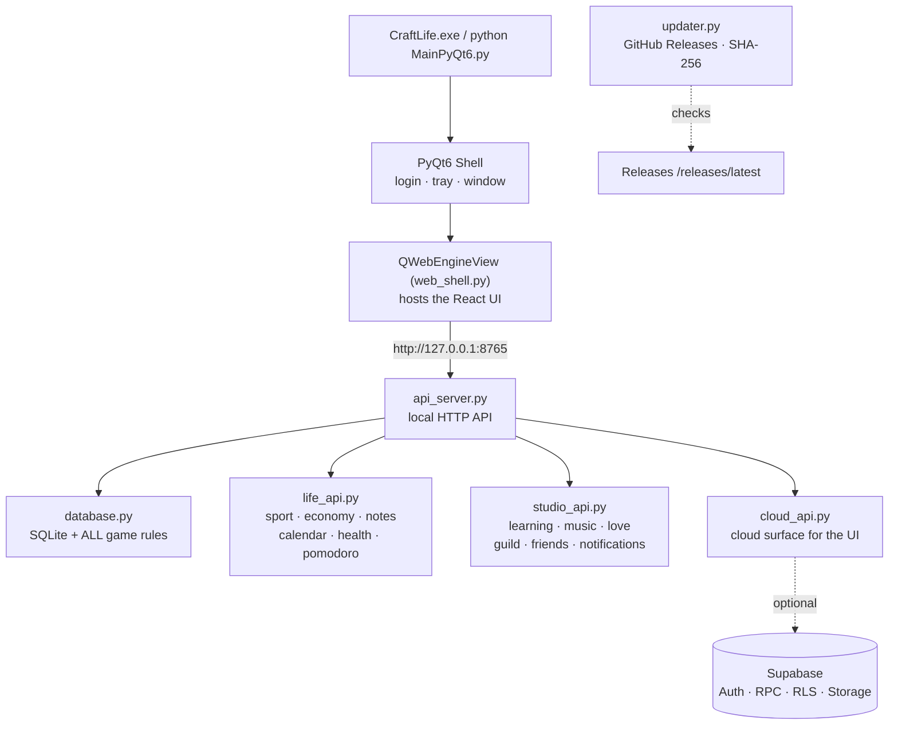

<div align="center">


# ⚒️ CraftLife

**An offline-first, Minecraft-themed desktop RPG for your real life.**

> **ID:** Tracker kebiasaan bergaya RPG — habits, quest, boss, pets, ekonomi, kesehatan, belajar, dan sosial.
> Semua fitur lokal jalan **100% offline**; cloud (Supabase) opsional untuk sync & fitur sosial online.


**Python + SQLite is the brain. React is the skin. Cloud is optional.**

[⬇️ Download](#install) · [✨ What's New](#whats-new) · [🎮 Feature Tour](#features) · [🧱 Architecture](#architecture) · [☁️ Cloud Guide](#cloud) · [🩺 Troubleshooting](#troubleshooting) · [❓ FAQ](#faq)

</div>

---

## 📌 What is CraftLife?

**CraftLife v1.4.0** is a **Windows-first desktop app** that turns real-life productivity into an RPG.
Finish habits → gain XP → level up → fight bosses → own pets → build an economy — all while your data stays
in a **local SQLite file you own**.

| Area | Status in v1.4.0 |
|------|------------------|
| 🖥️ Local tracker (habits, RPG, notes, health, economy, music, learning) | ✅ Ready — works **fully offline** |
| 🧊 Hybrid React UI in a PyQt6 WebEngine shell | ✅ Ready (29 pages, full parity P30–P46) |
| 🗿 Legacy PyQt widgets | ✅ Kept — launch with `CRAFTLIFE_WEB_UI=0` |
| ☁️ Cloud sync + social (Supabase) | ✅ Source ready — **you** apply the migrations |
| 🔔 Push notifications while the app is closed | ⏳ Not in this release |
| 🎨 Pixel-identical PyQt skins | 🚫 Not a goal — **action parity** is the goal |

> [!IMPORTANT]
> Game rules live **only** in `database.py` (Python/SQLite). The React frontend never re-implements
> RPG math — it calls the local API. The `Referention` branch is **UI reference only**.

---

<a id="whats-new"></a>

## ✨ What's New in v1.4.0

> **“Full Parity Release”** — every React page is now **1:1 in features & behavior** with the PyQt
> reference (P30–P46 complete). Tagged on GitHub as release `CraftLife-1.4.0`.

| Category | Change |
|----------|--------|
| 🧭 **Full page parity** | All 29 React pages match the PyQt reference feature-for-feature (P30–P46). |
| 🕐 **Your timezone, everywhere** | The app clock & all chat timestamps follow **your device's timezone**, not the server's. Per-message epoch timestamps — works with any server zone (UTC, WIB, etc.). |
| 💬 **Friends & Guild chat rebuilt** | Attachments (≤5), reply, edit, delete, reactions + remove, load-earlier (50/page), typing indicator (cloud), reliable 3s refresh — hybrid cloud/local storage. Guild send path fixed (no more “silently unsent”), leader-only clear-all. |
| ⚔️ **Real boss combat feedback** | Every attack shows damage dealt, damage blocked, boss HP remaining, crits, shield, revive, and ultimate effects. **Spyglass** now actually reveals full boss stats. Guild boss start is leader-only. |
| 🐾 **New pet slots scaling** | Below level 25 → 1 pet · level 25+ → `2 + floor((level−25)/5)` pets (25→2, 30→3, 35→4…). Buffs recalc on equip/unequip. |
| 🦸 **Profile upgrades** | Hero Customization moved to Profile; class change limited to **once per 7 days**. |
| 💰 **Economy, done right** | Savings accept any amount · investments store current total value · transaction cards show **names** · full subscription dialog (name/icon/cost/due/period/auto-renew/notes) · dialogs follow **your active currency** (no more hardcoded IDR). |
| 📊 **Charts & pages polish** | Home sleep↔productivity chart edge-to-edge · SportTrack reps chart renders + folder system · weight/height trends stretch properly · food DB names translated (id/en). |
| 🎵 **Live-synced lyrics** | Faster, wider lyric search; found lyrics are **time-synced (min:sec)** to playback. |
| 🎓 **Learning 3-tab slide** | Sources / Chat AI / Studio Generate; layout stretches when a tab is closed. |
| 🛠️ **Smaller fixes** | Crafting blocked when a consumable requirement is 0 · buff descriptions in Bag · re-buying increments by amount bought · navbar shows **all** active buffs · Love Space couple profile 1:1 · duplicate quick-template buttons removed. |

<details>
<summary><b>🔍 Verification checklist for this release</b> (click to expand)</summary>

- ✅ `py_compile` — all core modules pass
- ✅ `tsc --noEmit` — 0 errors
- ✅ `vite build` — clean production build
- ✅ Backend smoke tests — auth, bootstrap/server clock, guild create/messages, friends chat, boss catalog
- ✅ i18n — **3,694 keys** consistent across `translations.py` ↔ `WEB_I18N_KEYS` ↔ `messages.json` (id + en)
</details>

---

<a id="features"></a>

## 🎮 Feature Tour

<details open>
<summary><b>🧙 Character & Dashboard</b></summary>

Level, XP, HP, MP, Gold, gems, streaks, avatar classes, talents, rebirth, titles, **command palette**
(<kbd>Ctrl</kbd>+<kbd>K</kbd>), toasts, level-up modal, onboarding wizard.

</details>

<details>
<summary><b> ✅ Habits · Dailies · Quests</b></summary>

- **Habits** — positive/negative, difficulty rewards, folders, notes, duplicate, templates
- **Dailies** — recurring, fail & freeze, folders, templates (`morning_routine_d`, …)
- **Quests** — one-time objectives, templates (`project_launch_t`, …)
- Drag reorder & undo across all three

</details>

<details>
<summary><b> 💪 Body — Sport · Food · Health · Pomodoro</b></summary>

- **SportTrack** — workout log, complete, duplicate, templates, calories, reps chart, folder system
- **Nutrition** — food database (id/en), meals, macros, water goal
- **Health logs** — steps, sleep, weight, height, mood + 7-day trend charts
- **Pomodoro** — sessions, give-up, test alarm

</details>

<details>
<summary><b> 💰 Economy & Supplies</b></summary>

Income/expense · debts & installments · savings (add/withdraw) · investments · subscriptions (renew) ·
IOU notes · multi-currency display · supplies stock in/out/adjust.

</details>

<details>
<summary><b> 🎓 Studio — Notes · Learning · Music · Calendar</b></summary>

- **Notes** — folders, archive, duplicate, LaTeX preview (rendered in Python)
- **Learning (NotebookLM-style)** — notebooks, sources, **Gemini chat** (key stored in Python, never in React),
  quiz, flashcards, FAQ, timeline, summary, mind map, study guide, TTS
- **Music** — local library, playlists, yt-dlp search/download, **live time-synced lyrics**
- **Calendar** — Indonesian holidays (2025–2027), day notes, year jump, reminders with sounds

</details>

<details>
<summary><b> ⚔️ RPG — Shop · Craft · Pets · Bosses</b></summary>

- **Shop & inventory** — buy, equip, buff descriptions, re-buy increments
- **Crafting & enchanting** — requirement checks (qty 0 blocks crafting)
- **Pets** — adopt, feed, train, equip; slot scaling by player level; buff recalc
- **Bosses** — solo & guild bosses, full combat feedback (damage/blocked/HP/crit/shield/revive/ultimate)
- **Achievements, redeem codes, leaderboard** · admin debug panel (only when `is_admin`)

</details>

<details>
<summary><b> ❤️ Social — Friends · Couple · Guild · PvP</b></summary>

- **Friends** — request/accept/reject/remove, profile dialog, **full chat** (attachments, reply, edit,
  delete, reactions, load-earlier, typing indicator)
- **Couple** — request/respond/cancel/end, shared couple profile
- **Love Space** — check-in, memories, bucket list, events, weekly review, cycle tracking, photo metadata
- **Guild** — create/join/leave, invite, kick, leadership transfer, description, chat, custom bosses
- **PvP** — challenge/respond/claim · **notification center** (navbar bell)

</details>

<details>
<summary><b> ⚙️ Settings & Account</b></summary>

Local login/register/switch account/stay logged in · password, lock, security question, backup codes ·
cloud link, sync, conflict resolution, device management, local→cloud migration · language (id/en),
sound, high contrast, font scale, currency · tracker SQLite export/import · check for updates.

</details>

---

<a id="architecture"></a>

## 🧱 Architecture



| Principle | Meaning |
|-----------|---------|
| **Local first** | SQLite (WAL) is always available — no internet required |
| **Server authority** | Friends, Couple, online Guild, PvP, attachments, cloud rewards go through RPC + RLS |
| **No fake success** | Online actions succeed only after the server confirms |
| **Explicit conflicts** | Snapshot clashes → keep local *or* restore cloud. Never silent overwrite |
| **Private storage** | Cloud buckets are never public |
| **Safe retries** | Idempotency keys / stable cloud IDs |
| **Both languages** | Every UI string ships in Indonesian + English |

```text
Developers
  py api_server.py          # API + (after npm run build) static UI on :8765
  cd web && npm run dev     # Vite :3000 — hot reload only
  py MainPyQt6.py           # after build, the window loads :8765, not Vite
```

| Mode | How |
|------|-----|
| 📦 Frozen exe (end users) | Serves embedded `web/dist` — **Node is never required** |
| 🔧 Source, after `npm run build` | Same behavior — port **8765** |
| 🔥 Source + Vite | Port **3000** for UI hot reload; the API must still run |
| 🗿 Legacy PyQt widgets | `CRAFTLIFE_WEB_UI=0` |
| 🌐 Web login screen | `CRAFTLIFE_WEB_LOGIN=1` |

> [!NOTE]
> React never talks to Supabase directly — no service-role key, no `sb_secret_*` ever reaches the web bundle.

---

<a id="install"></a>

## ⬇️ Download & Install

### 👤 For users (Windows)

1. Go to the [latest release](https://github.com/Hellowww-02/CraftLife/releases/latest) — **`CraftLife-1.4.0`**.
2. Download the attached **`.zip`** (~371 MB) and extract it anywhere.
3. Run **`CraftLife.exe`**. That's it — no Python, no Node, no installer.

> [!TIP]
> The app **auto-updates**: on launch it checks GitHub Releases, downloads in the background, and applies
> the update with **SHA-256 verification** (re-checks at most once per 24h per version). You can also
> trigger it manually from **Settings → Check for updates**.

### 🧑‍💻 For developers (from source)

```powershell
git clone https://github.com/Hellowww-02/CraftLife.git
cd CraftLife
python -m venv .venv
.\.venv\Scripts\Activate.ps1
python -m pip install --upgrade pip
pip install -r requirements.txt
```

First UI build (developers only — end users never need Node):

```powershell
cd web
npm install
npm run build
cd ..
python MainPyQt6.py
```

> [!WARNING]
> Do **not** run `npm audit fix --force` (it can jump Vite to an incompatible major).
> The frozen/production window must load **:8765**, not Vite `:3000`, or you get `ERR_CONNECTION_REFUSED`.

### 💻 System requirements

| | Minimum | Recommended |
|--|---------|-------------|
| OS | Windows 10 x64 | Windows 11 x64 |
| Python (source) | 3.10 | 3.11 / 3.12 |
| Node (developers only) | 20+ | 20+ |
| RAM | 4 GB | 8 GB+ |
| Disk | 500 MB | 2 GB+ (learning/music cache) |
| Display | 1080×700 | 1280×720+ |
| Internet | Optional | Needed for cloud, Gemini, TTS, yt-dlp |

Linux/macOS may run from source (codecs, tray, packaging differ). **Windows is the supported release target.**

---

<a id="cloud"></a>

## ☁️ Optional Cloud (Supabase) — Operator Guide

Cloud is **optional**. A missing `.env` never disables local features — Settings still shows the cloud
form with a clear “not configured” message.

### Desktop `.env` (beside `MainPyQt6.py` or `CraftLife.exe` — never inside `_internal`)

```env
SUPABASE_URL=https://YOUR_PROJECT_REF.supabase.co
SUPABASE_PUBLISHABLE_KEY=sb_publishable_...
CRAFTLIFE_CLOUD_ENABLED=true
CRAFTLIFE_SYNC_INTERVAL_SECONDS=60
```

> [!CAUTION]
> **Never** put these in the desktop `.env` or in git:
> `sb_secret_*` · `SUPABASE_SERVICE_ROLE_KEY` · database password · `CHAT_MAINTENANCE_SECRET` · SMTP/CLI tokens.
> `.env` is gitignored — publishable (anon) keys only, and RLS is mandatory.

<details>
<summary><b>📂 Apply these 13 migrations, in this exact order</b></summary>

```text
supabase/migrations/
  20260812000000_initial_social_cloud.sql
  20260812010000_fix_profiles_insert_policy.sql
  20260813000000_social_realtime_pvp_guild.sql
  20260813120000_personal_realtime_sync.sql
  20260813180000_phase4a_love_space_shared.sql
  20260813210000_phase4b1_chat_core.sql
  20260813220000_phase4b2_b3_chat_attachments.sql
  20260813230000_phase4c_guild_complete.sql
  20260813235900_phase4d_e_final.sql
  20260814000000_phase5a_reward_ledger.sql
  20260818000000_phase5b_inventory_shop_craft.sql
  20260821000000_phase4f_couple_profile_both.sql
  20260821010000_app_updates.sql
```

- Do **not** rename an applied migration. Test on **staging first**, then production.
- Run Alice/Bob/Carol RLS tests (Carol must not read Alice–Bob chat, Love Space, guild internals,
  snapshots, or devices).
- Deploy the `chat-attachment-maintenance` **Edge Function**
  (`supabase/functions/`) and schedule it for attachment cleanup.
- Reward ledger & shop SQL **exist in the repo** — they only go live once applied. Until then,
  wallet/inventory stay **local-authoritative**.
</details>

### 🔗 Link an account in the app

**Settings → Cloud & Sync** → create account → verify email → **Sign in & link** → *Migrate local data* → **Sync now**.

### 📍 Source of truth

| Feature | Unlinked | Linked (after migrations) |
|---------|----------|---------------------------|
| Habits, dailies, quests, notes, health, economy, sport, reminders | SQLite | SQLite + `tracker_v1` personal snapshot |
| Profile | SQLite | Cloud profile + cache |
| Friends, Couple, Love Space, chat, PvP, Guild | Local fallback | Supabase RPC + RLS + cache |
| Shop / inventory / craft | SQLite | Cloud shop RPCs **if** 5a/5b applied |
| Music files, reminder sound paths | Local disk | **Never uploaded** |

`tracker_v1` = private document · ~36 tables · 8 MB cap · SHA-256 · keep-local or restore-cloud on conflict.

---

## 📂 Project Layout

```text
CraftLife/
├── MainPyQt6.py          🖥️ Desktop shell (WebEngine + legacy PyQt pages kept)
├── web_shell.py          QWebEngineView host
├── api_server.py         🔌 Local HTTP API — 127.0.0.1:8765
├── life_api.py           🏃 Sport, economy, notes, calendar, health, pomodoro
├── studio_api.py         🎓 Learning, music, love, guild, friends, notifications
├── cloud_api.py          ☁️ Cloud HTTP surface for the UI
├── database.py           🧠 SQLite schema + ALL game logic (single source of truth)
├── translations.py       🌐 id / en (3,694 keys per language)
├── updater.py            🔄 v1.4.0 · GitHub Releases (default) or Supabase · SHA-256
├── cloud_config.py / cloud_service.py / sync_service.py
├── food_data.py  holidays.py  mathtools.py  learning_helper.py  music_downloader.py
├── CraftLife.spec        📦 PyInstaller (onedir, web/dist embedded)
├── scripts/
│   ├── build.ps1         Windows build (ASCII, PowerShell 5.1)
│   ├── export_i18n.py    translations.py → web i18n
│   └── copy_qtwebengine.py
├── icons/craftlife.ico
├── web/                  ⚛️ React 18 + Vite 5 + Tailwind 4 + TS (29 views)
│   └── src/components/views/  Dashboard · Habits · Dailies · Quests · Sport ·
│                             Nutrition · HealthFood · Pomodoro · Economy · Supplies ·
│                             Notes · Learning · Music · Calendar · Reminders · Shop ·
│                             Craft · Pets · Boss · Achievements · Leaderboard ·
│                             Friends · LoveSpace · Guild · Profile · Settings · …
└── supabase/             ☁️ 13 migrations + chat-attachment-maintenance function
```

<details>
<summary><b>🌿 GitHub branches & how to contribute</b></summary>

| Branch | Role |
|--------|------|
| `main` | Product |
| `New-Update` | Hybrid UI / API drops before merge to `main` |
| `Supabase-Update` | Cloud client files |
| `Utilities-Update` | Scripts, updater, spec |
| `Update-Road` | Docs |
| `Referention` | Design zip only — **never merge for features** |

```bash
git clone https://github.com/Hellowww-02/CraftLife.git
git checkout -b feature/short-name
```

- Keep RPG logic in **Python**. Do not restore the zip's `server.ts`. Do not commit secrets.
- Update **id** and **en** strings together.
- Prefer `New-Update` → `main` for hybrid UI changes.
- Do not upload nested `web/src` via GitHub's “Add file” dialog — use `git push`.

</details>

---

## 📊 Data & Storage

| Mode | Database location |
|------|-------------------|
| `python MainPyQt6.py` | `craftlife.db` next to the sources |
| Frozen exe | `%APPDATA%\CraftLife\craftlife.db` |

- `.env` stays **beside the exe** (not in `_internal`).
- Never ship a user's database or `.env` inside a GitHub Release zip.
- **Backup before updates.** Settings → export/import tracker uses SQLite (`export_tracker_data`), not React `localStorage`.

---

## 🔐 Security & Privacy

- 🔒 Local passwords: **PBKDF2-HMAC-SHA256** + salt, lockout, backup codes, optional app lock.
- 🛡️ Cloud: TLS, Supabase Auth (email verification), RLS, private buckets (`profile-photos`, `love-space-photos`, `chat-attachments`).
- Refresh tokens use the OS **keyring** — passwords are never stored in SQLite.
- ⚠️ Direct chat is **not E2EE** — do not advertise it as such.
- 🤖 Optional Gemini key is set **inside the app**, stored in Python/SQLite, never in the React bundle, and excluded from cloud snapshots.
- 🩺 CraftLife is **not a medical device** — health & cycle tools are personal trackers only.

---

## 🏗️ Windows Build & Release

From the repo root (PowerShell 5.1):

```powershell
powershell -ExecutionPolicy Bypass -File .\scripts\build.ps1
```

The script: `export_i18n.py` → `npm run build` → PyInstaller `CraftLife.spec` → copies `web/dist` next to the exe.
Users run `dist\CraftLife\CraftLife.exe`.

> [!WARNING]
> Do **not** use PyInstaller `--optimize 2` or `--strip` (the Gemini SDK crashes on missing docstrings).
> Do **not** run `copy_qtwebengine.py` unless you explicitly need it.

### 🔄 Shipping an auto-update

`updater.py` reads **GitHub Releases** (`/releases/latest`) — the default `UPDATE_SOURCE` in v1.4.0 —
or Supabase Storage `app-updates` when switched to `"supabase"`.

1. Zip the **contents** of `dist\CraftLife\` (no `.env`, no `craftlife.db`).
2. Repo → **Releases** → Draft → tag **newer** than `APP_VERSION` → attach the zip → publish.
3. The updater downloads the first `.zip` asset, verifies **SHA-256** (when provided), and applies it on restart.

---

## 🧪 Smoke Tests

```powershell
python -m py_compile MainPyQt6.py database.py api_server.py life_api.py studio_api.py cloud_api.py web_shell.py updater.py
python -c "import database as db; db.init_db(); c=db.get_conn(); print(c.execute('pragma integrity_check').fetchone()[0])"
```

Expect `ok`. After UI changes, `cd web && npm run build` must produce `web/dist/index.html`.
Also: `cd web && npm run lint` (= `tsc --noEmit`, expect 0 errors).

---

<a id="troubleshooting"></a>

## 🩺 Troubleshooting

| Symptom | Fix |
|---------|-----|
| `ERR_CONNECTION_REFUSED` on `:3000` | Build the UI and use API **8765**; don't point WebEngine at Vite in production. |
| Blank “UI React belum di-build” | `cd web && npm install && npm run build`. |
| `build.ps1` parse errors (`P8`, `do`) | Use the ASCII `scripts/build.ps1` from this repo (no em-dashes / smart quotes). |
| Cloud shows “not configured” | `.env` beside the exe/source, then restart. |
| `PGRST205` on profiles | Supabase migrations not applied yet. |
| `otp_expired` | Fix Auth Site URL / redirect allowlist; request a new verification email. |
| `QtWebEngineProcess.exe` missing | `pip install PyQt6-WebEngine` and rebuild. |
| Database locked | Run one CraftLife process; don't write the DB from another tool. |
| Music plays silently | Check file exists, OS codecs, output device, Mutagen. |
| Clock looks 7h off | Fixed in v1.4.0 — the clock now renders in **your local timezone**. Update the app. |

---

## 🗺️ Roadmap

**In the repo (code):** cloud phases 1–4 · couple 4f · `app_updates` · reward ledger 5a · shop/inventory 5b.

**Next up / operator-side:** applying migrations live · scheduled attachment purge · closed-app push
notifications · malware scanning of attachments · deeper anti-cheat beyond server-scored productivity ·
Linux/macOS packaging.

---

<a id="faq"></a>

## ❓ FAQ

<details>
<summary><b>Do I need internet?</b></summary>

No. Every local module works offline. Internet is only needed for cloud sync, Gemini chat, TTS, and yt-dlp.
</details>

<details>
<summary><b>Do I need Supabase?</b></summary>

Only for multi-device sync and online social features. The app is fully usable without it.
</details>

<details>
<summary><b>A publishable key ships in the exe — is that safe?</b></summary>

Yes — publishable keys are designed for clients; protection comes from RLS policies. A **service-role key must never** be included.
</details>

<details>
<summary><b>Will a new exe wipe my data?</b></summary>

No — as long as `%APPDATA%\CraftLife` is preserved. The database never lives inside the app folder for frozen installs.
</details>

<details>
<summary><b>Can I upload <code>web/</code> through github.com's “Add file” dialog?</b></summary>

Nested folders fail in the upload UI — use `git push`. Re-uploading the same path replaces the file.
</details>

---

## 🤝 Contributing

Pull requests are welcome!

1. Fork / clone, branch off (`feature/short-name`).
2. Keep RPG logic in `database.py` — never duplicate game math in TypeScript.
3. Add new UI strings in **both** `id` and `en` (`translations.py` + web i18n via `scripts/export_i18n.py`).
4. `py_compile` + `tsc --noEmit` + `vite build` must all pass before you open a PR.
5. Never commit secrets, `.env`, or databases.

---

## ⚖️ License

[MIT](LICENSE) © 2026 CraftLife — provided **“AS IS”**, without warranty.

Minecraft and other marks belong to their respective owners. CraftLife is an independent project and is
not affiliated with Mojang or Microsoft.

---

## 💬 Support

👉 [github.com/Hellowww-02/CraftLife/issues](https://github.com/Hellowww-02/CraftLife/issues)

Include: OS, CraftLife version, source vs exe, local vs cloud, and the exact error.
**Never** attach `.env`, `craftlife.db`, or API keys.

---

<div align="center">

**⚔️ Complete real quests. 🛡️ Keep your data. 🐺 Level up your life. ⚒️**

*CraftLife v1.4.0 — “Full Parity Release”*

</div>
