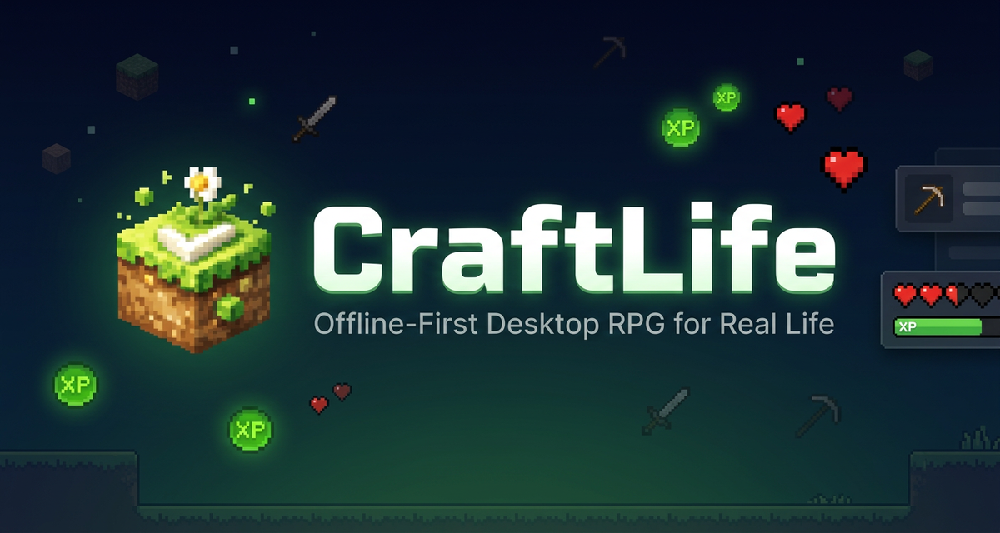
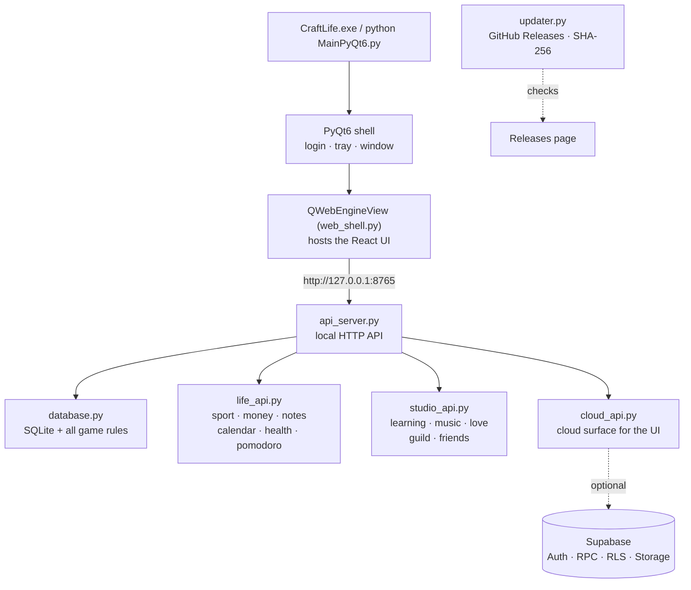

<div align="center">



# CraftLife

**An offline-first, Minecraft-themed desktop RPG for real life.**

Habits, quests, bosses, pets, money, health, learning, and social features —
with your data in a local SQLite file you own.

[](https://github.com/Hellowww-02/CraftLife/releases/latest)
[](https://github.com/Hellowww-02/CraftLife/releases/latest)
[](requirements.txt)
[](LICENSE)

[Download](https://github.com/Hellowww-02/CraftLife/releases/latest) ·
[Features](#features) · [Getting started](#getting-started) ·
[Project structure](#project-structure) · [Docs](#documentation) ·
[Contributing](#contributing) · [Support](#support)

</div>

---

## About

CraftLife turns everyday productivity into a role-playing game. Complete habits to
earn XP and gold, level up your character, adopt pets, fight bosses, and manage a
full in-game economy — all themed around a blocky world you already know.

Everything local runs **100% offline**. An optional Supabase cloud adds multi-device
sync and online social features, but the app never requires it.

- **Local first** — one SQLite database, stored on your machine, updated in place.
- **No fake success** — online actions only complete after the server confirms.
- **Two languages** — every screen ships in Indonesian and English (4,409 strings).
- **29 pages** — a React UI inside a PyQt6 desktop shell, with the legacy Qt pages
  still available as a fallback.

## ✨ What's New in v1.6.4

| Area | Highlights |
|------|------------|
| 📚 Learning | True 3-panel NotebookLM-style shell with draggable splitters and collapse; multi-file upload (23 types, drag-and-drop) with originals kept; website and YouTube sources with transcripts; 4 new Studio outputs (Briefing Doc, Data Table, Infographic, Slide Deck) with CSV/HTML export; KaTeX math in AI chat |
| ✅ Habits & date | Real fail streaks (counts no longer resurrect) with a done-today indicator; server-clock "today" that ticks and rolls over at midnight without a full reload |
| 🗄️ Database | Self-care: scheduled auto-cleanup independent of retention, per-table sizes, one-click checkpoint/VACUUM with before/after reports |
| 🔄 Updater | Auto-update that actually works: verified downloads with progress, release notes, countdown dialog, and a logged, abort-safe apply step |

## Features

**Character & dashboard** — Level, XP, HP, MP, gold, streaks, avatar classes,
talents, rebirth, titles, command palette (Ctrl+K), onboarding wizard, and a
Year Wrapped report in your own currency.

**Habits, dailies & quests** — Positive/negative habits with true streaks and a
done-today indicator, recurring dailies with fail and freeze, one-time quests,
folders, templates, drag-to-reorder with undo.

**Body** — Workout log with reps chart, food database with meals and macros,
health logs (steps, sleep, weight, height, mood) with 7-day trends, water goals,
and a global Pomodoro timer with alarm.

**Money** — Income/expense tracking, debts with installments, savings,
investments, subscriptions, multi-currency display, and a supplies inventory.

**Notes & learning** — Notes with folders, archive, attachments, and LaTeX
preview. A NotebookLM-style learning space: 3-panel shell (sources, chat,
studio) with draggable splitters, 23-type multi-upload with originals kept,
website and YouTube sources, Gemini chat with source citations, quizzes,
flashcards, summaries, study guides, timelines, Briefing Doc, Data Table,
Infographic and Slide Deck outputs, and a two-host Audio Overview podcast.

**Music** — Local library with playlists and custom icons, downloads, a
cross-page mini player, and synced lyrics that follow the track — with scored
search, manual `.lrc`/`.txt` import, and export.

**Calendar & reminders** — Indonesian holidays (2025–2027), day notes, and
reminders with sounds, including yearly repeats (29 Feb safely lands on 28 Feb).

**RPG systems** — Shop and 10-slot equipment, crafting and enchanting, pets with
training and buffs, solo and guild boss battles, achievements, redeem codes,
and a leaderboard.

**Social** — Friends with full chat (attachments, replies, reactions),
couple link with a six-tab Love Space (overview, plans, memories, connection,
cycle, gallery), guilds with chat and bosses, PvP challenges, and a
notification center.

**Account & settings** — Local login with lockout protection, backup codes, and
optional app lock. Cloud link with explicit conflict resolution. Themes, font
scale, high contrast, sound toggle, tracker export/import, scheduled database
self-care, and working in-app updates.

## Getting started

### For users (Windows)

1. Open the [latest release](https://github.com/Hellowww-02/CraftLife/releases/latest).
2. Download the release `.zip` and extract it anywhere.
3. Run `CraftLife.exe`.

Your data lives in `%APPDATA%\CraftLife\craftlife.db`, outside the app folder,
so updating never wipes it. Keep a backup anyway (Settings → Data).

Requirements: Windows 10+ x64. No internet needed except for cloud sync,
Gemini chat, podcast voices, and music downloads.

### For developers (from source)

```bash
git clone https://github.com/Hellowww-02/CraftLife.git
cd CraftLife

pip install -r requirements.txt

cd web && npm install && npm run build && cd ..
python MainPyQt6.py
```

Requirements: Python 3.10+, Node.js 18+ (only to build the UI).

Useful modes:

| Mode | How |
|------|-----|
| Normal (built UI served by the API) | `python MainPyQt6.py` after `npm run build` |
| UI hot reload during development | `python api_server.py` + `cd web && npm run dev` (Vite on `:3000`, API on `:8765`) |
| Legacy Qt pages instead of the web UI | `CRAFTLIFE_WEB_UI=0` |
| Custom API port | `CRAFTLIFE_API_PORT=8899` |

Sanity checks after changing code:

```bash
python -m py_compile MainPyQt6.py database.py api_server.py life_api.py studio_api.py cloud_api.py web_shell.py updater.py
cd web && npm run lint && npm run build
```

`npm run lint` is `tsc --noEmit` and must report 0 errors; the build must
produce `web/dist/index.html`.

## Configuration

All settings live inside the app. The only file you may need to touch is `.env`,
placed next to the sources (or next to `CraftLife.exe` for installed copies):

```ini
SUPABASE_URL=https://xyzcompany.supabase.co
SUPABASE_PUBLISHABLE_KEY=sb_publishable_...
CRAFTLIFE_CLOUD_ENABLED=1
CRAFTLIFE_SYNC_INTERVAL_SECONDS=300
```

Without a `.env`, the app runs fully offline and cloud features simply report
"not configured". Never commit your `.env`, and never ship one inside a release
archive. Only the publishable key belongs in a client — a service-role key must
never be included anywhere.

Feature flags used by the app:

| Variable | Default | Purpose |
|----------|---------|---------|
| `CRAFTLIFE_MUSIC_LIB_LIMIT` | `500` | Max files listed by `/api/music/library` |
| `CRAFTLIFE_API_PORT` | `8765` | Port of the local API |
| `CRAFTLIFE_WEB_UI` | `1` | `0` falls back to the legacy Qt pages |
| `CRAFTLIFE_WEB_LOGIN` | `0` | `1` shows the web login screen |

## Architecture



Design rules the codebase follows:

- Game logic lives in `database.py` only — the React UI never reimplements it.
- Money is formatted through `web/src/utils/currency.ts`; dates follow the
  server clock, not the browser clock.
- The UI talks to the local API only. It never contacts Supabase directly, so no
  secret key can leak into the web bundle.
- Schema changes are idempotent (`_safe_alter` in `init_db()`): fresh and
  existing databases end up identical, and user data is never dropped.

## Project structure

```text
CraftLife/
├── MainPyQt6.py          Desktop shell + legacy Qt pages
├── web_shell.py          QWebEngineView host, download manager
├── api_server.py         Local HTTP API (127.0.0.1:8765)
├── life_api.py           Sport, money, notes, calendar, health, pomodoro
├── studio_api.py         Learning, music, love, guild, friends, notifications
├── cloud_api.py          Cloud HTTP surface for the UI
├── cloud_service.py      Supabase client · sync_service.py · cloud_config.py
├── database.py           SQLite schema + all game logic (single source of truth)
├── translations.py       UI strings, Indonesian + English (4,409 keys)
├── updater.py            Auto-update from GitHub Releases (v1.6.4, SHA-256)
├── learning_helper.py    Gemini prompts and Studio parameters
├── music_downloader.py   Download engine (yt-dlp)
├── mathtools.py          Math text and LaTeX conversion
├── food_data.py          Food database · holidays.py + holidays_2025/26/27.json
├── applog.py             Logging helper
├── CraftLife.spec        PyInstaller spec (onedir, web/dist embedded)
├── requirements.txt      Python dependencies
├── package.json          Supabase CLI tooling (root, cloud development only)
├── icons/craftlife.ico   App icon
├── scripts/
│   ├── build.ps1         Windows release build
│   ├── build_windows.md  Build notes
│   ├── export_i18n.py    translations.py -> web i18n JSON
│   └── copy_qtwebengine.py  QtWebEngine helper (rarely needed)
├── web/                  React 18 + Vite 5 + Tailwind 4 + TypeScript UI (29 pages)
│   ├── src/components/views/  One file per page + Login + Onboarding
│   ├── src/components/   Shared UI, learning, love, music, notes, wrapped parts
│   ├── src/context/GameContext.tsx  Global app state
│   ├── src/api/          Typed API clients (client, life, studio, rpg, cloud)
│   ├── src/utils/        currency, serverClock, serverTime, theme, sound, pomoAlarm
│   └── src/i18n/         Generated messages.json (do not edit by hand)
├── supabase/             17 migrations + attachment-maintenance function + tests
└── *.md                  This file plus roadmaps and reports (see below)
```

## Documentation

Design docs and phase reports kept in the repo:

| Document | Contents |
|----------|----------|
| [UPDATE_RULES.md](UPDATE_RULES.md) | How update sessions are run (process reference) |
| [UPDATE_ROADMAP_A01_A14_v1.6.3.md](UPDATE_ROADMAP_A01_A14_v1.6.3.md) | v1.6.3 plan with per-phase evidence |
| [UPDATE_ROADMAP_C01_C09_v1.6.4.md](UPDATE_ROADMAP_C01_C09_v1.6.4.md) | v1.6.4 plan with per-phase evidence |
| [OPERATOR_RELEASE_v1.6.4.md](OPERATOR_RELEASE_v1.6.4.md) | Release operator runbook (build → zip → tag → publish → verify) |
| [RELEASE_NOTES_v1.6.4.md](RELEASE_NOTES_v1.6.4.md) | v1.6.4 GitHub Release notes |
| [2026-09-23-C01-C09-PHASE-SUMMARY.md](2026-09-23-C01-C09-PHASE-SUMMARY.md) | v1.6.4 consolidated phase report |
| [UPDATE_ROADMAP_P47_P63.md](UPDATE_ROADMAP_P47_P63.md) | v1.6.0 fix roadmap |
| [2026-09-08-P47-P63-PHASE-SUMMARY.md](2026-09-08-P47-P63-PHASE-SUMMARY.md) | v1.6.0 consolidated phase report |
| [2026-09-11-P63-finalize-v1.6.0.md](2026-09-11-P63-finalize-v1.6.0.md) | v1.6.0 release log |
| [PARITY_ROADMAP_P30_P46.md](PARITY_ROADMAP_P30_P46.md) | Phase-4 parity roadmap |
| [CRAFTLIFE-PARITY-REPORT.md](CRAFTLIFE-PARITY-REPORT.md) | Cumulative parity report (P1–P19) |
| [<CRAFTLIFE PHASE 3 FINAL PARITY REPORT.md>](<CRAFTLIFE PHASE 3 FINAL PARITY REPORT.md>) | Phase-3 parity report (P22–P29) |
| [FINAL-PARITY-MATRIX.md](FINAL-PARITY-MATRIX.md) | Page-by-page parity matrix |
| [UIUX_ROADMAP_U1_U12.md](UIUX_ROADMAP_U1_U12.md) | UI v2 "Craft Design System" roadmap |

## Data & storage

| Setup | Database location |
|-------|-------------------|
| From source | `craftlife.db` next to the sources |
| Installed exe | `%APPDATA%\CraftLife\craftlife.db` |

Settings → Data can export and re-import your tracker data. Release archives
never contain a database or a `.env`.

## Security & privacy

- Local passwords use PBKDF2-HMAC-SHA256 with salt, plus lockout, backup codes,
  and an optional app lock. Cloud refresh tokens use the OS keyring.
- Cloud traffic goes over TLS with Supabase Auth and row-level security;
  storage buckets are private.
- Your Gemini key (optional, for Learning) is stored locally and never sent to
  the cloud snapshot or the web bundle.
- Direct chat is not end-to-end encrypted.
- Health and cycle tools are personal trackers, not medical devices.

## Building a release (maintainers)

From the repo root in PowerShell 5.1:

```powershell
powershell -ExecutionPolicy Bypass -File .\scripts\build.ps1
```

The script regenerates the web i18n files, builds the UI, runs PyInstaller, and
places the result in `dist\CraftLife\`. Do not use `--optimize 2` or `--strip`
(the AI SDK crashes on missing docstrings).

To ship an auto-update (full runbook:
[OPERATOR_RELEASE_v1.6.4.md](OPERATOR_RELEASE_v1.6.4.md)):

1. Zip the **contents** of `dist\CraftLife\` (no `.env`, no `craftlife.db*`).
2. Draft a GitHub Release with a tag newer than `APP_VERSION`, attach the zip
   (plus a SHA-256 checksum), and publish.
3. Clients pick it up from `/releases/latest` and apply it on restart.

## Troubleshooting

| Symptom | Fix |
|---------|-----|
| Blank page / "React UI has not been built" | `cd web && npm install && npm run build` |
| `ERR_CONNECTION_REFUSED` on `:3000` | Use the API port `8765` in production; `:3000` is dev-only |
| Cloud shows "not configured" | Put `.env` beside the exe/sources, then restart |
| `PGRST205` on profiles | Supabase migrations have not been applied yet |
| `QtWebEngineProcess.exe` missing | `pip install PyQt6-WebEngine` and rebuild |
| Database locked | Run only one CraftLife process at a time |
| Update applied but version unchanged | The archive had the wrong layout — copy the **contents** of `dist\CraftLife\` over the app folder without touching `craftlife.db*` / `.env` |

## Changelog

Full notes live on the [Releases page](https://github.com/Hellowww-02/CraftLife/releases).

- **v1.6.4 "Study & Stability"** (23 Sep 2026) — NotebookLM-style Learning
  shell, 23-type multi-upload, URL/YouTube sources, 4 new Studio outputs, KaTeX
  math; real habit fail streaks; ticking server-clock date with midnight
  rollover; database self-care; and an auto-updater that actually works.
- **v1.6.3 "Quality of Life+"** (16 Sep 2026) — Lyrics follow the track, scored
  lyric search, documented lyric import; download/export overhaul; Learning with
  answerable quizzes, per-generator dialogs, artifact list, NotebookLM-style
  shell, citations, two-host Audio Overview; six polished Love Space tabs with
  Special Days and yearly reminders; Year Wrapped in the user's currency.
- **v1.6.0 "Quality of Life"** (11 Sep 2026) — 17 requested fixes including
  redeem codes, single-send AI chat, global music engine, playlist icons,
  couple tracking, and monthly database cleanup.
- **v1.5.0** — UI v2: the full "Craft Design System" rebuild of the web UI.
- **v1.4.0 "Full Parity Release"** — Complete PyQt → React feature parity,
  server clock, auto-update from GitHub Releases.

## Roadmap

- ✅ Commit Phase C (C01–C09) — v1.6.4 "Study & Stability" (Learning · Database
  & Updater · Date Utilities).
- Closed-app push notifications, attachment malware scanning, deeper anti-cheat
  for server-scored features, Linux/macOS packaging.
- Cloud-side: applying migrations live, scheduled attachment purge.

## Contributing

Pull requests are welcome:

1. Fork, clone, and branch off (`feature/short-name`).
2. Keep game logic in `database.py` — never duplicate it in TypeScript.
3. Add UI strings in both Indonesian and English (`translations.py`, then
   `python scripts/export_i18n.py`).
4. `py_compile`, `tsc --noEmit`, and `vite build` must all pass.
5. Never commit secrets, `.env` files, or databases.

## License

[MIT](LICENSE) © 2026 CraftLife — provided "AS IS", without warranty.

Minecraft and other marks belong to their respective owners. CraftLife is an
independent project, not affiliated with Mojang or Microsoft.

## Support

Issues: [github.com/Hellowww-02/CraftLife/issues](https://github.com/Hellowww-02/CraftLife/issues)

Please include your OS, CraftLife version, source vs exe, local vs cloud, and
the exact error. Never attach `.env`, `craftlife.db`, or API keys.

---

<div align="center">

**Complete real quests. Keep your data. Level up your life.**

*CraftLife v1.6.4 — "Study & Stability"*

</div>
