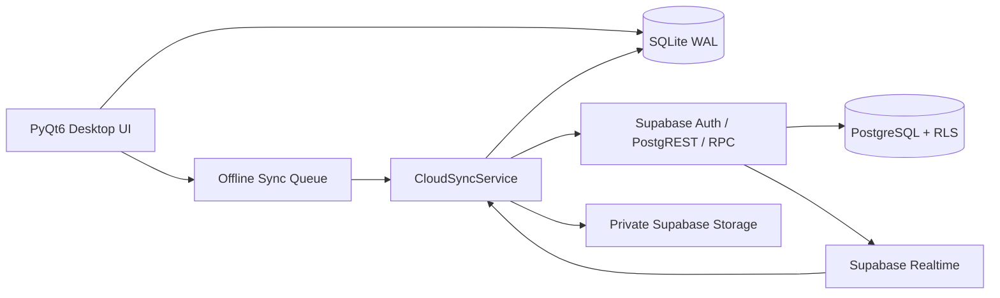

# ⛏️ CraftLife Desktop

<div align="center">

**Offline-first productivity, personal management, learning, and social RPG desktop app built with PyQt6.**

Turn daily progress into XP, Gold, streaks, achievements, Guild contribution, and a stronger character—without giving up ownership of your local data.


[Quick Start](#-quick-start-offline) · [Features](#-feature-set) · [Cloud Setup](#%EF%B8%8F-optional-cloud--supabase-setup) · [Build](#-build-windows-release) · [Troubleshooting](#-troubleshooting)

</div>

---

## Language

Dokumentasi utama menggunakan **Bahasa Indonesia**. Aplikasi mendukung Bahasa Indonesia dan English.

> **English summary:** CraftLife is an offline-first PyQt6 desktop productivity RPG. It combines tasks, health, finance, learning, notes, reminders, Love Space, friends, realtime chat, PvP, Guilds, and optional Supabase multi-device sync. SQLite remains the local store and the app can run without cloud configuration.

---

## 📌 Release scope

CraftLife v1.0.0 menyediakan pengalaman desktop lengkap yang dapat dipakai secara lokal tanpa internet. Integrasi Supabase bersifat opsional dan additive.

| Area | Status |
|---|---|
| Desktop offline/local | ✅ Siap digunakan |
| SQLite cache dan backup | ✅ Aktif |
| Cloud Phase 1–4 source | ✅ Tersedia |
| Supabase deployment | ⚙️ Harus diterapkan oleh operator project |
| Realtime + periodic fallback | ✅ Tersedia setelah cloud dikonfigurasi |
| Cloud game wallet/inventory penuh | 🗺️ Phase 5 |
| Push notification saat aplikasi tertutup | 🗺️ Phase 6 |
| Production operations/purge scheduler | 🗺️ Phase 6 |

**“Full Release” pada repository ini berarti aplikasi desktop offline-first dapat berjalan penuh.** Operator yang mengaktifkan cloud wajib menerapkan migration, RLS test, Storage policy, dan Edge Function sesuai panduan sebelum membuka project untuk pengguna publik.

---

## 📚 Table of contents

- [Overview](#-overview)
- [Feature set](#-feature-set)
- [Offline-first architecture](#-offline-first-architecture)
- [System requirements](#%EF%B8%8F-system-requirements)
- [Quick start](#-quick-start-offline)
- [Optional AI setup](#-optional-ai-learning-setup)
- [Optional cloud setup](#%EF%B8%8F-optional-cloud--supabase-setup)
- [Cloud migrations](#-cloud-migration-order)
- [Project structure](#-project-structure)
- [Data locations and backup](#-data-locations--backup)
- [Security and privacy](#-security--privacy)
- [Build Windows release](#-build-windows-release)
- [Updating an installation](#-updating-an-existing-installation)
- [Testing](#-testing--validation)
- [Troubleshooting](#-troubleshooting)
- [Known limitations](#-known-limitations)
- [Roadmap](#%EF%B8%8F-roadmap)
- [Contributing](#-contributing)
- [License](#-license)

---

# 📖 Overview

CraftLife adalah aplikasi desktop all-in-one yang menggabungkan:

- produktivitas dan task management;
- gamifikasi RPG;
- health, food, water, dan sport tracking;
- personal finance;
- learning workspace berbantuan AI;
- notes, calendar, reminders, Pomodoro, dan music;
- Love Space;
- friends, realtime chat, PvP, Guild, dan leaderboard;
- SQLite offline cache;
- Supabase Auth, Database, Storage, RPC, RLS, dan Realtime sebagai cloud opsional.

CraftLife tidak memaksa pengguna membuat akun cloud. Tanpa `.env`, aplikasi tetap dapat digunakan secara lokal.

## Prinsip desain

1. **Local first** — UI selalu menggunakan SQLite untuk pengalaman cepat dan tahan putus koneksi.
2. **Cloud optional** — pengguna lokal tidak kehilangan fitur hanya karena tidak menautkan akun.
3. **No fake success** — aksi sosial online baru dianggap sukses setelah Supabase mengonfirmasi.
4. **Server authority** — Friends, Couple, online Guild, online PvP, attachment registration, dan reward claim dikontrol RPC/RLS.
5. **Private by default** — Storage bucket cloud tidak public.
6. **Backward compatible** — migration dan fitur cloud bersifat additive terhadap sistem lokal.

---

# ✨ Feature set

## 🏠 Dashboard dan character progression

- ringkasan level, XP, HP, MP, Gold, dan streak;
- widget dashboard yang dapat dikonfigurasi;
- daily progress;
- activity summary;
- onboarding;
- quick add;
- command palette;
- rank progression;
- annual “Year Wrapped” summary;
- talent tree dan class passive buffs.

## ✅ Habits, Dailies, dan Quests

- positive/negative habits;
- recurring Dailies;
- one-time Quests/Todos;
- tingkat kesulitan dan reward;
- folder;
- drag-and-drop/reordering;
- repeat days;
- streak dan fail tracking;
- task history;
- template kebiasaan;
- trash/restore;
- productivity event cloud yang idempotent.

## 🍅 Pomodoro

- focus timer;
- break timer;
- looping alarm sampai dikonfirmasi;
- task label;
- XP dan Gold lokal;
- history sesi;
- productivity point cloud dengan limit server.

## 🏃 SportTrack

- custom sport activities;
- duration dan calories burned;
- completion streak;
- reps dan sets log;
- weekly series;
- sport rank;
- sport level dan statistics;
- cloud productivity event.

## 💚 Health & Food

- food database bawaan dengan ratusan entri nutrisi;
- custom food;
- calories, protein, carbohydrates, dan fat;
- meal logs;
- recipes;
- nutrition goals;
- water intake dan target;
- weight, height, BMI, age, gender, dan activity factor;
- steps, sleep, resting heart rate, stress, dan mood;
- health trends dan chart;
- offline storage di SQLite.

> CraftLife bukan perangkat medis. Prediksi dan ringkasan kesehatan hanya untuk pencatatan pribadi, bukan diagnosis.

## 💰 Economy

- income dan expense;
- categories dan folders;
- debt;
- debt notes/piutang;
- savings goals;
- investments dan returns;
- subscriptions;
- charts dan daily series;
- currency preference;
- export report.

## 📚 Learning workspace

- learning notebooks;
- PDF/text/document sources;
- source chunking dan local retrieval;
- AI chat berbasis context;
- flashcards;
- quiz/generation;
- mind map;
- two-host podcast generation;
- multilingual Edge TTS;
- export learning output;
- optional Gemini integration;
- graceful fallback ketika library/provider AI tidak tersedia.

## 📝 Notes

- rich text editor;
- folders dan nested folders;
- archive;
- search;
- zoom level;
- local JSON import/export integration.

## ⏰ Reminders

- date/time reminder;
- repeat type dan repeat days;
- system tray notification;
- looping beep;
- custom MP3 sound;
- automatic next occurrence;
- local-only custom sound path.

## 📅 Calendar

- monthly calendar;
- Indonesian/international holiday data;
- per-day notes;
- task and event context;
- Love Space event integration.

## 🎵 Music

Music tersedia melalui Command Palette:

- local playlists;
- favorite playlists;
- local file playback;
- metadata melalui Mutagen;
- MP3/FLAC/MP4/Ogg support tergantung codec OS;
- file musik tetap lokal dan tidak diunggah ke Supabase.

## 🛒 Shop, Inventory, Crafting, dan Pets

- local item shop;
- weapons, armor, consumables, dan buffs;
- inventory quantity/equipment;
- enchant state;
- crafting recipes;
- pets, active pet, hunger, happiness, level, dan EXP;
- class skill dan boss bonuses;
- achievements dan redeem codes.

> Pada v1.0.0, game wallet/inventory utama tetap local-authoritative. Server reward ledger penuh direncanakan pada Phase 5.

## 👤 Profile dan personalization

- display name;
- username;
- bio;
- avatar class, color, dan emoji;
- profile photo BLOB lokal;
- private profile-photo Storage cloud;
- themes;
- high contrast;
- font scale;
- Indonesian/English;
- IDR/USD/EUR display preference.

## 💞 Love Space

### Local dan cloud-aware relationship

- explicit Couple request/accept/reject/cancel;
- satu accepted partner per user;
- satu shared Love Space per Couple;
- shared profile dan start date;
- days together;
- events/plans;
- memories;
- daily check-ins;
- connection score;
- Connection Prompts dan favorites;
- weekly reviews;
- bucket list;
- menstrual/cycle tracker dan prediction;
- shared/private Gallery;
- image decode validation dan local BLOB cache.

### Cloud privacy rules

- hanya member Love Space yang dapat membaca shared data;
- write hanya saat relationship `accepted`;
- relationship ended memiliki 30-day read-only grace period;
- uploader tetap dapat mengelola fotonya sesuai policy;
- Gallery image diproses dan cloud maximum 5 MB;
- Love Space Gallery quota 1 GB;
- cycle data adalah data sensitif—gunakan hanya dengan persetujuan pasangan.

## 👥 Friends dan realtime Direct Chat

- server-authoritative friend request;
- friend profile;
- online/away/offline presence;
- typing indicator;
- Direct Chat local fallback;
- cloud message cache;
- offline send queue;
- reply;
- edit pesan sendiri;
- soft-delete/tombstone;
- reaction;
- unread count;
- pagination;
- 30-message/minute server limit;
- Realtime update;
- periodic pull fallback.

### Private chat attachments

Supported:

- JPG/JPEG/PNG/WebP → diproses menjadi WebP;
- PDF;
- UTF-8 TXT;
- DOCX;
- XLSX;
- PPTX.

Limits:

| Rule | Limit |
|---|---:|
| Attachment per message | 5 |
| Processed image | 5 MB |
| Document | 10 MB |
| Active quota per uploader | 250 MB |
| Upload slots | 50 files/hour |
| Image dimensions after processing | max 1600×1600 |

Hardening:

- server-authorized upload slots;
- deterministic private Storage path;
- slot expiry;
- SHA-256 verification;
- idempotent retry;
- SQLite BLOB cache;
- thumbnail cache;
- deleted-attachment retention;
- orphan cleanup Edge Function.

## ⚔️ Online PvP

- challenge request/accept/reject/cancel;
- server time window;
- score dihitung dari validated productivity events;
- client tidak mengirim skor;
- automatic/opportunistic finalization;
- one-time reward claim;
- local reward application hanya setelah cloud claim sukses;
- Realtime challenge state.

## 🛡️ Online Guild

- create, request join, cancel request, accept, dan reject;
- leave, kick, ban, dan unban;
- leader transfer;
- disband;
- one-user-one-Guild;
- one-leader invariant;
- `leader`, `officer`, dan `member` permissions;
- Guild description;
- Guild chat reply/edit/delete/reaction/pagination/unread;
- moderation delete oleh leader/officer;
- SQLite Guild chat cache;
- productivity contribution feed;
- server boss catalog;
- server-computed boss HP, duration, expiry, dan damage;
- one-time boss rewards;
- Guild EXP/level;
- online Guild leaderboard.

## 🔔 Notification Center

- durable cloud notification cache;
- unread badge;
- filters: message, social, Love Space, PvP, Guild, security;
- pagination;
- mark one/all read;
- deep-link ke entity terkait;
- Realtime + periodic fallback;
- new-device dan revoked-device events.

## 💻 Device Manager

- list cloud devices;
- identify current device;
- rename;
- revoke one other device;
- revoke all other devices;
- device first/last seen;
- platform dan app version;
- current device protection.

> Device registry revoke menghentikan UUID tersebut melakukan personal sync. Global Supabase Auth session revocation belum setara dengan device revoke dan masuk production hardening Phase 6.

## 🏆 Leaderboards

- local ranking;
- global productivity ranking;
- online Guild ranking;
- server-computed points;
- public profile fields only.

---

# 🧱 Offline-first architecture



## Source of truth by feature

| Feature | Offline/local | Cloud-linked mode |
|---|---|---|
| Habits/Dailies/Quests | SQLite | SQLite + personal snapshot/productivity event |
| Notes/Health/Economy | SQLite | SQLite + private personal snapshot |
| Profile | SQLite | Profile cloud mirror + SQLite cache |
| Friends | Local fallback | Supabase authoritative |
| Couple membership | Local fallback | Supabase authoritative |
| Shared Love Space | SQLite cache | Supabase authoritative |
| Direct Chat | Local fallback | Supabase authoritative + SQLite cache |
| Online PvP | Local PvP fallback | Supabase authoritative |
| Online Guild | Local Guild fallback | Supabase authoritative |
| Profile/Gallery/Chat files | SQLite cache | Private Storage + RLS |
| Game wallet/inventory | SQLite | Server ledger planned Phase 5 |

## Personal multi-device sync

`tracker_v1` is a private document snapshot covering 36 tracker tables, including tasks, notes, finance, health, Pomodoro, calendar, reminders, and relationship tracker data.

- optimistic revisions;
- semantic SHA-256 hash;
- maximum 8 MB payload;
- conflict detection;
- no silent overwrite;
- **Keep Local Data** or **Restore Cloud Data** resolution;
- ten historical server versions;
- custom reminder file paths are excluded.

---

# 🖥️ System requirements

## Desktop application

| Component | Minimum | Recommended |
|---|---:|---:|
| OS | Windows 10 64-bit | Windows 11 64-bit |
| Python source mode | 3.10 | 3.11/3.12 |
| RAM | 4 GB | 8 GB+ |
| Free disk | 500 MB | 2 GB+ for Learning/audio/cache |
| Display | 1080×700 | 1280×720 or larger |
| Internet | Optional | Required for cloud/AI/TTS |

Windows is the primary tested target. Linux/macOS may run from source, but multimedia codecs, keyring backend, tray behavior, and packaging can differ.

## Cloud development

- Node.js 20+;
- npm 10+;
- Supabase CLI 2.113+;
- Docker Desktop for local Supabase tests;
- Supabase project for staging/production;
- Singapore region recommended for users near Indonesia.

---

# 🚀 Quick start offline

Cloud configuration is not required.

## 1. Clone

```bash
git clone https://github.com/Hellowww-02/CraftLife.git
cd CraftLife
```

## 2. Create a virtual environment

### Windows PowerShell

```powershell
python -m venv .venv
.\.venv\Scripts\Activate.ps1
```

If execution policy blocks activation:

```powershell
Set-ExecutionPolicy -Scope Process -ExecutionPolicy Bypass
.\.venv\Scripts\Activate.ps1
```

### Linux/macOS

```bash
python3 -m venv .venv
source .venv/bin/activate
```

## 3. Install dependencies

```bash
python -m pip install --upgrade pip
pip install -r requirements.txt
```

## 4. Run

```bash
python MainPyQt6.py
```

At first launch, CraftLife initializes its SQLite schema and built-in data.

---

# 🤖 Optional AI Learning setup

Learning features that use Gemini require a valid provider API key configured by the user in CraftLife. AI-related packages are included in `requirements.txt`, but the application handles missing/failed optional imports gracefully.

Important:

- never commit an AI API key;
- do not include it in screenshots/issues;
- source documents and prompts sent to an AI provider are subject to that provider’s privacy policy;
- Gemini keys are not included in CraftLife personal cloud snapshots;
- local Learning features and stored notebook data remain available without cloud account linking.

Podcast TTS and transcript retrieval require internet access.

---

# ☁️ Optional Cloud — Supabase setup

For the complete operator guide, see [`SUPABASE_SETUP.md`](SUPABASE_SETUP.md).

## 1. Install cloud dependencies

```bash
pip install -r requirements.txt
npm install
```

## 2. Create local `.env`

```powershell
Copy-Item .env.example .env
notepad .env
```

Use only:

```env
SUPABASE_URL=https://YOUR_PROJECT_REF.supabase.co
SUPABASE_PUBLISHABLE_KEY=sb_publishable_...
CRAFTLIFE_CLOUD_ENABLED=true
CRAFTLIFE_SYNC_INTERVAL_SECONDS=60
```

Compatibility aliases are accepted, but the names above are recommended.

### Never put these in desktop `.env`

```text
sb_secret_*
service_role
SUPABASE_SERVICE_ROLE_KEY
database password
Supabase CLI access token
CHAT_MAINTENANCE_SECRET
SMTP credentials
```

`.env` is ignored by Git.

## 3. Auth configuration

In Supabase Dashboard:

1. enable Email/Password Auth;
2. require email verification;
3. set a non-localhost Site URL suitable for your release;
4. configure the verification redirect allowlist;
5. request a fresh verification email after changing redirect settings.

CraftLife does not store the Supabase password in SQLite. Refresh tokens use the OS credential store through `keyring`.

## 4. Link CLI

```powershell
npx supabase login
npx supabase link --project-ref YOUR_PROJECT_REF
npx supabase migration list
```

The CLI may ask for the database password. Enter it only in the CLI prompt—never commit it.

## 5. Validate locally

Docker Desktop must be running:

```powershell
npm run supabase:start
npm run supabase:reset
npm run supabase:test
npm run supabase:lint
```

Local Studio is normally available at:

```text
http://localhost:54323
```

## 6. Dry-run and push staging

```powershell
npx supabase db push --dry-run
npx supabase db push
npx supabase migration list
npx supabase db lint --linked --level warning
```

Always use a staging project first. Do not push directly to production before Alice/Bob/Carol authorization tests pass.

## 7. Deploy attachment cleanup Edge Function

Generate a secret locally without pasting it into chat/source:

```powershell
$secret = -join (
    (48..57) + (65..90) + (97..122) |
    Get-Random -Count 48 |
    ForEach-Object { [char]$_ }
)

npx supabase secrets set CHAT_MAINTENANCE_SECRET=$secret
npx supabase functions deploy chat-attachment-maintenance
```

The function uses `SUPABASE_SERVICE_ROLE_KEY` only inside Supabase Edge Runtime. Scheduler configuration is a production Phase 6 operation.

## 8. Link a CraftLife account

1. run CraftLife with `.env` beside the source or executable;
2. open **Settings → Cloud & Sync**;
3. choose **Link Cloud Account**;
4. create account;
5. verify email;
6. return and choose **Sign In & Link**;
7. choose **Migrate Local Data**;
8. choose **Sync Now**;
9. inspect Device Manager and sync status.

---

# 🗃 Cloud migration order

Migrations must remain in this exact order:

```text
20260812000000_initial_social_cloud.sql
20260812010000_fix_profiles_insert_policy.sql
20260813000000_social_realtime_pvp_guild.sql
20260813120000_personal_realtime_sync.sql
20260813180000_phase4a_love_space_shared.sql
20260813210000_phase4b1_chat_core.sql
20260813220000_phase4b2_b3_chat_attachments.sql
20260813230000_phase4c_guild_complete.sql
20260813235900_phase4d_e_final.sql
```

Do not rename an applied migration. Do not use `migration repair` only to hide an SQL error.

If a migration fails:

1. read the first SQLSTATE and statement number;
2. confirm whether it is listed as applied remotely;
3. correct the unapplied local file;
4. run `db push --dry-run` again;
5. use repair only when remote history and actual schema are known to differ.

### Fixed attachment migration syntax

The final attachment migration uses:

```sql
p_size_bytes > (
  case when p_mime_type like 'image/%'
    then 5242880
    else 10485760
  end
)
```

This fixes the earlier PL/pgSQL `SQLSTATE 42601` caused by an unparenthesized `CASE` expression in an `IF` condition.

---

# 🗂 Project structure

```text
CraftLife/
├── MainPyQt6.py              # PyQt6 application and pages/dialogs
├── database.py               # SQLite schema, migrations, local domain logic
├── translations.py           # Indonesian/English text
├── learning_helper.py        # Learning/AI/TTS helpers
├── cloud_config.py           # External .env configuration
├── cloud_service.py          # Supabase client boundary
├── sync_service.py           # Queue, pull/push, conflict orchestration
├── applog.py                 # Application logging
├── food_data.py              # Built-in nutrition data
├── holidays.py               # Calendar/holiday helpers
├── mathtools.py              # Learning math helper
├── requirements.txt
├── package.json
├── .env.example
├── SUPABASE_SETUP.md
├── CLOUD_FINALIZATION_PLAN.md
├── LICENSE
├── README.md
└── supabase/
    ├── config.toml
    ├── migrations/
    ├── tests/
    └── functions/
        └── chat-attachment-maintenance/
            └── index.ts
```

Generated folders/files such as `.venv`, `node_modules`, `build`, `dist`, `.env`, `craftlife.db`, logs, and backups are ignored.

---

# 💾 Data locations & backup

## Source mode

When run with:

```bash
python MainPyQt6.py
```

`craftlife.db` is stored beside the source files.

## PyInstaller Windows build

The frozen application stores its database under:

```text
%APPDATA%\CraftLife\craftlife.db
```

`.env` remains external beside the executable:

```text
dist\CraftLife\CraftLife.exe
dist\CraftLife\.env
```

Do not put `.env` inside `_internal`.

## Backup

Before every update:

```powershell
Copy-Item .\craftlife.db .\craftlife.before-update.db -Force
Copy-Item .\.env .\.env.before-update -Force
```

CraftLife also provides manual database backup and tracker JSON export/import.

Never distribute a user’s:

- `craftlife.db`;
- `.env`;
- backup folder;
- logs containing personal information;
- generated Learning audio unless explicitly intended.

---

# 🔐 Security & privacy

## Local authentication

- PBKDF2-HMAC-SHA256;
- random salt;
- 260,000 iterations;
- temporary login lockout;
- local session token hashing;
- security questions and backup codes;
- profile lock.

## Cloud authentication

- Supabase Email/Password Auth;
- email verification required;
- refresh tokens stored through `keyring`;
- publishable key only in desktop client;
- RLS and RPC authorization;
- private Storage buckets;
- 30-day soft-delete request.

## Cloud Storage buckets

```text
profile-photos
love-space-photos
chat-attachments
```

All must have:

```text
public = false
```

## Realtime security

Realtime does not replace authorization. PostgreSQL RLS decides which rows a client may receive.

Manual test accounts:

- **Alice** and **Bob**: valid shared relationship/conversation/Guild flow;
- **Carol**: non-member denial test.

Carol must not be able to read or receive:

- Alice/Bob Direct Chat;
- attachment metadata/object;
- private Love Space records;
- private Guild chat/contributions/boss actions;
- personal snapshots;
- device records;
- owner notifications.

## Encryption scope

CraftLife cloud traffic uses TLS and data access is protected by Auth/RLS/private Storage. Direct Chat is **not end-to-end encrypted**. Do not describe it as E2EE.

## Sensitive data

Health, finance, cycle, relationship, and Learning data may be sensitive. Users should:

- use a trusted device;
- protect the OS account;
- enable disk encryption;
- avoid public screenshots;
- review third-party AI privacy policies;
- avoid uploading unnecessary personal documents.

---

# ⚡ Realtime and sync behavior

Realtime subscriptions cover social requests, messages, reactions, typing, presence, notifications, PvP, Guild state, Love Space, attachments, and personal snapshots.

Reliability mechanisms:

- async Supabase client;
- dedicated background thread;
- exponential reconnect backoff;
- event debounce;
- sync lock;
- periodic sync fallback;
- queue retry with exponential delay;
- idempotency keys;
- local cloud cache;
- optimistic personal snapshot revisions.

When internet is unavailable:

- local modules continue to work;
- cloud cache remains readable;
- eligible personal changes queue;
- queued Direct Chat text/attachments retry;
- server-authoritative social mutations are not falsely reported as successful.

---

# 📦 Build Windows release

Install PyInstaller:

```powershell
pip install --upgrade pyinstaller
```

Recommended onedir build:

```powershell
python -m PyInstaller `
  --name CraftLife `
  --onedir `
  --windowed `
  --clean `
  --noconfirm `
  --optimize 1 `
  --collect-all google.generativeai `
  --collect-all google.ai.generativelanguage `
  --collect-all google.genai `
  --collect-all grpc `
  --collect-all supabase `
  --collect-all realtime `
  MainPyQt6.py
```

If an icon exists, add:

```powershell
--icon path\to\craftlife.ico
```

## Critical build rule

Do not use:

```text
--optimize 2
--strip
```

`--optimize 2` is equivalent to Python `-OO` and removes docstrings. Some Google Generative AI packages inspect docstrings at runtime and can crash with:

```text
AttributeError: 'NoneType' object has no attribute 'splitlines'
```

Use:

```text
--optimize 1
```

After building:

```powershell
Copy-Item .\.env .\dist\CraftLife\.env -Force
```

Only copy `.env` for a controlled deployment. Never publish a real `.env` in GitHub Release assets.

---

# 🔄 Updating an existing installation

1. close CraftLife;
2. backup `.env` and database;
3. replace application source/binaries only;
4. preserve local user data;
5. copy new additive migrations;
6. run Python validation;
7. run Supabase dry-run;
8. apply staging migration;
9. test Alice/Bob/Carol;
10. deploy Edge Functions if included;
11. only then distribute the update.

Example source update backup:

```powershell
$Project = 'D:\Path\To\CraftLife'
Set-Location $Project

Get-Process CraftLife -ErrorAction SilentlyContinue | Stop-Process -Force
Copy-Item .\craftlife.db .\craftlife.before-update.db -Force
if (Test-Path .\.env) {
  Copy-Item .\.env .\.env.before-update -Force
}
```

Never overwrite `%APPDATA%\CraftLife\craftlife.db` when installing a new EXE build.

---

# 🧪 Testing & validation

## Python syntax

```powershell
python -m py_compile MainPyQt6.py database.py cloud_config.py cloud_service.py sync_service.py translations.py learning_helper.py
```

## SQLite integrity

```powershell
python -c "import database as db; db.init_db(); c=db.get_conn(); print(c.execute('pragma integrity_check').fetchone()[0]); print('FK errors:', len(c.execute('pragma foreign_key_check').fetchall()))"
```

Expected:

```text
ok
FK errors: 0
```

A fresh final Phase 4 schema currently contains approximately 88 SQLite tables, including cloud caches.

## Local Supabase

```powershell
npm run supabase:start
npm run supabase:reset
npm run supabase:test
npm run supabase:lint
```

## Remote staging

```powershell
npx supabase migration list
npx supabase db push --dry-run
npx supabase db push
npx supabase db lint --linked --level warning
```

## Required authorization matrix

| Test | Alice | Bob | Carol |
|---|---:|---:|---:|
| Read own profile/private data | Allow | Allow | Own only |
| Read Alice/Bob shared Love Space | Allow | Allow | Deny |
| Read Alice/Bob Direct Chat | Allow | Allow | Deny |
| Download Alice/Bob chat attachment | Allow | Allow | Deny |
| Edit another sender’s message | Deny | Deny | Deny |
| Read Guild private chat as member | Allow if member | Allow if member | Deny if non-member |
| Promote self to Guild leader | Deny | Deny | Deny |
| Supply Guild boss HP | Deny | Deny | Deny |
| Read another user’s tracker snapshot | Deny | Deny | Deny |
| Manage another user’s device | Deny | Deny | Deny |

## Long-run test

Before production:

- run Realtime for 8–24 hours;
- sleep/resume Windows;
- disconnect/reconnect internet;
- expire/refresh Auth token;
- simultaneous edit/delete/reaction;
- attachment upload interruption;
- duplicate queue retry;
- Guild leader transfer race;
- PvP/Guild reward double-claim;
- database backup/restore rehearsal.

---

# 🐞 Troubleshooting

## Supabase is “Configured: False”

Verify `.env` is beside `MainPyQt6.py` in source mode or beside `CraftLife.exe` in frozen mode.

Recommended names:

```env
SUPABASE_URL=...
SUPABASE_PUBLISHABLE_KEY=...
```

Restart CraftLife after editing `.env`.

## `PGRST205` / table `public.profiles` missing

The initial Supabase migration has not been applied to the linked project.

```powershell
npx supabase migration list
npx supabase db push --dry-run
npx supabase db push
```

## RLS error inserting `profiles`

Ensure this migration has been applied:

```text
20260812010000_fix_profiles_insert_policy.sql
```

## Verification link opens localhost or reports `otp_expired`

- configure Auth Site URL/redirect allowlist;
- request a new verification email;
- use the newest link;
- return to CraftLife and sign in after verification.

## Attachment migration `SQLSTATE 42601`

Ensure the final corrected file is present:

```text
supabase/migrations/20260813220000_phase4b2_b3_chat_attachments.sql
```

Verify:

```powershell
Select-String .\supabase\migrations\20260813220000_phase4b2_b3_chat_attachments.sql -Pattern 'p_size_bytes > \(case'
```

Do not repair a migration that never succeeded remotely. Replace the file, dry-run, then push again.

## CLI warning: `.supabase\profile` not found

If the CLI still says it is using an access token, initializes the login role, and connects to the remote database, this warning is non-fatal. The SQLSTATE that follows is the real migration result.

## Docker missing

Supabase local development requires Docker Desktop. Remote push does not start the local stack.

## Realtime sync-client `NotImplementedError`

CraftLife uses Supabase’s async client for Realtime. Ensure `cloud_service.py` is current and reinstall:

```powershell
pip install --upgrade supabase realtime
```

## `QThread has been deleted`

Use the current `MainPyQt6.py`, which safely resets deleted cloud worker references and follows `worker.finished → thread.quit → deleteLater` lifecycle.

## Google Generative AI `splitlines` crash after build

Rebuild without `--optimize 2` and without `--strip`.

```powershell
Remove-Item build,dist,CraftLife.spec -Recurse -Force -ErrorAction SilentlyContinue
```

Then build with `--optimize 1`.

## Database locked

- close duplicate CraftLife processes;
- wait for backup/export to finish;
- do not open `craftlife.db` in another writer;
- restart CraftLife;
- preserve WAL/SHM files while the app is running.

## Music does not play

Check:

- file path still exists;
- OS multimedia codec supports the format;
- audio output device is available;
- Mutagen is installed.

## AI/TTS unavailable

Check optional packages and internet access. CraftLife should continue running without AI provider availability.

---

# ⚠️ Known limitations

- Direct Chat uses TLS/Auth/RLS, not E2EE.
- Push notifications while CraftLife is closed are not implemented yet.
- Device UUID revoke is not full global Auth-session revoke.
- Permanent account purge after the 30-day grace period requires Phase 6 scheduling.
- PvP/Guild automatic maintenance is currently also triggered opportunistically by active clients; full scheduler is Phase 6.
- Attachment cleanup Edge Function must be scheduled by the production operator.
- Server-side antivirus/content scanning is not yet included; client signature checks and server metadata validation are not a substitute for malware scanning.
- Cloud game wallet, inventory, shop, crafting, pets, achievements, and Learning sync are not fully server-authoritative yet.
- A modified desktop client cannot forge server-scored productivity points directly, but complete anti-cheat requires the Phase 5 reward ledger.
- Linux/macOS multimedia, tray, credential backend, and packaging behavior may differ from Windows.
- Very large tracker datasets can exceed the `tracker_v1` 8 MB document limit and will need granular sync planned for Phase 5.

---

# 🛣️ Roadmap

Detailed planning is maintained in [`CLOUD_FINALIZATION_PLAN.md`](CLOUD_FINALIZATION_PLAN.md).

## Completed in source

- [x] Phase 1 — Auth, Profiles, Friends, Couple, Love Space, Gallery, Storage, RLS
- [x] Phase 2 — Chat, Presence, Notifications, Productivity, PvP, Guild, Leaderboards
- [x] Phase 3 — Device registry, private multi-device tracker sync, conflict resolution
- [x] Phase 4A — Cloud-native shared Love Space
- [x] Phase 4B — Direct Chat core, reactions, attachments, hardening
- [x] Phase 4C — Complete online Guild lifecycle/chat/boss/reward
- [x] Phase 4D — Notification Center and Device Manager
- [x] Phase 4E — Final RLS/privilege/rate-limit hardening

## Planned

### Phase 5 — Cloud game state and Learning

- server reward ledger;
- cloud wallet;
- inventory/shop/crafting transactions;
- pets, achievements, and redeem;
- Learning notebooks/sources/generations Storage;
- granular per-row sync;
- full data export/delete.

### Phase 6 — Production operations

- scheduled maintenance;
- permanent account purge;
- global session revocation;
- push notification when app is closed;
- abuse/report/moderation;
- malware scanning strategy;
- monitoring and alerts;
- backup/restore drill;
- migration rollback rehearsal;
- staged production rollout.

---

# 🤝 Contributing

Contributions are welcome.

## Workflow

```bash
git clone https://github.com/Hellowww-02/CraftLife.git
cd CraftLife
git checkout -b feature/short-description
```

Before opening a pull request:

```bash
python -m py_compile MainPyQt6.py database.py cloud_config.py cloud_service.py sync_service.py translations.py learning_helper.py
```

For cloud changes:

```bash
npm run supabase:reset
npm run supabase:test
npm run supabase:lint
```

Pull request descriptions should include:

- problem and solution;
- affected local/cloud modules;
- migration/RLS impact;
- backward-compatibility impact;
- test steps;
- screenshots for UI changes;
- confirmation that no secrets or user data were committed.

## Coding guidelines

- preserve SQLite local fallback;
- do not perform network requests on data-only database helpers;
- keep social state server-authoritative in cloud mode;
- use RPC/RLS for sensitive mutations;
- use idempotency keys for retryable operations;
- do not silently overwrite sync conflicts;
- use `_card`, `_btn`, `_lbl`, and `PageHeader` for UI consistency;
- update Indonesian and English translations;
- keep private buckets private;
- never add `service_role` to desktop code.

---

# ❓ FAQ

## Apakah CraftLife wajib online?

Tidak. Semua modul utama dapat digunakan lokal dengan SQLite.

## Apakah akun Supabase wajib?

Tidak. Akun cloud hanya diperlukan untuk multi-device dan fitur sosial online.

## Apakah publishable key aman di desktop?

Publishable key memang ditujukan untuk client, tetapi bukan pengganti RLS. Jangan gunakan secret/service-role key di desktop.

## Apakah chat terenkripsi end-to-end?

Tidak. Chat dilindungi TLS, Auth, RLS, dan private Storage, tetapi bukan E2EE.

## Di mana password cloud disimpan?

Password ditangani Supabase Auth dan tidak disimpan di SQLite. Refresh token menggunakan OS credential store melalui `keyring`.

## Apakah data lokal hilang ketika cloud gagal?

Tidak seharusnya. SQLite tetap menjadi cache/offline store. Social mutation cloud tidak dilaporkan sukses jika server menolak.

## Bagaimana memindahkan data ke PC lain?

- offline-only: copy database dengan aplikasi tertutup atau gunakan export/import;
- cloud-linked: link akun yang sama, lalu sync/restore;
- selalu buat backup sebelum restore.

## Apakah update EXE menghapus database?

Tidak jika installer/distribusi tidak menghapus `%APPDATA%\CraftLife`. Jangan pernah memasukkan database pengguna ke paket update.

## Apakah Supabase Free cukup?

Cukup untuk staging dan test kecil. Review database, Storage, Realtime, egress, dan function limits sebelum production.

---

# 📄 License

CraftLife dilisensikan di bawah [MIT License](LICENSE).

```text
Copyright (c) 2026 CraftLife
```

Software diberikan “AS IS”, tanpa jaminan. Lihat `LICENSE` untuk teks lengkap.

---

# 🙏 Acknowledgements

CraftLife menggunakan atau terinspirasi oleh:

- Python;
- PyQt6 / Qt;
- SQLite;
- Supabase;
- Pillow;
- Matplotlib;
- OpenPyXL;
- python-docx;
- ReportLab;
- Mutagen;
- PyMuPDF / pypdf;
- Edge TTS;
- Google Generative AI SDK;
- Minecraft-inspired progression aesthetics;
- Habitica-style productivity gamification;
- notebook and knowledge-work applications.

Minecraft and other referenced products are trademarks of their respective owners. CraftLife is an independent project and is not affiliated with Mojang or Microsoft.

---

# 📬 Support and bug reports

Use GitHub Issues:

```text
https://github.com/Hellowww-02/CraftLife/issues
```

Include:

- OS and version;
- Python/CraftLife version;
- source or EXE mode;
- local-only or cloud-linked mode;
- exact reproduction steps;
- complete error text;
- migration filename and statement number for SQL errors.

Never attach:

- `.env`;
- `craftlife.db` containing personal data;
- publishable key screenshots;
- database password;
- service-role key;
- `sb_secret_*`;
- CLI access token;
- maintenance secret.

---

<div align="center">

## ⛏️ CraftLife Desktop

**Build better systems. Complete real quests. Level up your life.**

Made with Python, PyQt6, SQLite, and optional Supabase cloud services.

</div>
