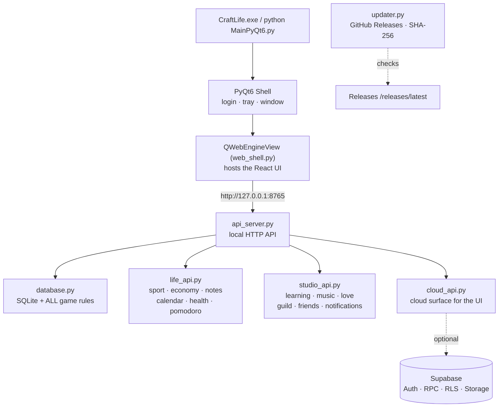

<div align="center">


# ⚒️ CraftLife

**An offline-first, Minecraft-themed desktop RPG for your real life.**

> A habit tracker in RPG clothing — habits, quests, bosses, pets, economy, health, learning and
> social features. Everything local runs **100% offline**; cloud (Supabase) is optional, for sync and online
> social features.


**Python + SQLite is the brain. React is the skin. Cloud is optional.**

[⬇️ Download](#install) · [✨ What's New v1.6.3](#whats-new) · [📄 Release Notes](RELEASE_NOTES_v1.6.3.md) · [🗺️ Phase roadmap](UPDATE_ROADMAP_A01_A14_v1.6.3.md) · [📋 Phase recap](2026-09-14-A01-A14-PHASE-SUMMARY.md) · [🎮 Feature Tour](#features) · [🧱 Architecture](#architecture) · [☁️ Cloud Guide](#cloud) · [📐 Update rules](UPDATE_RULES.md) · [🩺 Troubleshooting](#troubleshooting) · [❓ FAQ](#faq)

</div>

---


## 📌 What is CraftLife?

**CraftLife v1.6.3** is a **Windows-first desktop app** that turns real-life productivity into an RPG.
Finish habits → gain XP → level up → fight bosses → own pets → build an economy — all while your data stays
in a **local SQLite file you own**.

> [!NOTE]
> **Current release: `v1.6.3` — “Quality of Life+”**, shipped **16 September 2026** as a single commit phase
> (`A01–A14`) plus the follow-up fix `A15`. Four product areas were delivered end-to-end — 🎵 **Music**,
> 📚 **Learning**, 💞 **Love Space** and 🏠 **Home** — together with an app-wide download/export audit
> (`A03.5`); three fatal bugs were closed along the way.
> Details: [What's New](#whats-new) · [Release Notes](RELEASE_NOTES_v1.6.3.md) ·
> [Roadmap + code-level evidence](UPDATE_ROADMAP_A01_A14_v1.6.3.md) ·
> [Consolidated phase report (Format 1–7)](2026-09-14-A01-A14-PHASE-SUMMARY.md).

### 🧾 Status by area — v1.6.3

| Area | Status in v1.6.3 | Phase |
|------|------------------|-------|
| 🎵 **Music** | ✅ **Lyrics follow the track** that is playing (auto-advance / next / prev / mini-player) · **scored lyric candidate search** (album, graded duration tolerance, penalties for live/karaoke edits) · **documented manual lyric import** (`.lrc` / `.txt`, downloadable template, validation, export) | A01–A03 |
| 📥 **Everywhere** | ✅ **Export/download audit**: every file (nutrition CSV/XLSX/DOCX/PDF, tracker JSON, Studio artifacts, chat attachments, lyrics) now really lands in **`Downloads/CraftLife`**, with a toast showing the full path | A03.5 |
| 📚 **Learning** | ✅ **Essay answers are typeable and scored** + composite score · **two independent counters** for multiple-choice/essay (total ≤ 30, default 10 + 5) · **one configuration dialog per generator type** (8 types) · **generated results become an artifact list** (rename / filter / export) · **NotebookLM-style shell** · **clickable source citations** + grounding selection · **two-host Audio Overview** with an interactive player · **left rail shows the icon you typed** (A15) | A04–A08, A15 |
| 💞 **Love Space** | ✅ All six sub-tabs professionalised: `plans` (**event notes**, editing, recurring **Special Days**) · `memories` + **Bucket List** (emoji, tags, favourites, targets, priority, “turn into memory”) · `connection` (answer history, 30/90-day mood trend, streak) · `cycle` (history + ovulation/fertile-window prediction + H-3/H-1 reminder) · `gallery` (album covers, bulk actions, keyboard lightbox) · `overview` (**couple dashboard** + **Special Day → yearly reminder**, 29 Feb → 28 Feb) | A09–A12 |
| 🏠 **Home** | ✅ **Year Wrapped uses the user's active currency** (`formatMoney`, currency chip + exchange-rate note), per-type breakdown, saving ratio, year picker, **copy & download summary** | A13 |
| 🖥️ **Platform** | ✅ Works **100% offline** (SQLite WAL) · **29 pages** of React inside a **PyQt6 WebEngine** shell with the **Craft Design System v2** · the legacy PyQt widgets remain available (`CRAFTLIFE_WEB_UI=0`) | — |
| ☁️ **Cloud (optional)** | ✅ Source ready; **you** apply the Supabase migrations — **16 files** (13 core + 3 optional for A09–A11) | — |
| 🔔 **Push while the app is closed** | ⏳ Not in this release | — |
| 🎨 **Pixel-identical PyQt skins** | 🚫 Not a goal — **action parity** is the goal | — |

### 📊 Version at a glance

| Fact | Value |
|------|-------|
| Installed version | `updater.py` `APP_VERSION = "1.6.3"` · `web/package.json` `"version": "1.6.3"` (the label in **Settings** is read from `/api/version`) |
| Release | **16 September 2026** · commit phase **A01–A14** + fix **A15** |
| i18n | **4,325 keys**, bilingual **id + en**, kept in sync across four sources (`translations.py` ↔ `src/i18n/messages.json` ↔ `public/i18n/messages.json` ↔ `WEB_I18N_KEYS`) |
| UI pages | **29** React pages — full feature parity with the PyQt reference |
| Migrations | **SQLite applies itself** on start (safe for existing and brand-new databases) · **Supabase: 16 files** (13 core + 3 optional A09–A11) |
| Required Python packages | `google-genai>=1.0.0` (the legacy `google.generativeai` SDK is end-of-support) · `edge-tts>=6.1.0` + `gTTS>=2.5.0` (podcast voices) |
| Your data | `craftlife.db` (SQLite) — local, owned by you, never uploaded automatically |
<a id="whats-new"></a>

## ✨ What's New in v1.6.3 — “Quality of Life+”

> **🎯 This is the current release** — **16 September 2026** · commit phase **A01–A14** + fix **A15**.
> Everything below belongs to this release; older releases were moved to
> [Release history (archive)](#release-history-v160-quality-of-life-archive).
>
> **Status: ✅ SHIPPED — commit phase `A01–A14` + fix `A15`** (music → learning → love space → home).
> All four requested areas were delivered inside a **single commit phase**, and three fatal bugs were closed
> with them (lyrics did not change with the track · quiz essay answers could not be typed · export/download
> never wrote a file). The installed version (`updater.py` `APP_VERSION` and `web/package.json`) is **1.6.3**,
> the release badge above points at **v1.6.3 “Quality of Life+”**, and the full notes live in
> [`RELEASE_NOTES_v1.6.3.md`](RELEASE_NOTES_v1.6.3.md).

| Phase | Area | What was delivered | Status |
|-------|------|--------------------|--------|
| A01 | 🎵 Music | **Lyrics switch with the song** — per-track cache, request race guard, live lyric panel during auto-advance / next / prev / mini-player, active-track header, auto-scroll that pauses for 3 s while you read | ✅ Done |
| A02 | 🎵 Music | **Wider and more accurate lyric search** — scored candidates with **album**, graded duration tolerance (≤2 s +3 · ≤5 s +1.5 · >15 s −2), penalties for live/remix/karaoke/cover versions, a **candidate picker dialog** (album · duration · SYNCED/PLAIN badge · score · 5-line preview), the user's choice stored permanently as `user-pick`, **library cap raised from 80 to 500** (`CRAFTLIFE_MUSIC_LIB_LIMIT`), batch metadata for tracks outside the listing, 10-minute negative cache | ✅ Done |
| **A03.5** | 📥 App-wide | **Complete export/download overhaul** — the Qt WebEngine shell had no `downloadRequested` handler, so **every** download (nutrition CSV/XLSX/DOCX/PDF, tracker JSON, Studio `.txt` exports, chat attachments, lyric templates and exports) was silently discarded with no message. A `DownloadManager` now writes to **`<Downloads>/CraftLife`** (unique names, location toast, **Open folder** button) and all frontends use one download helper (`downloadApiFile` / `saveFileToComputer`) | ✅ Done |
| A03 | 🎵 Music | **Documented manual lyric import** — a dialog with two tabs (**Import** and **Guide**), a `.lrc`/`.txt` drop zone, a **ready-to-download `.lrc` template**, a copy-once format example and **pre-save validation** (timed lines, time ranges, breaks, metadata, 8 warning classes). Full support for the `[ar:] [ti:] [al:] [by:] [offset:±ms]` tags, multi-timestamp lines and break lines, plus **lyric export** (timed `.lrc` or plain `.txt`) | ✅ Done |
| **A04** | 📚 Learning | **Quizzes can be answered and configured fully** — essay questions are finally typeable (the `type`/`modelAnswer` markers used to vanish when the notebook was re-fetched, and the textarea was locked while scoring), **two independent counters** for multiple-choice and essay (default **10 + 5**, total ≤ 30, four presets), **composite score** (`MC 4/10 · Essay 3.5/5`, essay self-scored ✅ 1 · 🟡 0.5 · ❌ 0), **auto-saved answer drafts** (`localStorage cl_learning_quiz_draft_<nb>_<gen>`), **Re-evaluate** without wiping answers, and **Show all model answers** | ✅ Done |
| **A05** | 📚 Learning | **One configuration dialog per Studio generator** — the eight generator cards no longer fire immediately; each opens **its own dialog** in the spirit of NotebookLM's *Customize* (type-specific options: difficulty, language, length, style, branch depth, study-guide sections, timeline granularity…), a **source summary** (`n sources · m words`), an **Advanced settings** section (focus topic + free-form instructions), **Remember settings per notebook**, **Reset to defaults**, plus a **⚡** button for a quick run with the last settings. Every value is re-validated and clamped server-side (`_studio_opts`) | ✅ Done |
| **A06** | 📚 Learning | **Generated results become a tidy artifact list** — every result is a card (type icon · editable title · type badge · relative time · item count `15 questions` / `20 cards` / `18 turns` / `340 words` · file size) with **type filters**, **search**, **sorting** (Newest/Oldest/Type), an **accordion preview** directly under the card, and **Open · Rename · Export .md · Export .txt · Duplicate · Delete**. The old chip history is gone. Adds the `updated_at` column (SQLite) and correct `Content-Type` headers for every download | ✅ Done |
| **A07** | 📚 Learning | **NotebookLM-style Learning shell** — a left notebook rail (72 px collapsed / 220 px expanded) with avatars, a **+ Notebook** button and a language switcher; a **topbar** with **inline notebook rename** (Enter saves · Esc cancels) plus `{n} sources` · `{m} words` · status chips; a centre column that toggles **Sources ⇄ Chat** (source cards: type icon · word count · date · **Used/Not used** chip, search above 3 sources; chat: AI/user bubbles + **4 suggestion cards** + composer); and a right **Studio** column (A06 artifact list + the 8-generator launcher grid). **Drag-resize was replaced by three width presets — Narrow 320 · Medium 420 · Wide 560 — plus hide panel**, with **automatic migration** of the old preference (`cl_learning_panel_widths` → `cl_learning_layout`). Below 1024 px the rail becomes a bottom bar and each column becomes a full tab | ✅ Done |
| **A08** | 📚 Learning | **Source citations, grounding and a two-host podcast** — AI answers now point at their sources: `[S1]` markers become **clickable numbered chips** (popover: title + the quoted sentence + **Open source**), followed by a citation summary line under the bubble. **`sourceIds`** are sent from the Sources column so the AI **uses only the sources you ticked** (with a `{n} of {total} sources used` chip in the chat header and *Select all/Clear* buttons in the rail). The **Audio Overview** podcast no longer uses browser speech: it is a real **MP3** with **two hosts matched to the transcript language** (`id → Ardi & Gadis`, `en → Andrew & Ava`) and an interactive player — **click a turn to jump to its second**, active turn highlighted and auto-scrolled, draggable progress, ±15 s, 0.75×–2× speed, loop, download MP3, regenerate. The AI dependency moved from **`google.generativeai` to `google.genai`** (the old package is end-of-support) with a safety fallback to the legacy SDK | ✅ Done |
| **A09** | 💞 Love Space | **The `plans` tab rebuilt** — two gaps you reported are closed: **event notes** (the `evNotes` state was already sent to the API but **no input was bound to it**, so notes were impossible to type) and **event editing** (previously delete-only). There is now an **Add/Edit event** dialog with title, date, **6 icon categories**, an **icon/emoji picker**, **location**, **notes**, a **Special Day** toggle → **repeat yearly** + **remind me N days before** (0/1/3/7/14/30) and a **live countdown preview**. The list is grouped into **Upcoming** (`H-12` / `Today!` badges, nearest first) and **Past** (collapsed), with **search** (title/location/notes), **category filters**, a **special days only** filter, a **Next special day** card (including **birthdays and anniversary derived from the profile**) and an **Edit** button on every card. Yearly events whose date has passed still appear with the current year's date; 29 Feb is safe (→ 28 Feb) | ✅ Done |
| **A10** | 💞 Love Space | **`memories` and the Bucket List grew up** — memories now have a **chosen emoji** (previously hardcoded 💖), **tags**, a **favourite star**, a **photo link from the gallery** (thumbnail included) and an **Edit** button (previously add + delete only) via `LoveMemoryDialog`. The list became a **timeline** with **search** (title/notes/tags), **year filter**, **tag filter**, **favourites only**, **Newest/Oldest** sorting and four stat cards (total · favourites · tagged · with photo). The **Bucket List** turned from a checklist into a shared plan: **progress bar + %**, total/done/open/**past-due** chips, **icon categories**, **target dates** with `H-30` / `12 days overdue` badges, **notes**, **priority ⭐–⭐⭐⭐**, **All/Open/Done/Overdue** filters + search, `LoveBucketDialog`, and a **“Turn into memory”** button — completed items become memories (completion date + notes carried over, `bucket` + category tags, idempotent) | ✅ Done |
| **A11** | 💞 Love Space | **The last three Love Space sub-tabs were rebuilt**: `connection` now has an **answer history** (text search, counted category filters, **favourites only**, one-click re-answer, ⭐ favourite, delete), a **favourite prompts panel** plus a **bank of 20 prompts** (5 categories) with a **Ask your partner** button (copies to clipboard), a **30/90-day mood trend chart** (your mood vs your partner's, separate lines) with a **connection-score chart**, and a **check-in streak** (“🔥 N days”) alongside four stat cards. `cycle` gained an editable **cycle history table** (start · end · length · notes) that can be **added manually, edited and deleted**, per-cycle notes, predictions for **next cycle · estimated ovulation · fertile window** with date ranges and a **confidence badge** (Low/Medium/High from the last three cycles), and a **“Create reminder (H-3 / H-1)”** button that creates a real reminder (idempotent — clicking twice does not duplicate). `gallery` gained **album covers** (⭐ set as cover; photos join the album automatically), **photo counts and dates** on every album chip, **bulk actions** through a single endpoint (`move` · `delete` · `visibility`, own photos only), a **keyboard-driven lightbox** (← → next/previous · `Esc` close · `+`/`-` zoom · save-to-album button) and an explicit **Save caption** button (previously edits were lost without saving). Bug fixed: **bulk photo deletion never reached the cloud sync queue** (`cloud_id` was read after the row had been deleted) | ✅ Done |
| **A12** | 💞 Love Space | **`overview` became a couple dashboard** — a hero reading **“N days · M years together”** computed from the anniversary date (with both names and initials, relationship-type chip, couple status and a friendly CTA when the date is missing), a **Next special day** card (yearly events **plus** birthdays/anniversary from the profile, with `Today!`/`Tomorrow`/`H-n` countdown, an “nth time” marker and a **🔔 Create reminder** button), an **Upcoming agenda** card, a **closeness score ring** with details (last check-in, streak, average mood for both of you), a **grid of six statistics** (memories · completed bucket items · photos · albums · prompts answered · check-ins this month) and **five quick actions**. **Special Days now really end in a reminder**: the reminder engine understands **`repeat_type='yearly'`** (29 Feb automatically becomes 28 Feb in non-leap years), an **idempotent** `POST /api/love/events/<id>/create-reminder` endpoint (for an event **or** a profile key such as `my_birthdate`/`partner_birthdate`/`start_date`, so a second click updates instead of duplicating), a **Yearly** option plus a **repeat-until** field and a **“Yearly · every {date}”** badge on the Reminders page, a 💞 marker for reminders born in Love Space, and a **single-line chip on Home**. Bugs found while testing: **new databases failed `init_db()`** (the `love_albums` index was created before its table), **updating a reminder without `repeat` silently removed yearly recurrence**, and invalid `repeat_until`/`reminder_datetime` values could break the reminder process | ✅ Done |
| **A13** | 🏠 Home | **Year Wrapped now uses the user's active currency** — income, expenses and net balance go through the single official formatter `formatMoney(v, user.currency)` (no more hardcoded `Rp`; the old `money()` helper is gone), with a **currency chip** and a **rate note** read from `/api/catalog/currency`. Every string moved into i18n **id+en**, and the report gained a colour-coded **net balance**, a **saving ratio**, a **per-type breakdown** from `by_type`, a top-habit row with icon and relative bar, a **year picker** (`GET /api/year-wrapped?year=` plus a `years[]` list from `db.get_wrapped_years`), **Copy summary** and **Download .txt** buttons, confetti, and a clear separation between **empty state** and **error** (they used to look identical). On the Reminders page the **Yearly** badge is now clickable and opens the edit dialog | ✅ Done |
| **A14** | 📦 Release | **Finalisation and release of v1.6.3** — four-way i18n sync (**4,324 keys** at the time), version bump (`updater.py` + `web/package.json` = **1.6.3**, the Settings label follows `/api/version`), README revision (badge + What's New + Feature Tour + 3 broken `UPDATES/…` links repaired), final `RELEASE_NOTES_v1.6.3.md`, consolidated **Format 1–7** report for the single commit phase, and smoke tests **S1–S10** | ✅ Done |
| **A15** | 📚 Learning | **The Learning left rail fixed** — notebook icons now show **the emoji you actually typed** (they used to fall back to 📚 because `icon` was never sent or stored: new `learning_notebooks.icon` + `description` + `updated_at` columns, `POST /api/learning/notebooks` forwarding `icon`/`description`, and a partial `rename` that accepts `icon` without clearing the title); the rail draws **one avatar per notebook** (your emoji, or the title initials only when the icon is genuinely empty — the emoji and the initials used to render on top of each other), and the layout was tidied (width follows the `--rail-w` token at 72/220 px, titles truncate cleanly, the **+ Notebook** button and navigation expand with the rail, long lists scroll, active marker plus tooltips/aria labels). The **Rename** dialog can now change the emoji of existing notebooks too | ✅ Done |

### 🧾 v1.6.3 at a glance, by area

| Area | What changed | Phase |
|------|--------------|-------|
| 🎵 **Music** | Lyrics **follow the track** as it changes (per-track race guard) · **scored candidate** lyric search (album, graded duration, multiple sources) · **documented manual import** (Import & Guide tabs, template, validation, `.lrc`/`.txt` export) | A01–A03 |
| 📥 **Everywhere** | **Export/download audit**: Qt WebEngine had no download handler, so every download (including the Web UI) is now really written to disk, with a download toast | A03.5 |
| 📚 **Learning** | **Essay answers are typeable and scored** (fatal bug) · **two counters** MC/Essay (default **15 = 10 + 5**, adjustable up to 30) with a **composite score** · **one dialog per generator** (8 cards, remembered settings) · results become an **artifact list** (rename/filter/export) · **NotebookLM-style shell** · **clickable citations** and grounding · **two-host podcast** with an interactive player · **`google.genai`** SDK migration · **rail icons match your input** (A15) | A04–A08, A15 |
| 💞 **Love Space** | `plans` (event notes, editing, recurring **Special Days**) · mature `memories` & bucket list (emoji, tags, favourites, targets, priority) · `connection` · `cycle` · `gallery` professionalised · `overview` as a **couple dashboard** + **Special Day → yearly reminder** (`repeat: yearly`, 29 Feb → 28 Feb) | A09–A12 |
| 🏠 **Home** | **Year Wrapped** uses the **user's active currency** (chip + rate note), i18n id+en, net balance, saving ratio, per-type breakdown, year picker, copy/download summary | A13 |
| 📦 **Release** | Finalisation: four-way i18n sync, version bump, README revision, Release Notes, phase report, smoke S1–S10 | A14 |
### 🎁 Year Wrapped: economy report in the active currency, ready to share (v1.6.3)

Open **Home → the 🎁 This Year button**. The *Wrapped* dialog now behaves like this:

| Section | New behaviour (A13) |
|---------|---------------------|
| **Economy card** | Income and expenses are shown in the **user's active currency** (IDR/USD/EUR/…) through `formatMoney(v, user.currency)` — conversion `amount / rate` plus the currency symbol, so non-IDR users no longer see hardcoded `Rp`. A currency chip and a small **rate note** (“Shown in USD (1 USD = Rp 17,800)”) come from `/api/catalog/currency`; IDR users see a “default currency” note instead |
| **Net balance** | `income − expense`, **green** when positive and **red** when negative (with a `+`/`−` sign) |
| **Saving ratio** | `(income − expense) / income` as a percentage; `—` when there is no income yet |
| **Per-type breakdown** | A new card built from `by_type`: Habits · Dailies · Quests · Sport, each with icon, count, percentage and a relative bar |
| **Top habit** | Icon + count + a bar relative to the best habit |
| **Year picker** | A dropdown in the header that calls `GET /api/year-wrapped?year=2025`; the server also returns `years[]` (from `db.get_wrapped_years`, combining task history, focus sessions and transactions) |
| **Copy summary** | Copies a tidy text report to the clipboard (handy for sharing with a partner or a friend); the button switches to “Summary copied” |
| **Download .txt** | Saves `craftlife-wrapped-2025.txt` through the official download helper (`saveBlobToFile`) |
| **Empty vs error** | “No activity this year” only appears when the year really is empty; if the API fails you get a message plus a **Try again** button (the two states used to look identical) |
| **Language** | Every string is available in **id + en** (it used to be hardcoded Indonesian) |
| **Confetti** | A short confetti burst when a report with activity opens (`canvas-confetti`, already a dependency; automatically disabled for `prefers-reduced-motion` users) |

Straight from a terminal:

```bash
# report for the current year
curl -s http://127.0.0.1:8899/api/year-wrapped | head -c 300

# a specific year, plus the list of available years
curl -s "http://127.0.0.1:8899/api/year-wrapped?year=2025"

# the exchange rates used by the currency note
curl -s http://127.0.0.1:8899/api/catalog/currency
```

> **Note:** the server **always** returns raw IDR amounts (single source of money in `economy_items`).
> Conversion to the user's currency happens on the client through `web/src/utils/currency.ts` — the same
> module used by Economy/Supplies/Shop, so a second money formatter can never drift out of sync.

### 💞 Yearly reminders (`repeat: yearly`) — quick guide (v1.6.3)

Birthdays, anniversaries and other Special Days can now **repeat yearly** all the way into a reminder.

**How to use it (Love Space → overview → Create reminder)**
1. Fill in the **anniversary date** in the couple profile (*Set partner*) — the hero immediately counts the days together.
2. The **Next special day** card shows the closest occurrence from `yearly` events **and** automatically
   from the profile: **your birthday**, **your partner's birthday**, **the relationship anniversary**.
3. Click **🔔 Create reminder** — the reminder is created **N days ahead** (following the event's *remind me*
   field; 7 days by default for yearly events, 1 day for one-off events) with `repeat_type = yearly`.
4. The button is **idempotent**: clicking again (or after changing the event date) only **updates** the same
   reminder — the marker is stored in the new `reminders.source_ref` column (`love_event:12`,
   `love_profile:start_date`). Duplicate reminders are therefore impossible.

**How to use it (Reminders page)**
- The add/edit dialog now offers **Yearly** and a **“Repeat until (optional)”** field
  (`repeat_until`) to bound the recurrence (e.g. only until 2030).
- The list shows a recurrence badge: **🕐 Yearly · every 03-14**, **Daily**, **Weekly**,
  **Specific weekday**, plus 💞 for reminders born in Love Space.
- Yearly behaviour: **29 February** automatically falls back to **28 February** in non-leap years.

**On Home** there is a single-line chip — **“💞 Special day: Anniversary (in 12 days)”** — that takes you to
Love Space. It is computed from data already on screen, so opening Home adds no API call.

**Through the API** (for scripts/automation):
```bash
curl -X POST http://127.0.0.1:8899/api/love/events/12/create-reminder \
     -H "Content-Type: application/json" -d '{"daysBefore": 7}'
# <id> may be an event id, or one of: my_birthdate | partner_birthdate | start_date
curl -X POST http://127.0.0.1:8899/api/reminders \
     -H "Content-Type: application/json" \
     -d '{"title":"Dad's birthday","reminderDatetime":"2027-03-14 09:00:00","repeat":"yearly","repeatUntil":"2030-12-31"}'
```

<details>
<summary><b>✅ A14 verification — v1.6.3 finalisation</b> (click to expand)</summary>

- ✅ `python -m py_compile api_server.py database.py studio_api.py life_api.py learning_helper.py music_downloader.py translations.py updater.py` → **8/8, exit 0**
- ✅ `tsc --noEmit` **0 errors** · `vite build` clean → **`index-C18HtkK7.js`** 1,295.08 kB (gzip 343.55 kB) · **`index-BtP_pgWk.css`** 178.50 kB (gzip 26.99 kB) · `dist/index.html` references both · **deterministic** build (same hash as A13)
- ✅ **Four-way i18n**: `translations.py` (`TRANSLATIONS`) **4,324** ↔ `web/src/i18n/messages.json` **4,324** ↔ `web/public/i18n/messages.json` **4,324** (byte-identical, **0 diverging values**) ↔ `WEB_I18N_KEYS` **4,253** (all present in id **and** en) — total for the commit phase **+567 keys** (3,757 → 4,324)
- ✅ **Smoke S1–S10: 55/55** (`a14_harness/smoke_a14.py`, live server on `:8899`): S1 health + `/api/version` **1.6.3** · S2 synced lyrics (LRCLIB) + `trackKey` guard present in the bundle · S3 `/api/music/lyrics-candidates` returns scored candidates · S4 `.lrc` template (`Content-Disposition`) and validation (`format: lrc`, `timedLines: 3`, `offsetMs: 500`, `ti`/`ar` metadata) · S5/S6 all 8 generator types pass validation (quiz 10 MC + 5 essay, FAQ 5 & 15, 30/30 does not crash, unknown type → `learning_type_invalid`) · S7 artifact appears in the notebook list → **rename** persists → **export .md** through the staged A03.5 path · S8 event with notes/icon/location/Special Day stored and re-read · S9 yearly reminder H-7 (`repeat_type=yearly`, second click idempotent) · S10 Wrapped 14-field contract + `years[]` + USD rate + currency round-trip + raw IDR amounts untouched
- ✅ **Frontend harnesses**: A13 **103/103** (unit 59 + jsdom DOM 44) · A12 **136/136** (unit 65 + SSR 71) · A11 **170/171** (the single failure was a stale i18n key-count snapshot, not a code regression)
- ✅ **Regression**: `a13_regress.py` **33/33** (3 consecutive runs) · `a13_db_api_test.py` **33/33** (2025 & 2026 data, year isolation, invalid `?year` handled safely)
- ✅ **Clean release database**: 0 rows in `reminders`, `relationship_*`, `learning_notebooks/generations`, `PRAGMA integrity_check` **ok**, `users.currency` back to **IDR**
- ✅ **Live**: `/api/health` 200 · `/api/version` `1.6.3` · `/assets/index-C18HtkK7.js` 200 · `/api/i18n` (id & en) serves every new key
- ✅ **Version readiness**: `updater.py` `APP_VERSION = "1.6.3"` · `web/package.json` `1.6.3` · Settings label read from `/api/version`
- ✅ **Workspace hygiene**: `.gitignore` extended (`craftlife.db-shm`, `craftlife.db-wal`, `logs/`) so no test artifact is ever committed; the whole A01–A14 scope shipped as **one commit phase**

</details>

<details>
<summary><b>✅ A15 verification — Learning left-rail fix</b> (click to expand)</summary>

- ✅ `python -m py_compile` (8 modules) → **8/8, exit 0** · `tsc --noEmit` **0 errors**
- ✅ `vite build` clean → **`index-BhYl4AnT.js`** 1,299,313 B (gzip 343.98 kB) · **`index-Cc5Zs89V.css`** 178,591 B (gzip 27.05 kB)
- ✅ **i18n**: new key **`learning_icon_label`** = ("Ikon (emoji)", "Icon (emoji)") → `translations.py`/`messages.json` at **4,325** keys (id = en, 0 divergence); a scan of **107** `web/src` files found **1,799 literal keys** in use with **0 missing** in either language (8 dynamic `xxx_` prefixes are concatenated at runtime)
- ✅ **Database tests 23/23** (temporary DB, `a15_harness/a15_db_test.py`): the new columns exist on **fresh** and **existing** databases (via `init_db`), `create_learning_notebook` stores icon and description, icon sanitising (spaces/None → 📚, control characters stripped, >8 characters trimmed), and **partial updates** (changing the icon keeps the title, changing the title keeps the icon, empty payload rejected)
- ✅ **Live API tests 17/17** (`a15_api_test.py`): a new notebook stores icon 🚀 and its description, `GET` returns the icon to the client, the `POST` response already carries the refreshed list, empty icon → 📚, icon-only `rename` keeps the title, empty payload → `learning_no_fields`, empty title → `learning_no_title`, the legacy notebook contract is unchanged, and the database is clean afterwards
- ✅ **Rail harness 46/46** (`a15_rail.cjs`, SSR with the real `messages.json`): exactly one avatar per notebook, the user's emoji rendered verbatim, initials fallback (`BJ`/`RP`/`NB`), no fake 📚, truncated titles while expanded, active marker present, count chip and i18n labels resolved (not fallbacks), 25 notebooks rendered, icon markup escaped (anti-XSS), and no utility class colliding with `.ct-nlm-*`
- ✅ **Frontend regression (nothing broken)**: A11 **unit 93/93 · SSR 59/59 · view 18/18** · A12 **unit 65/65 · SSR 71/71** · A13 **unit 59/59 · DOM 44/44**
- ✅ **Live**: `/` 200 → `index-BhYl4AnT.js` + `index-Cc5Zs89V.css` 200 with correct byte sizes and content types; `notebook-avatar`, `learning_rail_expand` and `learning_icon_label` present in the bundle; `.ct-nlm-railbtn.is-row`/`.is-sm` present in the CSS · demo database has **0 rows** in `learning_notebooks`

</details>

<details>
<summary><b>✅ A13 verification — Year Wrapped in the active currency</b> (click to expand)</summary>

- ✅ `py_compile` (6 modules) · `tsc --noEmit` **0 errors** · `vite build` clean — these were the release assets at the time of the phase
- ✅ **DB/API tests 33/33** (`a13_db_api_test.py`, test rows tagged `A13UJI` and cleaned up automatically): `get_year_wrapped(uid, 2025)` → **128 tasks** (habit 70 · daily 30 · todo 20 · sport 8), **91 active days**, best day **2025-07-04 (9 tasks)**, focus **52 sessions / 1,300 minutes**, `income` **178,000,000** and `expense` **71,200,000** (raw IDR) · `get_year_wrapped(uid, 2026)` does **not leak** 2025 data (7 tasks, 4 active days, 1,780,000/890,000) · `get_wrapped_years` lists 2025+2026 in descending order · live `GET /api/year-wrapped?year=2025` matches the database and includes `years[]` · no parameter = current year · `?year=abc`/`0`/`-5`/`99999` fall back to the current year without error · `/api/catalog/currency` provides the rate used by the note (17,800 → 178 m shown as **$ 10,000**) · other endpoints (`/api/dashboard/summary`, `/api/bootstrap`, `/api/love/events/upcoming`, `/api/reminders`) still answer 200
- ✅ **Frontend tests 103/103** (esbuild harness with the **real `messages.json`**, so a mistyped key fails immediately): **unit 59/59** — `wrappedNet` (106.8 m), `wrappedSavingRate` 60% · `null` at zero income · `−50%` when overspending, type labels id+en including the `quest` alias, `wrappedTypeRows` (sorted, 55% share, bars, zero rows dropped), `wrappedHabitRows` (relative bars 100%/29%, empty icon → 🏅), `wrappedYearOptions` (unique, descending, current year always present, max 10, junk ignored), `wrappedFileName`, `wrappedCurrencyNote`, `wrappedSummaryText` in **id & en** · **DOM 44/44** (jsdom, fresh React root per scenario): with `currency='USD'` the economy card shows **`$ 100`**, `$ 50`, **`+$ 50`**, ratio **50%**, chip **`$ USD`**, rate note **Rp 17,800** per USD and no raw IDR; switching year → 128 tasks/91 days/**$ 10,000**/**+$ 6,000**/60%; **Copy summary** sends the right text to the clipboard (contains `$ 10,000`, no `Rp`) and flips its label; language **en** renders the whole dialog in English; **empty state** and **error + Try again** are distinct; `currency='IDR'` shows **Rp 178,000,000** intact
- ✅ **Regression 33/33** (`a13_regress.py`, run **3×** in a row, rows tagged `A13REG`): A09 events (create · upcoming · yearly) · A12 yearly reminder from a Special Day (H-3, `repeat_type=yearly`, **second click idempotent**, the yearly row survives in `/api/reminders` without piling up) · A10 memory + bucket (toggle) · A11 check-in & cycle · A13 Wrapped (14-field contract + years) · 7 core endpoints 200 · invalid years handled · cleanup leaves every love/reminder/task/economy table at **0 rows**, `PRAGMA integrity_check` **ok**, `users.currency` restored to **IDR**
- ✅ **i18n**: **4,308 → 4,324 keys** (**+16** new; 19 existing keys reused) — identical across `translations.py` ↔ `web/src/i18n/messages.json` ↔ `web/public/i18n/messages.json`; `WEB_I18N_KEYS` extended accordingly

</details>

<details>
<summary><b>✅ A12 verification — couple dashboard & yearly reminders</b> (click to expand)</summary>

- ✅ `py_compile` (6 modules) · `tsc --noEmit` **0 errors** · `vite build` clean
- ✅ **DB tests 47/47** (`/tmp/test_a12_db.py`, brand-new database at `/tmp/a12_test.db`): `init_db()` now really runs from scratch (the A11-era bug was found here) · `reminders.repeat_until` + `source_ref` columns and their index installed · `get_next_reminder_datetime('yearly')`: 10 Mar → 10 Mar +1 year, **29 Feb 2024 → 28 Feb 2025**, 31 Dec → 31 Dec, `repeat_until` earlier than the next date → `None`, exactly on the date → still counted, invalid datetime → `None` (no crash) · `create_reminder_from_special_day`: H-7 default for yearly events, date = occurrence − N, `repeat_type=yearly`, 09:00, event notes carried into the description, **second call returns `already:true` with the same id (still one row)**, H-3 from an updated event date updates the same row, one-off events → `none` with H-1, the event's own `remind_days_before` respected (H-10), unknown id → `not_found`, bad key → `bad_event`, profile keys `start_date`/`my_birthdate`/`partner_birthdate` supported (**29 Feb safe**), missing date → `no_date` · `upcoming_relationship_events(365)` includes events plus the three profile-derived special days
- ✅ **API smoke 35/35** (`/tmp/smoke_a12.py`, live server): `/api/i18n` serves the 64 new keys · `/api/love/events/upcoming?days=365` returns an `events` key · profile `startDate` → `POST /api/love/events/<id>/create-reminder` (yearly, **H-5 following the event**, second click `already:true`, `daysBefore:1` → H-1 on the same row) · `start_date` → H-7 · `my_birthdate` 29 Feb → no error · unknown id → `love_reminder_bad_event` · `/api/reminders` exposes `repeat:'yearly'`, `sourceRef`, `repeatUntil` · `POST /api/reminders {repeat:yearly, repeatUntil}` persists · toggling does not clear recurrence
- ✅ **Regression 50/50** (3 consecutive runs): A09 events (create/edit/upcoming/delete) · A10 memories & bucket · A11 cycle (create/update/idempotent reminder) · albums (create/rename) · prompt + favourite + check-in · A12 yearly reminders (partial `update` **does not** drop `yearly`, `repeatUntil` survives, trigger works) · automatic cleanup leaves love and reminder tables at **0 rows**, `integrity_check` **ok**
- ✅ **Frontend tests 136/136**: **unit 65/65** (`daysTogether` 78/1/366/cross-year and invalid dates · `durationParts`/`durationText` · `countdownBadge` Today!/Tomorrow/H-n · `specialIcon` · `nextSpecialDay` · `nextSpecialFromProfile` including **29 Feb → 28 Feb in non-leap years and staying 29 Feb in leap years** · `overviewStats` · `scoreBreakdown` clamped 0–100 · `quickActions` · `relationshipLabel`) · **SSR 71/71** (full panel: **1,648 days · “4 years 188 days”**, dating & couple badges, `Anniversary #4` at **H-4**, create-reminder button, **78%** score ring, streak/mood details, six stat cards, five quick actions, no leaked `{placeholder}`; empty state for new users; standalone `ConnectionScoreRing` · `repeatLabel` Yearly/Daily/Weekly/Specific · 60 A12 keys present in id & en)
- ✅ **Live server** after restart: `/api/health` ok · `/api/i18n?lang=id` with correct values · `/api/love` and `/api/reminders` normal · deep links `?loveTab=overview|connection|cycle|memories|gallery|plans` all 200
- ✅ **i18n**: **4,244 → 4,308 keys** (**+64**) — identical across the three sources; `WEB_I18N_KEYS` extended
- ✅ Database clean after every test (0 rows in the love and reminder tables, `integrity_check` ok)

</details>
### 📜 Manual lyric format — `.lrc` & `.txt` (v1.6.3)

Open the lyric panel while a track is playing → the ⤴ (**Import**) or ❓ (**Guide**) button — both open a
dialog with an **Import** and a **Guide** tab. A sample and a template can also be downloaded:
`GET /api/music/lyrics-template` (file `craftlife-lyrics-template.lrc`).

| Supported | Explanation |
|-----------|-------------|
| **Timestamped LRC** | One lyric line per row, prefixed with `[mm:ss.xx]` → the lyrics scroll automatically with the song. `[mm:ss]`, `[mm:ss.x]` and `[mm:ss.xxx]` are accepted too. |
| **Multi-timestamp** | One text for several times: `[00:16.20][00:48.00]Chorus` (used for repeated choruses). |
| **Break lines** | A timestamp with no text, e.g. `[00:24.00]` → treated as an instrumental break, not an error. |
| **Metadata tags** | `[ar:Artist]` `[ti:Title]` `[al:Album]` `[by:]` `[re:]` `[length:]` — filled into the stored lyrics when the title/artist columns are still empty. |
| **Offset** | `[offset:+500]` (milliseconds) shifts the lyrics; the value is applied to the track (also adjustable with the −0.5 s/+0.5 s buttons in the lyric panel). |
| **Plain text** | A `.txt` without timestamps → the lyrics display as a block without synchronisation (still storable and exportable). |

**Safe flow (validation before saving):** pick or drop a file → the server inspects it and reports back
(**LRC**/**PLAIN**, number of timed lines, time span `mm:ss → mm:ss`, break count, offset, metadata found,
5-line preview) plus warnings for: untimed lines, duplicate timestamps, unknown tags, too few lines, a first
line later than 20 s, timestamps beyond the track duration, and an invalid `[offset:]` value. Only then does
the **Save lyrics** button become active.

**Export:** the ⤓ button in the lyric panel produces `.lrc` (timestamps plus a
`[ti:][ar:][al:][offset:][re:]` header, generated server-side from the stored lyrics) or `.txt` (plain text).
Lyrics that have not been saved yet can still be exported — the file is built from what is currently shown.

### 📥 Downloads & exports — where do files go? (v1.6.3)

Every export in the web UI now **really lands on your computer**, in the folder
**`Downloads/CraftLife`** (Windows: `C:\Users\<name>\Downloads\CraftLife`).
Once a file is saved, the app shows a toast with the **full path**; an **Open downloads folder** button lives
in **Settings → Data management**. The folder can be changed with the `CRAFTLIFE_DOWNLOAD_DIR` environment
variable.

| Export feature | Where | Format | Download path |
|----------------|-------|--------|---------------|
| Nutrition export (Health & Food) | Food/Health → 📤 Export nutrition | CSV · XLSX · DOCX · PDF* | attachment `/api/nutrition/export` |
| Tracker export | Settings → Data management | JSON | attachment via `/api/system/stage-file` |
| Studio export (Learning) | Learning → Export button | TXT | attachment via `/api/system/stage-file` |
| Chat/friend attachments | Friends/Chat → 💾 | original file | attachment `/api/friends/attachments/{id}/download` |
| Lyric template | lyric panel → ⤴ Import → Guide | LRC | attachment `/api/music/lyrics-template` |
| Lyric export | lyric panel → ⤓ Export | LRC · TXT | attachment `/api/music/lyrics-export` (+ staging when unsaved) |

\* PDF requires `reportlab`; when it is not installed the server falls back to CSV (no error).

**Root cause fixed in A03.5:** the PyQt shell (`web_shell.py`) never connected
`QWebEngineProfile.downloadRequested`. In Qt WebEngine, a download request without a handler is **silently
discarded** — no file, no message, no dialog. On top of that, several buttons created an `<a download>`
element **without inserting the anchor into the DOM**. Both are fixed now.

### 💞 Love Space → `memories` & Bucket List: from plain lists to mature features (v1.6.3)

The audit of these two sub-tabs found the same pattern as A09 — **the data was there, the way in was not**:

| Audit finding | Evidence in the code | Fix |
|---------------|----------------------|-----|
| **Memories could not be edited** | Only a 🗑️ button; the API only had `/memories/<id>/delete` | `POST /api/love/memories/<id>/update` + the `LoveMemoryDialog.tsx` add/edit dialog |
| **The emoji was always the same** | `_love_map` always returned `"emoji": "💖"` | An `emoji` column (5 new `relationship_memories` columns) + a 12-emoji picker + free text |
| **No tags/favourites/search** | The table only had title/date/notes | `tags` and `is_favorite` columns; search bar + year/tag filters + “favourites only” + sorting |
| **Memories were cut off from the gallery** | No link to `love_space_photos` | A `photo_id` column + a photo picker in the dialog + thumbnails on the card |
| **The bucket list was a checklist** | Title + checkbox + delete, nothing else | Progress bar, category, target date, notes, priority, filters, editing, promotion to a memory |

**The `memories` tab** is now a **timeline**: each card shows emoji · title · date · ⭐ favourite · clickable
tags (which filter the list immediately) · notes · photo thumbnail. Above it sit **four stat cards** (total
memories · favourites · tagged · with photo) and a **toolbar** with search, a **year** filter, a **tag**
filter (with counts), **Newest/Oldest** sorting and a **Favourites only** toggle. Every card has a ⭐
(instant favourite), ✏️ **Edit** and 🗑️ **Delete**.

**The memory dialog** (`components/love/LoveMemoryDialog.tsx`): **emoji picker** (12 presets + free input) ·
title · date · **tags** (with a `#tag` chip preview) · **the story** · **Link a photo** from the gallery
(dropdown with caption + image preview) · a **Mark as favourite** toggle.

**The Bucket List** (`components/love/LoveBucketDialog.tsx` + a new panel): a **progress bar** with
`{done} of {total} reached` plus a percentage, **total · done · open · past-due** chips, **quick add**
(type a dream → Enter, keeping the old behaviour) and **full add** through the dialog, **item search**,
**All/Open/Done/Overdue** filters with counts, then one card per item: category icon · title ·
**priority ⭐** · category · **target date with an `H-30` / `12 days overdue` badge** · notes · completion
date · ✏️ edit · 🗑️ delete. Items marked as done offer a **“Turn into memory”** button: one call to
`POST /api/love/bucket/<id>/promote-to-memory` creates a memory containing the title, the **completion
date**, the item's notes plus an origin marker, the category emoji and the tags `bucket` + category — and
the item is marked **Already a memory** (promoting again creates no duplicate).

### 💞 Love Space → `connection` · `cycle` · `gallery`: full audit & professional polish (v1.6.3)

The remaining three sub-tabs were audited with the same method as A09/A10 — hunting for **data that already
existed but had no way in**. What was found and fixed:

| Sub-tab | Audit finding (evidence in the code) | A11 fix |
|---------|--------------------------------------|---------|
| `connection` | Prompt answers were stored (`relationship_prompt_responses`) but **could never be seen again**; favourites (`promptFavorites`) had no dedicated view; check-in moods lived in the database **with no chart at all**; no streak | **Answer history** panel + **favourite prompts** + **30/90-day mood trend** & **connection score** + **check-in streak** |
| `connection` | The prompt bank was picked at random with no category detail; a `useEffect` fired a prompt as soon as the tab opened | Prompts with **category markers**, per-category counts, an **Shuffle** button and **Ask your partner** (copy); past picks can be replayed from history |
| `cycle` | Cycle history could only be **added and deleted** — no editing, no per-cycle notes | **History table** (start/end/length/notes) with **Edit** + **Add manually** + **Delete**; notes are stored |
| `cycle` | The prediction was only “the next start date” — no ovulation/fertile window/confidence | Prediction + **estimated ovulation** + **fertile window** (date range) + a **confidence badge** derived from the last three cycles; a **Create reminder H-3/H-1** button |
| `gallery` | Albums had no **cover** and no photo count/date; bulk actions were limited to delete and visibility | **Album covers** (⭐, photo joins the album automatically), **photo count + date** per album, and **move to album** as a bulk action |
| `gallery` | Photo metadata was only saved on `blur` — edits could vanish without a trace; the lightbox had no navigation | An explicit **Save caption** button and a lightbox with **← → / Esc / zoom / save to album** |
| bug | `POST /api/love/photos/bulk` read `cloud_id` **after** deleting the row → bulk deletions never entered the cloud sync queue | `cloud_id` is read **before** deletion, for own photos only, then `enqueue_sync("gallery_photo", …)` |

**What was preserved:** no existing feature was removed. `LoveSpaceView.tsx` actually shrank from
**2,200 to 1,635 lines** because the three tabs moved into their own panels
(`LoveConnectionPanel.tsx` · `LoveCyclePanel.tsx` · `LoveGalleryPanel.tsx`) and the shared UI helpers
(`Modal`/`PhotoThumb`/`ZoomableViewer`) were collected in `galleryParts.tsx`, so no two copies can drift apart.

**The cycle reminder flow (H-n).** The button in the cycle panel calls
`POST /api/love/cycles/create-reminder` → the server reads the prediction (`get_menstrual_prediction`),
subtracts n days (n clamped to 0–30, default 3) and creates a reminder at **09:00** with
`repeat_type="none"`. It is idempotent: the same title + date is never duplicated, so pressing the button
repeatedly is safe.

### 💞 Love Space → `plans` tab: notes, editing & Special Days (v1.6.3)

The `plans` audit found exactly the two gaps you reported — both are now closed:

| Audit finding | Evidence | Fix |
|---------------|----------|-----|
| **Event notes were impossible to type** | `LoveSpaceView` sent `loveEvent({ …, notes: evNotes })`, but **not a single input** called `setEvNotes` | A **Notes** (textarea) field in the event dialog, stored in `relationship_events.notes` and shown on the card |
| **Events could not be edited** | Only a Delete button; the API only had `/delete` | A new `POST /api/love/events/<id>/update` endpoint + the same dialog used for both Add **and** Edit |
| **No Special Day / reminder support** | No columns, no logic | 6 new columns + `recurring='yearly'` + `remind_days_before` + the `GET /api/love/events/upcoming?days=90` endpoint |
| **A flat, context-free event list** | One date-ordered list with just a date and a title | Grouped into **Upcoming / Past**, countdown badges, search, category filters, and a next-special-day card |

**The event dialog** (`components/love/LoveEventDialog.tsx`): title · date · **icon categories**
(💕 Date · 🎁 Gift · 🏆 Milestone · 🌟 Dream · 💞 Anniversary · ✈️ Trip) · a **free icon** (12 presets + custom
emoji) · **location** · **notes** · a **Special Day** toggle → **Repeat every year** and **Remind beforehand**
(None · H-1 · H-3 · H-7 · H-14 · H-30). Underneath sits a **live countdown preview**: “Today!”, “Tomorrow!”,
“in 12 days”, “passed 40 days ago (can become a yearly special day)” plus the next date for yearly events.

**The event list** shows per card: icon · title · ⭐ (special day) · 🔁 (yearly) · date (→ the next date for
yearly events) · category chip · 📍 location · 🔔 H-n (reminder) · a countdown badge (`H-12` / `Today!` /
`+30` for past events) · **Edit** and **Delete** buttons, with notes displayed on two lines below. Above the
list, the **Next special day** card automatically includes **birthdays and the anniversary from the Love
Space profile** — no manual event needed.

**Date rules (identical on server and client):** a `yearly` event uses the same month/day in the current
year and rolls to the next year once it has passed; **29 February becomes 28 February in non-leap years**;
ordinary events that have passed no longer appear under “Upcoming”. All of this is also available from the
server (`/api/love/events/upcoming?days=90`) so other clients (PyQt) can reuse it later.

**Direct links to a sub-tab:** the Love Space page can be opened straight to a section, e.g.
`…?loveTab=plans` (the same pattern as `?login=1`) — handy for bookmarks and quick links.
### 🔖 Source citations in AI answers — clickable chips (v1.6.3)

Answers in Learning can now be **traced back to their sources**, in both directions:

**1) The AI points at its sources.** `learning_helper.chat_with_citations()` hands the model a numbered list
of sources (`[S1] Title: …`) and asks for `[S1]`/`[S2]` markers on each claim. The server maps those markers
back to the source rows in SQLite and returns:

```json
{ "ok": true, "answer": "…according to [S1]…", "grounded": true,
  "citations": [ { "index": 1, "sourceId": "5", "title": "Entropy & the Second Law",
                   "marker": "[S1]", "snippet": "Entropy measures…" } ],
  "sourcesUsed": 3 }
```

On screen `[S1]` becomes a **small numbered chip** inside the answer bubble. Clicking it opens a popover with
the **source title + the quoted sentence + an Open source button** (which loads the full text through the
existing `source-content` endpoint). A `Citations: 1. Entropy… 2. Heat…` summary line below the bubble offers
a shortcut. Citations are **persisted** in `learning_chats.citations`, so the chips survive a restart — not
just on freshly generated bubbles.

**2) You decide which sources are used (grounding).** Every source card in the **Sources** column has a
**Used / Not used** chip. The ticked list is sent as `sourceIds` with the question and also when generating
Studio material. If nothing is ticked, all notebook sources are used (the previous behaviour). The chat header
shows a `{n} of {total} sources used` chip; **Select all / Clear** buttons live in the source rail. When the
model returns no markers at all, the answer still renders normally (`citations: []`) — no error.

### 🎧 Audio Overview: language-matched voices + an interactive player (v1.6.3)

**The root complaint:** the old podcast player used `window.speechSynthesis` **without** `lang`/`voice`, so Qt
WebEngine read Indonesian text with an **English voice** — and it could only “play/stop”.

The podcast transcript is now turned into a **real MP3 file** (`build_podcast_audio()`):

| Aspect | Before | Now |
|--------|--------|-----|
| Voice source | OS default (English) | **edge-tts** per language: `id → id-ID-ArdiNeural (Host A)` & `id-ID-GadisNeural (Host B)`, `en → en-US-AndrewNeural/AvaMultilingualNeural`, etc. |
| Language mapping | none | transcript `language` → voice list; `languageLabel` sent to the UI |
| Fallback | — | **gTTS** when edge-tts is unreachable (lower quality, still the right language) |
| Interaction | play/stop the whole text | **click a turn to jump to its second**, the active turn is **highlighted** and auto-scrolled (*Follow*), draggable progress, **±15 s**, **0.75×–2× speed**, **loop**, **download MP3**, **regenerate** |
| Access quality | — | the endpoint serves MP3 with **HTTP Range/206**, so seeking never re-downloads |
| Cost | — | results are stored in the `learning_audio` table plus `<db dir>/learning_audio/podcast_<id>.mp3`; reopening is **instant** (cache) and *Regenerate* forces a new version |

Each turn stores `{index, speaker, voice, text, startSec, endSec}` — that is what makes the transcript list
clickable and in sync with the audio position. The same data is carried by `GET /api/learning/notebooks`
(`generations[].audio`), so the player comes back to life after the app is reopened.

> **Packages needed:** `edge-tts` (recommended) and `gTTS` (fallback) — both are listed in `requirements.txt`.

### 🔁 AI SDK migration: `google.generativeai` → `google.genai` (v1.6.3)

The terminal used to print `All support for the google.generativeai package has ended…`. That package is
indeed **end-of-support**, so every model call moved to the official **`google-genai`** SDK
(`from google import genai`):

- `learning_helper.py` uses `genai.Client(api_key=…)` + `client.models.generate_content(...)`;
- **automatic multi-model fallback** (`gemini-2.5-flash` → `2.0-flash` → `1.5-flash` → `gemma-3-27b`) with
  retries and quota/limit detection;
- **safety net**: if `google-genai` is not installed, the code falls back to the legacy
  `google.generativeai` (with a log warning and a diagnostic hint), so the app never dies completely;
- the active SDK is shown on the Learning diagnostics page: `Active SDK: google.genai ✅`.

`requirements.txt` was updated: **`google-genai>=1.0.0`** (required), `google-generativeai` removed from the
install list, and `gTTS>=2.5.0` added as a voice fallback.

### 🧩 Learning left rail: notebook icons match your input + a tidy layout (v1.6.3 · A15)

**The problem you reported:** in the **left sidebar** of the Learning page, a newly created notebook did not
show the emoji you picked — it always showed 📚 — and the layout was untidy.

**Root cause (not a cosmetic issue):** the *New notebook* dialog already sent `{ title, description, icon }`,
but **the server never stored the icon** — the `learning_notebooks` table only had
`(id, user_id, title, created_at)`, and `POST /api/learning/notebooks` only read `title`. The rail then drew
`nb.icon || '📚'` (always 📚) **on top of** an initials avatar — two “avatars” stacked inside a 40 px button,
which also squeezed the title.

**What was fixed (left rail only — the Sources and Chat/Studio panels were not touched):**

| Part | After A15 |
|------|-----------|
| **Database columns** | `learning_notebooks` + `icon` (default `📚`), `description`, `updated_at` — an automatic `ALTER TABLE` on start (`_safe_alter`), safe for both old and new databases |
| **API** | `POST /api/learning/notebooks` reads `icon` + `description` (it used to read `title` only); `POST /api/learning/notebooks/<id>/rename` accepts `title`, `icon` or `description` **partially** (sending an icon will not clear the title); icons are sanitised and trimmed (max 8 characters, spaces/control characters stripped) |
| **Notebook avatar** | **One** mark: your emoji exactly as chosen; only when the icon is genuinely empty does it fall back to title initials (e.g. “Bahasa Jepang” → `BJ`), wrapped in a directly testable `notebookGlyph()` helper |
| **Size & tidiness** | The rail width follows the shell's `--rail-w` token (**72 px** collapsed / **220 px** expanded) so the centre column is no longer squeezed; titles use `truncate` + `min-w-0` (never overlapping the icon); the active item gets a small left bar; the **+ Notebook** button and the Sources/Chat/Studio navigation use the full row when expanded (`.is-row`); long lists scroll (`max-h` + thin scrollbar); `title`/`aria-label`/`aria-current` are complete |
| **Connected dialogs** | Notebook emoji became **one shared list** (`NB_EMOJI`, 8 choices) used by both the *New notebook* **and** the *Rename* dialog — so existing notebooks can have their icon changed too; the icon resets to 📚 after creating a notebook |

**Through the API** (if you want to set icons from a script):
```bash
curl -X POST http://127.0.0.1:8899/api/learning/notebooks \
     -H "Content-Type: application/json" -d '{"title":"Physics","icon":"🚀","description":"Chapters 1-3"}'

# change only the icon — the title is left untouched
curl -X POST http://127.0.0.1:8899/api/learning/notebooks/3/rename \
     -H "Content-Type: application/json" -d '{"icon":"🧠"}'
```

### 🧭 NotebookLM-style Learning shell — rail · topbar · width presets (v1.6.3)

The Learning page is now laid out like NotebookLM while keeping CraftLife's identity
(`--ct-primary`/`--ct-accent` accents, `--ct-nlm-*` surfaces, no `backdrop-filter` — following the R10
anti-flicker rule).

```
┌─────────┬──────────────────────────────────────────┬──────────────┐
│  RAIL   │  TOPBAR   Thermodynamics  [4 sources][…] │   STUDIO     │
│ 📚 🧪 + │  ────────────────────────────────────────│  artifact    │
│         │  [ Sources ][ Chat ]     [Medium][▮ ]    │  list (A06)  │
│ Sources │  ┌────────────────────────────────────┐  │  + grid of   │
│ Chat    │  │  source cards / chat bubbles +      │  │  8 generators│
│ Studio  │  │  suggestion cards (since A07)       │  │  (A05)       │
│ ID/EN   │  └────────────────────────────────────┘  │              │
└─────────┴──────────────────────────────────────────┴──────────────┘
```

| Part | Detail |
|------|--------|
| **Left rail** | 72 px (icons only) → **220 px** when expanded, holding the notebook list (icon/initials avatar, active notebook highlighted), the **+ Notebook** button, rename & delete for the active notebook, **Sources / Chat / Studio** navigation and an **id/en** switcher (which calls `POST /api/settings`). |
| **Topbar** | The notebook title can be typed in place (`Enter` saves · `Esc` cancels — still `POST /api/learning/notebooks/{id}/rename`), followed by **`{n} sources`**, **`{m} words`**, a **Ready for the AI** status, and **Rename** and **Export** buttons. |
| **Centre column** | Tabs **Sources** ⇄ **Chat**. Sources: an **Upload** button (.txt/.md/.pdf/.docx) and **Add** (paste text/link), search (appears above 3 sources), source cards with type icon (PDF · Document · Text · Link · YouTube), word count, date and a **Used/Not used** chip (the grounding foundation of A08), plus a guiding empty state. Chat: user/AI bubbles, font controls, **Clear chat**, **4 suggestion cards** while the chat is empty and a composer where `Enter` sends / `Shift+Enter` adds a line. |
| **Studio column** | The **A06 artifact list** (cards + filters + search + sorting + accordion preview + Open/Rename/Export/Duplicate/Delete) **and the A05 launcher grid of 8 generators** on top; this column can be widened or hidden. |
| **Width presets** | Replacing drag-resize: **Narrow 320 px → Medium 420 px → Wide 560 px** (click a preset to cycle) plus **hide panel**. The choice is stored in `localStorage` under **`cl_learning_layout`**; the old `cl_learning_panel_widths` (pixels) preference is **migrated automatically** to the nearest preset, so no user setting is lost. The effective width is also capped so the centre column always stays ≥ 360 px. |
| **Responsive** | ≥ 1024 px: three columns. < 1024 px: the rail becomes a **bottom bar** and the centre/Studio columns become **full tabs** (Sources / Chat / Studio) — a single scroll, no dragging. |

Every previous Learning capability **still works**: create/delete/rename notebooks, upload & delete sources,
read a source, AI chat (+ clear), all eight Studio generators with their dialogs, answering quizzes and
essays, flipping cards, playing podcasts, font controls and export.

### 🗂️ Studio artifact list — every generated result in one place (v1.6.3)

Generated results used to appear only in the single area of the active type, plus a small history strip of
`type + topic + date` chips. Selecting another type made previous results look lost. Now **every generated
result is one vertical list** in the Studio panel.

| Card part | Content |
|-----------|---------|
| Title & type | `title` (editable) · type badge · an **active** marker when its content is on screen |
| Metadata | relative time (“3 minutes ago”) · item count · file size (B/KB) · an **edited** marker once renamed |
| Actions | **Open** (interactive view) · **Rename** · **Export .md** · **Export .txt** · **Duplicate** · **Delete** |
| Preview | click a card → the artifact content appears **directly below the card** (quiz + key, cards, podcast dialogue, mind-map JSON, text) |

**Item count per type:** quiz → `15 questions`, flashcards → `20 cards`, Audio Overview → `18 turns`, text
types (summary/FAQ/timeline/study guide/mind map) → `340 words`.

**List controls:** per-type filter chips (dynamic, only types that exist, with counts), title search,
**Newest / Oldest / Type** sorting, an empty state that points at the generators, and a specific message when
a filter matches nothing. The **interactive preview** area (quizzes are answerable, cards flip, podcasts play)
stays above the list and can now be **collapsed**.

**Artifact export.** The server prepares the file (a tidy `.md`: questions + ✅ key + essay model answers, or
plain `.txt`) and the UI downloads it through the **A03.5** path — so the file really lands in
`Downloads/CraftLife` as `artifact-title.md`. `.md`/`.txt`/`.csv`/`.lrc` files now also carry the correct
`Content-Type` (previously everything was `application/octet-stream`).

**New endpoints:** `POST /api/learning/generations/rename` · `POST /api/learning/generations/duplicate` ·
`GET /api/learning/generations/export?notebookId=&generationId=&format=md|txt`.
**New column:** `learning_generations.updated_at` (SQLite via `_safe_alter` — automatic on existing databases).

### 🎛️ Studio generator dialogs — one dialog per type (v1.6.3)

Clicking a generator card in the **Studio** panel used to call the AI immediately with no configuration.
Every type now opens **its own dialog** (in the spirit of NotebookLM's *Customize*) with type-specific
options, settings remembered per notebook and validation on both sides (UI + server).

| Type | Options in the dialog | Range / choices |
|------|----------------------|-----------------|
| 📝 **Quiz** | MC count · essay count · difficulty · language · focus/instructions | MC 0–30 · Essay 0–30 · **total ≤ 30** (see the quiz section below) |
| 🃏 **Flashcards** | Card count · card style · difficulty · language · focus | 5–30 (default 15) · Term→Definition / Question→Answer / Formula→Meaning |
| 🎙️ **Audio Overview** | Host style · length · language · extra instructions · focus | Casual / Formal / **Critical discussion** · Short (6–8 turns) / **Standard (14–24)** / In-depth (26–36) |
| 🗺️ **Mind Map** | Branch depth · main branches · max sub-branches · language | 1–3 · 3–8 · 2–6 |
| 📘 **Study Guide** | Sections included (multi-select) · practice questions · language | Summary/Concepts/Examples/Practice/Conclusion · 3–10 questions |
| ❓ **FAQ** | Q&A count · answer style · language | 5–15 (default 8) · Brief / Detailed |
| 🕒 **Timeline** | Time granularity · include absolute dates (toggle) · language | Daily / Weekly / Monthly / Yearly |
| 📄 **Summary** | Length · summary style · language | Short ≤150 words / Standard 200–400 / In-depth 500–800 · Bullet points / Narrative |

**Button behaviour.** Clicking a card **opens the dialog**; the **⚡** button on the right edge of a card
**generates immediately** with the last settings (the old fast path is preserved). The panel also shows a
**Last settings** line plus an *Change settings* button, so the dialog content can be checked without opening it.

**Remembered settings.** Configuration is stored in `localStorage` under
**`cl_learning_studio_cfg_<notebookId>_<type>`** (the *Remember these settings for this notebook* checkbox,
enabled by default, plus a *Reset to defaults* button). Corrupt or unknown values are ignored and fall back to
the defaults.

**Server-side validation.** `studio_api._studio_opts()` accepts a whitelist
(`difficulty`, `language`, `style`, `length`, `depth`, `branches`, `subs`, `sections`, `exercises`,
`faqCount`, `granularity`, `absoluteDates`, `focus`, `instructions`, plus the aliases
`cardStyle`/`hostStyle`/`answerStyle`/`summaryStyle`), **drops values outside the whitelist**, clamps numbers
to their range (depth 1–3, branches 3–8, subs 2–6, exercises 3–10, faqCount 5–15), trims text
(focus 200 characters, instructions 600) and restricts study-guide sections to the five known choices.
With no options at all, prompts and output are **identical to the previous version** (zero regression).

### 🧠 Studio quiz — two MC/Essay counters, essay answers & a composite score (v1.6.3)

The **Studio → Quiz** panel in Learning controls how many questions of each kind are generated. Previously
there was a single `10–30` box split automatically into 70% multiple-choice / 30% essay, so the essay count
could not be controlled (and was often zero).

| Control | Range | Notes |
|---------|-------|-------|
| **Multiple choice** | 0 – 30 | Number of MC questions (`mcCount`) |
| **Essay** | 0 – 30 | Number of essay questions (`essayCount`) |
| **Total** | 1 – 30 | Enforced automatically; the ✨ Generate button is disabled when the total is > 30 or 0 |
| **Presets** | — | `10 MC + 5 essay` (default) · `20 MC + 10 essay` · `30 MC only` · `10 essay only` |

If the total exceeds 30, the server **still** clamps it to the safe limit of 30 and reports it
(`count_note`) — so nothing fails silently when the payload comes from another integration.

**Answering essay questions.** The answer field uses a `textarea` that is **never locked** — it used to be
`disabled={quizSubmitted}`, so an answer could not be corrected after pressing *Evaluate*. Answer keys are now
stored per **question id** (`g<generation>_<number>`) instead of per row index, so re-fetching the notebook
after a generation no longer shifts answers.

| Button | Function |
|--------|----------|
| ✅ Correct · 🟡 Partial · ❌ Not yet | Self-assessment per essay question → weights **1 / 0.5 / 0** |
| **Evaluate** | Shows the score, the MC answer key and explanations |
| **Show / hide model answers** | Compare your answer with the `modelAnswer` |
| **Re-evaluate** | Leaves scored mode **without deleting** answers (they stay intact) |
| **Retake** | Starts over — clears answers and the draft |

**Composite score.** `MC 4/10 · Essay 3.5/5` — the total is correct MC answers plus self-assessed essay
points, shown with a percentage. Previously only multiple choice was counted.

**Automatic drafts.** Every answer change is saved (400 ms debounce) to `localStorage` under
**`cl_learning_quiz_draft_<notebookId>_<quizGeneration>`**; the draft is restored when the panel/tab reopens
and cleared automatically when a new quiz is generated. Switching notebooks **never** mixes answers between
notebooks.

### 🔧 New configuration in v1.6.3

| Variable | Default | Purpose |
|----------|---------|---------|
| `CRAFTLIFE_MUSIC_LIB_LIMIT` | `500` (was hardcoded to 80) | Maximum number of files in `/api/music/library`. Files beyond the limit can still be read via `/api/music/track-meta` (batch, mtime-cached). |
<details>
<summary><b>✅ A11 verification — connection · cycle · gallery</b> (click to expand)</summary>

- ✅ `py_compile` (5 modules) · `tsc --noEmit` **0 errors** · `vite build` clean (`index-CN4g_y0E.js` 1,265,432 B / gzip ≈335 kB · CSS 176.88 kB; the hash changed again in the final A12 build — see the A12 block)
- ✅ **DB tests 49/49** (`/tmp/test_a11_db.py` on a **copy** of the database, `init_db()` run twice to prove idempotence): `menstrual_cycles.updated_at`, `love_albums.cover_photo_id` and the two new indexes installed · `update_menstrual_cycle` (None = leave unchanged; `end_date=""` → NULL “ongoing cycle”; inclusive `length_days`; rejects empty/`range`/`no_fields`/`not_found`/`forbidden`) · `set_love_album_cover` (auto-inserts membership, correct `added` flag, 0 clears the cover, another user's photo rejected) · `bulk_love_photos` (`delete`/`visibility`/`move` with `affected`/`failed`/`requested`, non-numeric ids ignored, a partner's photos **untouched**) · deleting a photo cleans `love_album_items` and resets `cover_photo_id` · `EXPLAIN QUERY PLAN` confirms the new indexes are used
- ✅ **API tests 44/44** (`/tmp/smoke_a11.py`, in-process against a database copy): `cycles/<id>/update` (i18n messages `love_cycle_date_required` / `love_cycle_range_invalid` / `love_cycle_no_fields` / `learning_not_found`) · `cycles/create-reminder` (date = prediction − 3, 09:00, `repeat_type=none`, a second click returns `already:true` **and still one row**, clamp 99→30 and −5→0, non-numeric→3, no data → `love_cycle_no_data`, `reminderId` populated) · `albums/<id>/cover` (`added`, cover cleared, `love_album_invalid`) · `photos/bulk` for all three actions + **cloud sync verification**: the correct `cloud_photo_id` per photo, only own photos enqueued, nothing enqueued without a cloud link
- ✅ **API regression 35/35** (`/tmp/regress_a11.py`): A09 events (+update, `/events/upcoming`) · A10 memories (add/update/favourite) and bucket (add, notes/priority/target, toggle, promote → memory) · A11 cycles (add/update/idempotent reminder) · A11 albums (create, cover auto-add, bulk move/visibility/delete, cover reset) · `/api/love` snapshot has ≥ 36 keys with `lengthDays` on cycles and `photoCount`/`coverPhotoId`/`hasCover` on albums
- ✅ **Frontend tests 170/170** (`a11_harness/fe/{unit,ssr,view}.cjs`): **unit 93/93** (prompt bank & 5 categories · `pickPrompt` never repeats · `shiftDay`/`weekStartOf` Monday · `checkinStats` streak/average mood from API shapes · `buildMoodSeries` for check-in days only, with an `empty` flag and out-of-range data dropped · `filterResponses` across own/partner answers, prompt text and category combinations · `cycleLength` inclusive and ongoing cycle `null` · `predictionConfidence` high/medium/low · `fertileWindow` ovulation = prediction − 14 ±2 days · `effectiveCycleLength` clamped 20–45 · `validateCycleForm` · `cycleRows` · `isOwnPhoto`/`selectableIds` (bulk actions on own photos only) · `albumSummary` user cover → first photo → empty · `neighborPhoto` wraps · `lightboxAction` ← → / Esc / ± · **i18n coverage**: all 137 keys used by the panels and view exist in `messages.json`, with equal counts in id and en) · **SSR 59/59** (connection/cycle/gallery with real data **and** without: informative empty states, “🔥 3 days” streak, two history rows plus a partner's answer, stat cards, prediction `2026-09-14`, **ovulation `2026-08-31`**, **fertile window `2026-08-29…2026-09-02`**, **High** confidence badge, three cycle rows with an edit button, a **Create reminder (H-3)** button, two album chips with **photo count + date + ⭐**, a caption and selection mode; `t`/`trv` use the **real i18n messages**, so a mistyped key fails immediately) · **view 18/18** (`LoveSpaceView` renders end-to-end through the real `GameProvider` without errors; no duplicate `Modal`/`PhotoThumb`/`ZoomableViewer`; 1,635 lines)
- ✅ **Live server `:8899`** after a restart: `/api/health {ok, phase:1}` · `/api/i18n?lang=id` serves `love_conn_streak` = `🔥 {n} days`, `love_cycle_add_reminder` = `Create reminder (H-{n})`, `love_cycle_confidence_high` = `High`, `love_gallery_save_meta` = `Save caption`, `love_cycle_no_fields` · `/api/love` has 36 keys · the deep link `/?loveTab=cycle` returns 200 with the new assets
- ✅ **i18n**: **4,244 keys** (**+78** from 4,166 — the A11 block contains 82 entries, four of which reuse existing keys) — identical across `translations.py` ↔ `web/src/i18n/messages.json` ↔ `web/public/i18n/messages.json`; one English-valued Indonesian string was corrected along the way (`love_weekly_review`)
- ✅ The local database stayed clean after every test (0 photo/album/cycle/reminder rows; tests always run on `/tmp/a11_*.db` copies)

</details>

<details>
<summary><b>✅ A10 verification — memories & Bucket List</b> (click to expand)</summary>

- ✅ `py_compile` (7 modules) · `tsc --noEmit` **0 errors** · `vite build` clean (**2,468 modules** · JS **1,235.31 kB** / gzip **328.32 kB** · CSS **176.52 kB**, file `index-D4kfx1iE.js`)
- ✅ **DB tests 65/65** (`/tmp/test_a10_db.py` on a **copy** of the database — 9 new columns + 2 indexes installed and idempotent across two `init_db()` runs): emoji/tags (lower-cased, unique, `, ; |` separators)/favourite/photo persisted · `update_relationship_memory` changes title/date/notes/emoji/tags/photo, rejects unknown ids (`learning_not_found`) and empty payloads (`no_fields`), ignores unknown keys · favourite toggles both ways · bucket: category/target/notes/priority (clamped 0–3) · `isDone=1` fills `completed_at`, `isDone=0` clears it · `get_relationship_bucket_stats` (total/done/open/**overdue**/targeted/percentage) · **promote** creates a memory with the completion date, notes and tags `bucket, <category>` and is **idempotent** · helpers `_love_tags_norm` / `love_memory_tags`
- ✅ **Frontend logic & render tests 77/77** (`/tmp/a10fe/unit.cjs` built with esbuild → node + `react-dom/server`): `normalizeTags`/`tagsToInput` · `filterMemories` (search across title/notes/tags, year/tag filters, favourites only, ordering, empty results) · `memoryFacets` (years descending, tags by count) · `daysTo`/`targetBadge` (overdue/today/soon/far/none) · `normalizeBucket` (overdue recomputed, priority clamped, completed items never overdue) · `bucketStats` · `filterBucket` (4 filters + search + ordering) · `bucketCategoryIcon` · `bucketProgressText` · both form validators and defaults · **memory dialog** (12 emoji, placeholders, default date, tags with chip preview, textarea, photo dropdown, favourite toggle, edit mode prefilled) · **bucket dialog** (6 categories, 4 priorities, target hints “optional” / “Target passed N days ago” / “Today!”, done toggle only in edit mode)
- ✅ **Render tests for the memories tab + Bucket List 37/37** (`/tmp/a10fe/tab.cjs`, mocked GameContext, deep links `?loveTab=memories` / `?loveTab=plans`): header + `3 of 3 memories` count · four stat cards · full toolbar · three `data-testid` memory cards with **chosen emoji** (🏖️/🥰), clickable tag chips, favourite star, a **Has photo** marker, an `edited …` trace and ⭐/✏️/🗑️ buttons · empty state · the Bucket List panel with **progress `1 of 4 reached` + a 25% bar**, statistic chips including **past due**, four counted filters, four cards (category icons 🎢 ✈️ 🏡 📚, badges **2450 days overdue** and **H-197**, ⭐⭐⭐ priority 3, notes) · the **Turn into memory** button only on completed, not-yet-promoted items · an **Already a memory** marker · the A09 plans tab intact · bucket empty state and 0% progress safe
- ✅ **Live server `:8899` — 45/45** (`/tmp/smoke_a10.py`): a full memory POST → the snapshot carries the chosen `emoji`, `tags` as a list, `isFavorite`, `photoId`, `updatedAt` · facets `memoryYears`/`memoryTags`/`memoryStats` · `POST …/memories/<id>/update` and `…/favorite` (both directions) · validation `love_memory_title_required` / `love_memory_date_required` / `love_bucket_title_required` / `no_fields` / `learning_not_found` · a full bucket item → `category`, `targetDate`, `daysToTarget -2450`, **`isOverdue true`**, `notes`, `priority` · `bucketStats.overdue` · updating the target flips `isOverdue false` · **promote** → a memory tagged `bucket, dream` plus a `promotedMemoryId` on the item; promoting again returns `already:true` · legacy payload shapes still accepted · the old `toggle` still works · **all test data removed afterwards** (0 memories & 0 bucket items)
- ✅ **Regression 38/38** (`/tmp/regress_a10.py`): A07 (notebook, 8 generators, artifacts) + A08 (chat `citations`/`grounded`, 6-turn podcast, **MP3 served as `audio/mpeg`**) + A09 (events with notes/icon/location/Special Day/reminder, `/events/upcoming`) + legacy Love Space parity (39-key snapshot, `/couple-tracking`, add/toggle/delete bucket, check-in) + all A10 endpoints
- ✅ **i18n**: **4,166 keys** (**+90** from 4,076) — identical across the three sources; `/api/i18n?lang=id` serves `love_bucket_progress` (`{done} of {total} reached`), `love_bucket_filter_late`, `love_memory_edit_title`, `love_memory_only_fav`, …
- ✅ **Test data cleaned up** after verification: test memories/bucket items/check-ins, chat rows, generations, regression audio files and test API keys removed or emptied
- ✅ **Migrations**: **SQLite required & automatic** — 9 new columns (`relationship_memories`: `emoji`, `tags`, `is_favorite`, `photo_id`, `updated_at`; `relationship_bucket_items`: `notes`, `priority`, `updated_at`, `promoted_memory_id`) + two pre-existing columns guaranteed (`category`, `target_date`) + **2 indexes** (`…memories(user_id, is_favorite)`, `…bucket_items(user_id, is_done, target_date)`). **Supabase optional** (for cloud users only): `supabase/migrations/20260916010000_phase_a10_love_memories_bucket.sql` — without it the app still works normally (new fields stay local)

</details>

<details>
<summary><b>✅ A09 verification — plans tab (notes, editing, Special Days)</b> (click to expand)</summary>

- ✅ `py_compile` (6 modules) · `tsc --noEmit` **0 errors** · `vite build` clean (**2,465 modules** · JS **1,203.62 kB** / gzip **321.64 kB** · CSS **174.55 kB**)
- ✅ **DB tests 37/37** (`/tmp/test_a09_db.py` on a **copy** of the database — the 6 new `relationship_events` columns installed and idempotent): notes/icon/location/is_special/recurring/remind persisted · wild values (`recurring='OFTEN'`, reminder `-9`) normalised · `update` changes every field and rejects unknown ids (`learning_not_found`), empty payloads (`no_fields`) and unknown keys (ignored) · a past `yearly` event reappears under “upcoming” with correct `nextDate`/`daysUntil`/`yearsCount`/`remindDate` · past non-recurring events and out-of-range events **do not** appear · ascending order · **29 Feb → 28 Feb** · birthdays and the anniversary from the profile are computed too
- ✅ **Frontend logic & render tests 51/51** (esbuild → node + `react-dom/server`): `nextOccurrence` (6 cases including exactly-today and leap years) · `daysUntil` (including a 15-day cross-month case) · `badgeKind` · `groupEvents` (grouping, ordering, search across title/location/notes, category filter, special-days-only, empty results, events without a date) · `validateEventForm` · **add-mode dialog** (title/date/location inputs + the **notes textarea is present**, reminder hidden when not a Special Day) · **edit-mode dialog** (title, **notes**, location prefilled; yearly and H-7 options shown; a “Next: 2027-03-15” preview) · a closed dialog renders nothing
- ✅ **Render tests for the plans tab 17/17** (SSR + mocked GameContext via `?loveTab=plans`): cards show **notes** and **location** · an `H-16` badge · a yearly event showing `2020-03-15 → 2027-03-15` · an `H-7` reminder chip · **Upcoming** and **Past** groups (collapsed by default) · two `data-testid` event cards with **Edit event** buttons · a search toolbar with six categories · an **Add event** button · a **Next special day** card · the **legacy Bucket List intact** · an empty state without events · local fallback computation when the server sends no `specialDays`
- ✅ **Live server `:8899` — 19/19** (`/tmp/smoke_a09.py`): a full event POST → `notes` **really stored** · `GET /api/love` returns the new fields plus `upcomingEvents`/`specialDays` · `GET /api/love/events/upcoming?days=400` → `2027-03-15`, `H-180`, `yearsCount 7`, `remindDate 2027-03-08` · `days=1` filters correctly · `days=abc` falls back to 90 without error · `POST …/update` visible after a refetch · an empty title → `love_event_title_required` · a bogus id → `learning_not_found` · an empty body → `no_fields` · an event without a date → `love_event_date_required` · legacy payload shapes still accepted · **all test events removed afterwards**
- ✅ **Regression 23/23** (`/tmp/regress_a09.py`): A07 (notebook list, 8 generators, artifacts) + A08 (chat returning `citations`/`grounded`, a 6-turn podcast, **MP3 served as `audio/mpeg`**) + all legacy Love Space sub-tabs unchanged
- ✅ **i18n**: **4,076 keys** (**+46**) — identical across the three sources; `/api/i18n?lang=id` serves `love_event_notes`, `love_event_special`, `love_event_remind_days`, `love_category_trip`, …
- ✅ **Test data cleaned up** after verification
- ✅ **Migrations**: **SQLite required & automatic** — 6 `relationship_events` columns (`icon`, `location`, `is_special`, `recurring`, `remind_days_before`, `updated_at`). **Supabase optional**: `supabase/migrations/20260916000000_phase_a09_love_special_days.sql` (columns + a new `upsert_love_space_record`)

</details>

<details>
<summary><b>✅ A08 verification — citations, grounding & two-host podcast</b> (click to expand)</summary>

- ✅ `py_compile` (6 modules) · `tsc --noEmit` **0 errors** · `vite build` clean (**2,463 modules** · JS **1,185.35 kB** / gzip **315.57 kB** · CSS **171.78 kB**)
- ✅ **AI helper unit tests 23/23** (`/tmp/test_a08_lh.py`, mocked SDK): `[S1]`/`[S2]` citation parsing · unknown markers left alone · index de-duplication · number → `sourceId` mapping · snippets capped at 200 characters on word boundaries · greetings without citations · `MOCK:`/quota messages not parsed · numbered source prompt assembly · language → voice mapping (`id`/`en`/`jv`/unknown) · per-turn synthesis with monotonically increasing offsets · gTTS fallback when edge-tts fails · the `podcast_to_speech` wrapper stays compatible with `MainPyQt6`
- ✅ **Component render tests 20/20** (SSR via an esbuild bundle → node): `[S1]`/`[S2]` become chip links and unknown markers stay as-is · numbered chips with `aria-label="Source 1: …"` · the citation summary names the source title · the grounding chip reads `2 of 5 sources used` · markdown answers keep their paragraphs · `findActiveTurnIndex` mid-turn · `shortVoice("id-ID-ArdiNeural") → "Ardi"` · `formatClock(75) → "1:15"` · `<audio>` uses the API URL and **no `speechSynthesis` remains anywhere in `web/src`** · three turns become buttons with `data-turn`/`data-start` · Indonesian voice names shown · Loop/Follow/1×/MP3 controls present · a **Create voice** button when no audio exists yet and *Building audio…* while busy
- ✅ **Live server `:8899` — 25/25**: test key → 2 sources → chat returns `citations` + `grounded` + `sourcesUsed` (two citations mapped to `sourceId`/title/`snippet`) · `sourceIds=["8"]` → `sourcesUsed=1` and citations limited to that source · `chatHistory[].citations` persisted in SQLite · `POST /api/ai/podcast` (6-turn transcript) → payload carries **`generationId`** · `POST /api/learning/podcast/audio` → `{cached:false, engine:"edge-tts", voiceA:"id-ID-ArdiNeural", voiceB:"id-ID-GadisNeural", languageLabel:"Indonesian", turns:6, durationSec:17.5}` · **the MP3 is really served** (`200 audio/mpeg`, 104,998 bytes) · `Accept-Ranges: bytes` + **Range → `206 Partial Content`** (`bytes 0-99/104998`) · a repeat POST → `cached:true` · `force` → `cached:false` · `generations[].audio` carries url/duration/turns · unknown id → `learning_not_found` · another notebook's audio → 404 · **path traversal rejected** → 404 · generation with `sourceIds` accepted
- ✅ **A07 regression still green: 24/24** (`/tmp/smoke_a07.py` on the same server — Learning shell, 8 generator types, artifacts, export, language)
- ✅ **SDK migration**: `learning_helper.SDK_NAME == "google.genai"` when the new `google-genai` package is available; the legacy `google.generativeai` path remains as a fallback (never used when the new SDK is present); `requirements.txt` → `google-genai>=1.0.0` + `gTTS>=2.5.0`, `google-generativeai` removed
- ✅ **Test data cleaned up** after the smoke run: test sources, podcast generations, `learning_audio` rows and MP3 files, test chats and the `AIza-test-a08` key removed or emptied
- ✅ **i18n**: **4,030 keys** (**+32** from A07) — identical across the three sources; `/api/i18n?lang=id` serves every A08 key
- ✅ **Migrations**: SQLite only — the new **`learning_audio`** table + **`learning_chats.citations`** (`_safe_alter`, idempotent). **No Supabase migration** in this phase

</details>

<details>
<summary><b>✅ A05 verification — one dialog per Studio generator</b> (click to expand)</summary>

- ✅ `py_compile` (5 modules) · `tsc --noEmit` **0 errors** · `vite build` clean (2,455 modules · JS **1,138.64 kB** / gzip **305.30 kB** · CSS 158.87 kB)
- ✅ **25 prompt cases** (monkeypatched `call_gemini`, prompts captured and inspected): podcast `debate`+`deep` → “Critical discussion” + “Create 26-36 turns”; podcast `short` → 6-8 turns; flashcards 5 cards with term style + HARD; flashcards `count 99` → 30 and `count 1` → 5; mind map `depth 1` → “do not branch further”, `depth 3` → “depth 3”; study guide `[practice, summary]` → only those two sections; empty `sections` → all sections; FAQ `faq_count=5`+`brief` → “EXACTLY 5 questions” + “Brief: 1-2 sentences”; timeline `year`+`absolute_dates=False` → “Yearly” + “do not invent dates”; summary `short` → “at most 150 words”
- ✅ **Zero-regression prompts**: with no options at all the podcast still asks for “14-24 turns” (no style line), the summary has no `LENGTH:`/`STYLE:` lines, the mind map defaults to 5 branches/depth 2, and the **A04 quiz counter matrix is intact** (`{}` → 10+5 · `20/20` → clamped 20+10 · `-5/99` → 0+30)
- ✅ **12 server validation cases** (`_studio_opts`): `difficulty:"HARD"` → `hard`; `difficulty:"impossible"` dropped; `language:"auto"` not sent; `depth:99/branches:1/subs:0` → `3/3/2`; `sections:"practice, unknown, summary"` → `["summary","practice"]`; `absoluteDates:"false"` → `False`; aliases `hostStyle`/`cardStyle` merged into a single `style` key; a 300-character focus → 200; instructions stripped of control characters
- ✅ **8-endpoint API integration** (`handle_post` with a stub generator): `/api/ai/quiz|flashcards|podcast|mindmap|study-guide|faq|timeline|summary` — options really reach `learning_helper` (`mc_count/essay_count` 7+3 · `count` 12 · `style=debate`+`length=short` · `depth=3/branches=8/subs=4` · `sections`/`exercises=6` · `faq_count=15`+`style=brief` · `granularity=year`+`absolute_dates=False` · `length=deep`+`style=narrative`) and each response carries the right key (`quiz`/`flashcards`/`podcast`/`mindMap`/`studyGuide`/`faq`/`timeline`/`summary`)
- ✅ **29 frontend schema cases** (esbuild → node, mocked `localStorage`): per-type defaults produce the right payload (quiz `15 = 10+5`, flashcards `15`+`qa`, podcast `standard`+`casual`, mindmap `2/5/3`, study guide 5 sections + 3 exercises, faq `8`+`detail`, timeline `month`+absolute dates, summary `standard`+`bullets`); `language:"auto"` is not sent; wild values clamped; focus/instructions trimmed to 200/600; **save-and-reload per notebook** (nb1 `faq` 12/brief/en does not affect nb2 or other types); corrupt JSON → defaults; `reset` restores defaults; the “Last settings” summary is populated
- ✅ **Live server `:8899`** → `/api/health {ok:true}` · `/` HTTP 200 (the bundle contains `cl_learning_studio_cfg_`) · `/i18n/messages.json` 3,928 keys · all 8 endpoints accept A05 option payloads without validation errors (stopping at `no_gemini_key` by design)
- ✅ **i18n**: **3,928 keys** (**+84**) — identical across the three sources
- ✅ **Migrations**: SQLite only — **no Supabase migration** in this phase

</details>

<details>
<summary><b>✅ A06 verification — Studio artifact list</b> (click to expand)</summary>

- ✅ `py_compile` (6 modules) · `tsc --noEmit` **0 errors** · `vite build` clean (2,456 modules · JS **1,156.59 kB** / gzip **309.34 kB** · CSS 159.67 kB)
- ✅ **Artifact metadata** (`_artifact_meta`) across 6 cases: quiz JSON → `itemCount 3` · non-JSON quiz → `0` (no error) · flashcards → `2` · `audio_overview` → `3` turns · a 40-word summary → `words 40` · timeline → `words 6`
- ✅ **`.md`/`.txt` export** (9 cases): quiz markdown contains `- [x] B ✅` (the key) and `**Model answer:**` for essays · `- [ ]` for wrong options · flashcards `**1. F**` · podcast `**Alex:**`/`**Sam:**` · mind map as a ```json``` block · text types verbatim
- ✅ **Live end-to-end** (server `:8899`, notebook `Smoke A06`, three real generations — quiz/flashcards/summary): the list returns `title` + `itemCount` + `words` + `sizeBytes` + `updatedAt`; essay items still read `type: essay` (the A04 fix intact)
- ✅ `rename` → `{"ok":true,"title":"…(revised)"}` with **`updatedAt` changing** (`06:23:08` → `06:23:21`) · an empty title → `title_required` · a bogus id → `learning_not_found`
- ✅ `duplicate` → a new generation `Summary Thermo (copy)`; `delete` removes it from the list
- ✅ `export?format=md` → `{"id":"1789453404_daebf51c7862","name":"Quiz Thermo Ch 3 (revised).md","size":262}` → `GET /api/system/download-file?id=…` → `Content-Disposition: attachment; filename="Quiz Thermo Ch 3 (revised).md"` (262 bytes, content verified)
- ✅ `export?format=txt` → `Content-Type: text/plain` + `Cards Thermo.txt` (84 bytes) · an unknown format (`exe`) normalises to `md` · an empty/bogus `generationId` → `learning_not_found`
- ✅ **Per-extension `Content-Type`** for staged files: `md → text/markdown`, `txt/lrc → text/plain`, `csv → text/csv`, `xlsx`/`docx` → OOXML mime types, plus `pdf`, `zip`, images and audio; unknown extensions → `application/octet-stream`
- ✅ Live server → `/api/health {ok:true}` · `/` HTTP 200 (the bundle contains `learning_artifacts_count`)
- ✅ **i18n**: **3,968 keys** (**+40**) — identical across the three sources
- ✅ **SQLite migration**: `learning_generations.updated_at` (via `_safe_alter`, idempotent) — **no Supabase migration**

</details>

<details>
<summary><b>✅ A07 verification — NotebookLM-style shell</b> (click to expand)</summary>

- ✅ `py_compile` (2 modules) · `tsc --noEmit` **0 errors** · `vite build` clean (**2,461 modules** · JS **1,167.85 kB** / gzip **312.39 kB** · CSS **169.74 kB**)
- ✅ **Layout logic, 11 cases** (esbuild bundle → node with a mocked `localStorage`): with no preference → `Medium/panel open/rail collapsed`; the new format read as-is; wild values (`studioWidth:"gigantic"`) → defaults; **old key migration** `cl_learning_panel_widths` 280 px → Narrow · 330 px → Narrow · 400 px → Medium · 540 px → Wide · 600 px → Wide; the new format wins when both keys exist; corrupt JSON → defaults; `saveShellState` writes the `cl_learning_layout` key
- ✅ **Component render tests, 10 cases** (SSR): the rail with `ct-nlm-rail` plus 5 notebook buttons · the collapsed rail without avatar/title · the topbar with the inline-rename input · 4 desktop tabs (Sources/Chat/preset/panel) · 2 source cards with a *Used* chip and word counts · 4 chat suggestion cards + composer · 3 mobile tab buttons · `view=sources` hides the Studio column on mobile and keeps it for desktop · `view=studio` hides the centre column · `view=chat` does not render source cards
- ✅ **Live server `:8899` — 24/24**: `GET /api/learning/notebooks` (title/icon/sources/chatHistory/generations with `wordCount`/`createdAt`) · `POST …/{id}/rename` (success and empty title → `learning_no_title`) · add source + `source-content` + delete source · `chat/clear` · `chat` · **all 8 generator types** accepted (stopping at `no_gemini_key` by design; no `learning_type_invalid`) · the A06 artifact list still alive · artifact rename/duplicate/`.md` + `.txt` export · `POST /api/settings {language}` for the rail language switcher (original value restored afterwards)
- ✅ **Responsiveness verified in the bundle**: media queries at `64rem` (1024 px — three columns / `max-lg` bottom bar), `48rem` (768 px) and `40rem` (640 px); all A07 shell classes (`.ct-nlm-rail`, `.ct-nlm-panel`, `.ct-nlm-topbar`, `.ct-nlm-chip`, `.ct-nlm-suggestion`, `.ct-nlm-bubble-user`, `.ct-nlm-title-input`, `.ct-nlm-scroll`) present in the built CSS
- ✅ **i18n**: **3,998 keys** (**+30**) — identical across the three sources
- ✅ **Migrations**: SQLite only (no new columns/tables); layout preferences live in `localStorage` with automatic migration from the old key

</details>

<details>
<summary><b>✅ A04 verification — quiz answers & counters</b> (click to expand)</summary>

- ✅ `py_compile` (5 modules) · `tsc --noEmit` **0 errors** · `vite build` clean (2,453 modules · JS **1,118.88 kB** / gzip **300.49 kB**)
- ✅ **Counter matrix** (unit tests straight against `learning_helper`): `{}` → 10+5 · `15` → 10+5 · `30` → 20+10 · `mc20/essay10` → 20+10 · `mc30/essay0` → 30+0 · `mc0/essay10` → 0+10 · `mc20/essay20` → clamped to 20+10 · `mc-5/essay99` → 0+30 · `mc0/essay0` → 10+5 · `mc7/essay3` → 7+3. Flashcards unchanged: `{}` → 15 · `25` → 25 · `99` → 30
- ✅ **HTTP smoke**: `POST /api/ai/quiz {"count":15,"mcCount":10,"essayCount":5}` maps to `mc_count=10, essay_count=5` in `_studio_generate` (verified via monkeypatch; without an API key the server answers `no_gemini_key` as designed)
- ✅ **Notebook mapping `_nb_map`**: quiz `[{mc, options}]` + `[{essay, modelAnswer}]` and legacy questions **without a `type`** read as `mc, essay, essay` — `type` and `modelAnswer` **no longer disappear** on re-fetch, and older essay questions are recognised too (heuristic: no options plus a `model_answer`)
- ✅ **Live server `http://0.0.0.0:8899`** → `/api/health {ok:true}` · `/` HTTP 200 (the built frontend) · `/api/i18n?lang=id` serves the A04 keys
- ✅ **i18n**: **3,844 keys** (**+25**) — identical across the three sources
- ✅ **Migrations**: SQLite only — **no Supabase migration** in this phase

</details>

<details>
<summary><b>✅ A03.5 verification — export/download audit</b> (click to expand)</summary>

- ✅ `py_compile` (all modules) · `tsc --noEmit` 0 errors · `vite build` clean (JS 1,111.52 kB / gzip 298.40 kB)
- ✅ **Shell**: the handler is installed in `WebMainWindow.__init__` → `install_download_handler(view)`; folder `Downloads/CraftLife`; name collisions become `name (1).ext`
- ✅ **`DownloadManager` simulation without Qt**: `accept()` is called, the `stateChanged/finished/isFinishedChanged` signals are connected, JS `craftlifeDownloadEvent("start"/"done"/"failed", name, path)` fires with the **full path**, and a failed download increments `failures`
- ✅ `/api/system/downloads-info` → `{dir, exists, active, lastName, lastPath, count, failures}`
- ✅ `POST /api/system/stage-file` → `{ok, id, name, size}`; `GET /api/system/download-file?id=…` → `Content-Disposition: attachment; filename="craftlife_tracker_2026-09-14.json"` (base64 and text verified)
- ✅ **Security**: bogus id → 404, invalid id (`../`) → 404, staged files capped at 8 MB and pruned after 1 hour
- ✅ `POST /api/system/open-downloads` → `{ok, mode: "shell"|"os"}` (falling back to `os.startfile`/`xdg-open`/`open`)
- ✅ **i18n**: **3,819 keys** (**+9**) — “Saved to: {path}”, “Open downloads folder”, etc.

</details>

<details>
<summary><b>✅ A03 verification — documented manual lyric import</b> (click to expand)</summary>

- ✅ `py_compile` (3 modules) · `tsc --noEmit` 0 errors · `vite build` clean (JS 1,109.37 kB / gzip 297.73 kB)
- ✅ `GET /api/music/lyrics-template` → HTTP 200 `Content-Disposition: attachment; filename="craftlife-lyrics-template.lrc"` (801 bytes, 20 lines)
- ✅ `POST /api/music/lyrics-validate` (a full `.lrc` with tags + offset + break + an untimed line) → `format: lrc`, `timedLines: 3`, `breakLines: 1`, `offsetMs: 500`, warning `untimed_lines:1`
- ✅ `POST /api/music/lyrics-import` → stored with `source: user` and `offsetMs: 500` (the offset tag is picked up automatically), title/artist filled from `[ti:]`/`[ar:]`
- ✅ `GET /api/music/lyrics-export?format=lrc` → `Content-Disposition: attachment; filename="Tulus - Monokrom.lrc"` + a `[ti:][ar:][al:][offset:][re:]` header; `format=txt` → plain text without timestamps
- ✅ Other warnings verified: `no_timestamps` (plain text), `duplicate_timestamps:1` and `beyond_track_duration`
- ✅ Exporting a track with no stored lyrics → `{"ok": false, "error": "no_saved_lyrics"}` (the UI then exports what is currently displayed)
- ✅ **i18n**: **3,810 keys** (**+34**) identical across the three sources; the A03 keys are also registered in `WEB_I18N_KEYS`

</details>

<details>
<summary><b>✅ A02 verification — wider, more accurate lyric search</b> (click to expand)</summary>

- ✅ `py_compile` (4 modules) · `tsc --noEmit` 0 errors · `vite build` clean (2,450 modules · JS 1,095.69 kB / gzip 294.56 kB)
- ✅ Live smoke `GET /api/music/lyrics-candidates?artist=Tulus&title=Monokrom&duration=219` → 9 candidates, the exact-duration one winning (score 8.5, delta 0)
- ✅ Version scoring units: studio 10.0 · karaoke 7.0 · other versions 3.5 · **live 0.5** (the penalty works) · album bonus +1.5
- ✅ Live smoke `POST /api/music/lyrics-apply` → stored as `source: user-pick`, and a reload does **not** overwrite it with a web search
- ✅ Negative cache: the second call for a track without lyrics → `cachedEmpty: true` (no repeated network request)
- ✅ `GET /api/music/track-meta?paths=…` (batch) plus `/api/music/library` returning `album` · `duration` · `durationMs` · `mtime`
- ✅ **i18n**: **3,776 keys** identical across the three sources; the A01+A02 keys are now registered in `WEB_I18N_KEYS` (`/api/i18n`)

</details>

<details>
<summary><b>✅ A01 verification — lyrics follow the track</b> (click to expand)</summary>

- ✅ `py_compile` (2 modules) · `tsc --noEmit` 0 errors · `vite build` clean
- ✅ Live smoke: `/api/health` ok · bootstrap ok · `/api/music/lyrics?artist=Tulus&title=Monokrom` → 1,220 synced characters (`source: lrclib`)
- ✅ **Migrations**: SQLite only — **no Supabase migration** in this phase

</details>


<a id="release-history-v160-quality-of-life-archive"></a>

## 📦 Release history — v1.6.0 “Quality of Life” (archive)

> Current release: **v1.6.3 “Quality of Life+”** — see [What's New v1.6.3](#whats-new). The section below is kept for historical reference.

> **“Quality of Life Release”** (archived v1.6.0) — the 17 fixes you requested (P47–P62), including 3 fatal bugs.
> The per-phase recap for v1.6.0 lives on the **Releases → v1.6.0** page on GitHub; the latest commit-phase recap is
> [`2026-09-14-A01-A14-PHASE-SUMMARY.md`](2026-09-14-A01-A14-PHASE-SUMMARY.md).

| # | Fix | Phase |
|---|-----|-------|
| 1 | 🧧 **Redeem codes grant rewards again** (fatal) — seed order fixed, admin code + password work, one redemption per account | P47 |
| 2 | 💬 **AI chat no longer sent twice** (fatal) — 1 request = 1 answer block (2× token saving) | P48 |
| 3 | 🔢 **Amount inputs**: backspacing to empty is smooth again (balance, savings, investments, …) | P49 |
| 4 | 🎨 **Theme persists** — a restart no longer resets it to default | P50 |
| 5 | 🦸 **Avatar colour renders** in the profile chip and navbar | P51 |
| 6 | 📏 **7-day height trend** is no longer flat (new `height_cm` column) | P52 |
| 7 | 📝 **Note duplication** in the same folder and position, without a “(copy)” suffix | P53 |
| 8 | 📎 **Note attachments** — image/PDF/txt ≤5 MB per file, stored locally per user | P54 |
| 9 | ∑ **LaTeX symbols** — 7-category palette with live Unicode preview | P55 |
| 10 | 📂 **Folder icons can be changed** (tasks & SportTrack) + quiz question counts follow the counters + Learning panel resize + essay questions | P56 |
| 11 | 🎵 **Music keeps playing across pages** — global music engine + navbar mini-player | P57 |
| 12 | 📜 **Accurate, per-second live lyrics** — matched to track duration, manual `.lrc` import, ±0.5 s offset, savable | P58 |
| 13 | 🖼️ **Custom playlist icons** — emoji or a photo from your computer (auto-resized ≤512 px) + shuffle/repeat ON/OFF indicator | P59 |
| 14 | 🖥️ **Music page fits the screen** — a single main scroll (hero + track list), deck always visible | P60 |
| 15 | 💞 **Couple detected and tracked** (fatal) — 500 crash fixed + cloud couple mirror + status badge | P61 |
| 16 | 🧹 **Monthly database cleanup** — tracker history only (30-day retention by default), automatic backup, VACUUM (no more 1 GB DB) | P62 |
| 17 | 🔇 **Music stops on logout/exit** — stop-all-audio hook in the PyQt shell | P57 |

<details>
<summary><b>🔍 Verification checklist — v1.6.0 release (archive)</b> (click to expand)</summary>

- ✅ `py_compile` — all core modules pass
- ✅ `tsc --noEmit` — 0 errors · `vite build` clean
- ✅ Live smoke — register → bootstrap → redeem `WELCOME100` → notes duplicate → music lyrics
- ✅ i18n — **3,757 keys** consistent across `translations.py` ↔ `WEB_I18N_KEYS` ↔ `messages.json` (id + en)
- ✅ SQLite-only migrations, auto-applied on first run — **no Supabase migration needed**
</details>

---

<a id="ui-v2-archive"></a>

## 🎨 UI v2 — Craft Design System (v1.5.0 · archive)

> **A new skin, the same engine.** The entire web interface was reconstructed across 12 phases
> (U1–U12) into a bespoke design system — with **not a single line** changed in the backend, game logic,
> handlers, i18n or database migrations.

**What changed** (41 TSX/CSS files under `web/src/`, ~90 `ct-*` classes):

| Layer | Contents |
|-------|----------|
| 🏗️ Design system | Colour/elevation/radius/motion tokens (`--ct-*`), a static aurora scene, bevel cards `.ct-task-card`, the signature 3D button `.ct-btn` (primary/gold/success/danger/secondary/ghost + stem press), icon sockets, chips and segmented tabs, a uniform spring dialog (`.ct-backdrop`/`.ct-dialog`) |
| 🃏 Pages | Dashboard, Task Core (habits/dailies/quests/folders), Pomodoro (phase ring timer), Sport/Nutrition/Health (water bar), Economy (financial hero), Supplies, Shop (hotbar equip), Craft, Pets, Achievements, Friends (chat bubbles), Guild (boss war-room), Love Space (rose theme), Leaderboard (podium), Music (vinyl disc + equaliser), Notes, Learning, Calendar, Reminders, Login/Onboarding/Profile/Settings |
| ⚡ Performance | The **R10 anti-flicker** rule for PyQt6 WebEngine: no `backdrop-filter` above the scene, no paint animation while idle — motion only on interaction (hover/press), scroll reveal purely via CSS `animation-timeline` |
| 🌗 Themes | Every theme preset (`modern_dark`, `modern_light`, `overworld`, `nether`, `the_end`, `ocean`, `ancient_city`) plus high-contrast keep working through tokens — switching is instant, no reload |

**Final verification (U12):** text contrast 17.1:1 (body) / 7.8:1 (muted) — well above WCAG AA · `tsc --noEmit` 0 errors · `vite build` clean (CSS 147 KB / JS 1.02 MB) · 20+ pages tested headless in a real WebEngine.

**Documentation:** [`UIUX_ROADMAP_U1_U12.md`](UIUX_ROADMAP_U1_U12.md) (12/12 tracker + rules R1–R10) · per-phase logs (format 1–7) live in the repo root: `2026-09-14-A01-…md` … `2026-09-16-A13-…md` (14 documents) plus the consolidated recap [`2026-09-14-A01-A14-PHASE-SUMMARY.md`](2026-09-14-A01-A14-PHASE-SUMMARY.md).

---

<a id="release-history-v140-full-parity-release-archive"></a>

## 📦 Release history — v1.4.0 “Full Parity Release” (archive)

> **“Full Parity Release”** — every React page is now **1:1 in features & behavior** with the PyQt
> reference (P30–P46 complete). Tagged on GitHub as release `CraftLife-1.4.0`.

| Category | Change |
|----------|--------|
| 🧭 **Full page parity** | All 29 React pages match the PyQt reference feature-for-feature (P30–P46). |
| 🕐 **Your timezone, everywhere** | The app clock & all chat timestamps follow **your device's timezone**, not the server's. Per-message epoch timestamps — works with any server zone (UTC, WIB, etc.). |
| 💬 **Friends & Guild chat rebuilt** | Attachments (≤5), reply, edit, delete, reactions + remove, load-earlier (50/page), typing indicator (cloud), reliable 3s refresh — hybrid cloud/local storage. Guild send path fixed (no more “silently unsent”), leader-only clear-all. |
| ⚔️ **Real boss combat feedback** | Every attack shows damage dealt, damage blocked, boss HP remaining, crits, shield, revive, and ultimate effects. **Spyglass** now actually reveals full boss stats. Guild boss start is leader-only. |
| 🐾 **New pet slots scaling** | Below level 25 → 1 pet · level 25+ → `2 + floor((level−25)/5)` pets (25→2, 30→3, 35→4…). Buffs recalc on equip/unequip. |
| 🦸 **Profile upgrades** | Hero Customization moved to Profile; class change limited to **once per 7 days**. |
| 💰 **Economy, done right** | Savings accept any amount · investments store current total value · transaction cards show **names** · full subscription dialog (name/icon/cost/due/period/auto-renew/notes) · dialogs follow **your active currency** (no more hardcoded IDR). |
| 📊 **Charts & pages polish** | Home sleep↔productivity chart edge-to-edge · SportTrack reps chart renders + folder system · weight/height trends stretch properly · food DB names translated (id/en). |
| 🎵 **Live-synced lyrics** | Faster, wider lyric search; found lyrics are **time-synced (min:sec)** to playback. |
| 🎓 **Learning 3-tab slide** | Sources / Chat AI / Studio Generate; layout stretches when a tab is closed. |
| 🛠️ **Smaller fixes** | Crafting blocked when a consumable requirement is 0 · buff descriptions in Bag · re-buying increments by amount bought · navbar shows **all** active buffs · Love Space couple profile 1:1 · duplicate quick-template buttons removed. |

<details>
<summary><b>🔍 Verification checklist — v1.4.0 release (archive)</b> (click to expand)</summary>

- ✅ `py_compile` — all core modules pass
- ✅ `tsc --noEmit` — 0 errors
- ✅ `vite build` — clean production build
- ✅ Backend smoke tests — auth, bootstrap/server clock, guild create/messages, friends chat, boss catalog
- ✅ i18n — **3,694 keys** consistent across `translations.py` ↔ `WEB_I18N_KEYS` ↔ `messages.json` (id + en)
</details>

---

<a id="features"></a>

## 🎮 Feature Tour

<details open>
<summary><b>🧙 Character & Dashboard</b></summary>

Level, XP, HP, MP, Gold, gems, streaks, avatar classes, talents, rebirth, titles, **command palette**
(<kbd>Ctrl</kbd>+<kbd>K</kbd>), toasts, level-up modal, onboarding wizard.

</details>

<details>
<summary><b> ✅ Habits · Dailies · Quests</b></summary>

- **Habits** — positive/negative, difficulty rewards, folders, notes, duplicate, templates
- **Dailies** — recurring, fail & freeze, folders, templates (`morning_routine_d`, …)
- **Quests** — one-time objectives, templates (`project_launch_t`, …)
- Drag reorder & undo across all three

</details>

<details>
<summary><b> 💪 Body — Sport · Food · Health · Pomodoro</b></summary>

- **SportTrack** — workout log, complete, duplicate, templates, calories, reps chart, folder system
- **Nutrition** — food database (id/en), meals, macros, water goal
- **Health logs** — steps, sleep, weight, height, mood + 7-day trend charts
- **Pomodoro** — sessions, give-up, test alarm

</details>

<details>
<summary><b> 💰 Economy & Supplies</b></summary>

Income/expense · debts & installments · savings (add/withdraw) · investments · subscriptions (renew) ·
IOU notes · multi-currency display · supplies stock in/out/adjust.

</details>

<details>
<summary><b> 🎓 Studio — Notes · Learning · Music · Calendar</b></summary>

- **Notes** — folders, archive, duplicate, attachments (image/PDF/txt ≤5 MB), LaTeX preview + symbol palette
- **Learning (NotebookLM-style)** — notebook rail (**icons match the emoji you typed** — A15) + sources
  (with selectable chips) + chat panel, **Gemini chat with citations** (the API key lives in Python, never in
  React), **one configuration dialog per generator type** (8 types), **generated results as an artifact list**
  (rename · type filter · `.md`/`.txt` export), **quiz with two MC/Essay counters** (essay answers are typeable
  + composite score), flashcards, FAQ, timeline, summary, mind map, study guide, **two-host Audio Overview**
  (edge-tts/gTTS) with an interactive player, per-language TTS
- **Music** — local library, playlists (custom icons), yt-dlp search/download, **per-track synced lyrics**
  (switching automatically with the track), **scored lyric candidate search** (album + duration),
  **documented manual lyric import** (`.lrc`/`.txt` + template + validation + export), cross-page mini-player
- **Calendar** — Indonesian holidays (2025–2027), day notes, year jump, reminders with sounds

</details>

<details>
<summary><b> ⚔️ RPG — Shop · Craft · Pets · Bosses</b></summary>

- **Shop & inventory** — buy, equip, buff descriptions, re-buy increments
- **Crafting & enchanting** — requirement checks (qty 0 blocks crafting)
- **Pets** — adopt, feed, train, equip; slot scaling by player level; buff recalc
- **Bosses** — solo & guild bosses, full combat feedback (damage/blocked/HP/crit/shield/revive/ultimate)
- **Achievements, redeem codes, leaderboard** · admin debug panel (only when `is_admin`)

</details>

<details>
<summary><b> ❤️ Social — Friends · Couple · Guild · PvP</b></summary>

- **Friends** — request/accept/reject/remove, profile dialog, **full chat** (attachments, reply, edit,
  delete, reactions, load-earlier, typing indicator)
- **Couple** — request/respond/cancel/end, shared couple profile
- **Love Space** — **6 professional sub-tabs**: `overview` (couple dashboard: days together, next special
  day + countdown, closeness-score ring, 6 statistics, quick actions) · `plans` (event notes, editing,
  **recurring Special Days** + a yearly **Create reminder** button) · `memories` & bucket list (emoji, tags,
  favourites, targets, priority) · `connection` (answer history + filters, 30/90-day mood trend, check-in
  streak) · `cycle` (cycle history, prediction + fertile window + confidence, create an H-3/H-1 reminder) ·
  `gallery` (albums with attachments, covers, bulk actions, keyboard lightbox)
- **Guild** — create/join/leave, invite, kick, leadership transfer, description, chat, custom bosses
- **PvP** — challenge/respond/claim · **notification center** (navbar bell)

</details>

<details>
<summary><b> ⚙️ Settings & Account</b></summary>

Local login/register/switch account/stay logged in · password, lock, security question, backup codes ·
cloud link, sync, conflict resolution, device management, local→cloud migration · language (id/en),
sound, high contrast, font scale, currency · tracker SQLite export/import · monthly DB cleanup (configurable retention) · check for updates.

</details>

---

<a id="architecture"></a>

## 🧱 Architecture



| Principle | Meaning |
|-----------|---------|
| **Local first** | SQLite (WAL) is always available — no internet required |
| **Server authority** | Friends, Couple, online Guild, PvP, attachments, cloud rewards go through RPC + RLS |
| **No fake success** | Online actions succeed only after the server confirms |
| **Explicit conflicts** | Snapshot clashes → keep local *or* restore cloud. Never silent overwrite |
| **Private storage** | Cloud buckets are never public |
| **Safe retries** | Idempotency keys / stable cloud IDs |
| **Both languages** | Every UI string ships in Indonesian + English |

```text
Developers
  py api_server.py          # API + (after npm run build) static UI on :8765
  cd web && npm run dev     # Vite :3000 — hot reload only
  py MainPyQt6.py           # after build, the window loads :8765, not Vite
```

| Mode | How |
|------|-----|
| 📦 Frozen exe (end users) | Serves embedded `web/dist` — **Node is never required** |
| 🔧 Source, after `npm run build` | Same behavior — port **8765** |
| 🔥 Source + Vite | Port **3000** for UI hot reload; the API must still run |
| 🗿 Legacy PyQt widgets | `CRAFTLIFE_WEB_UI=0` |
| 🌐 Web login screen | `CRAFTLIFE_WEB_LOGIN=1` |

> [!NOTE]
> React never talks to Supabase directly — no service-role key, no `sb_secret_*` ever reaches the web bundle.

---

<a id="install"></a>

## ⬇️ Download & Install

### 👤 For users (Windows)

1. Go to the [latest release](https://github.com/Hellowww-02/CraftLife/releases/latest) — **`CraftLife v1.6.3 “Quality of Life+”`** (asset `craftlife-1.6.3.zip`, ±373 MB).
2. Download the attached **`.zip`** and extract it anywhere.
3. The application lives **inside `dist\CraftLife\`** in that archive — open that folder and run **`CraftLife.exe`**.
   That's it — no Python, no Node, no installer.

> [!IMPORTANT]
> The 1.6.3 release archive still contains a `build\` folder (not needed) and ships the developer's
> `dist\CraftLife\.env` — **do not use that `.env`**; create your own if you want cloud features. When
> overwriting an older install, **do not** overwrite `craftlife.db*` (your data). Cleaning up the release
> archive is planned for a later phase.

> [!TIP]
> The app **auto-updates**: on launch it checks GitHub Releases, downloads in the background, and applies the
> update with **SHA-256 verification** (when the release ships a checksum; the same version is not re-checked
> for 24 hours). You can also trigger it manually from **Settings → Check for updates**.
>
> **Note:** the *Check for updates* button in the **web UI** only **checks** for a newer version and shows a
> notification; the automatic download and install are performed by the **desktop (PyQt) window** — or you can
> download manually from the Releases page. If the update dialog finishes but the version does not change, see
> **Troubleshooting**.

### 🧑‍💻 For developers (from source)

```powershell
git clone https://github.com/Hellowww-02/CraftLife.git
cd CraftLife
python -m venv .venv
.\.venv\Scripts\Activate.ps1
python -m pip install --upgrade pip
pip install -r requirements.txt
```

First UI build (developers only — end users never need Node):

```powershell
cd web
npm install
npm run build
cd ..
python MainPyQt6.py
```

> [!WARNING]
> Do **not** run `npm audit fix --force` (it can jump Vite to an incompatible major).
> The frozen/production window must load **:8765**, not Vite `:3000`, or you get `ERR_CONNECTION_REFUSED`.

### 💻 System requirements

| | Minimum | Recommended |
|--|---------|-------------|
| OS | Windows 10 x64 | Windows 11 x64 |
| Python (source) | 3.10 | 3.11 / 3.12 |
| Node (developers only) | 20+ | 20+ |
| RAM | 4 GB | 8 GB+ |
| Disk | 500 MB | 2 GB+ (learning/music cache) |
| Display | 1080×700 | 1280×720+ |
| Internet | Optional | Needed for cloud, Gemini, TTS, yt-dlp |

Linux/macOS may run from source (codecs, tray, packaging differ). **Windows is the supported release target.**

---

<a id="cloud"></a>

## ☁️ Optional Cloud (Supabase) — Operator Guide

Cloud is **optional**. A missing `.env` never disables local features — Settings still shows the cloud
form with a clear “not configured” message.

### Desktop `.env` (beside `MainPyQt6.py` or `CraftLife.exe` — never inside `_internal`)

```env
SUPABASE_URL=https://YOUR_PROJECT_REF.supabase.co
SUPABASE_PUBLISHABLE_KEY=sb_publishable_...
CRAFTLIFE_CLOUD_ENABLED=true
CRAFTLIFE_SYNC_INTERVAL_SECONDS=60
```

> [!CAUTION]
> **Never** put these in the desktop `.env` or in git:
> `sb_secret_*` · `SUPABASE_SERVICE_ROLE_KEY` · database password · `CHAT_MAINTENANCE_SECRET` · SMTP/CLI tokens.
> `.env` is gitignored — publishable (anon) keys only, and RLS is mandatory.

<details>
<summary><b>📂 Apply these 16 migrations, in this exact order (13 inti + 3 opsional A09–A11 di baris terakhir)</b></summary>

```text
supabase/migrations/
  20260812000000_initial_social_cloud.sql
  20260812010000_fix_profiles_insert_policy.sql
  20260813000000_social_realtime_pvp_guild.sql
  20260813120000_personal_realtime_sync.sql
  20260813180000_phase4a_love_space_shared.sql
  20260813210000_phase4b1_chat_core.sql
  20260813220000_phase4b2_b3_chat_attachments.sql
  20260813230000_phase4c_guild_complete.sql
  20260813235900_phase4d_e_final.sql
  20260814000000_phase5a_reward_ledger.sql
  20260818000000_phase5b_inventory_shop_craft.sql
  20260821000000_phase4f_couple_profile_both.sql
  20260821010000_app_updates.sql
  # optional — only if you use Love Space cloud sync (A09–A11):
  20260916000000_phase_a09_love_special_days.sql
  20260916010000_phase_a10_love_memories_bucket.sql
  20260916020000_phase_a11_love_cycle_gallery_alignment.sql
```

- Do **not** rename an applied migration. Test on **staging first**, then production.
- Run Alice/Bob/Carol RLS tests (Carol must not read Alice–Bob chat, Love Space, guild internals,
  snapshots, or devices).
- Deploy the `chat-attachment-maintenance` **Edge Function**
  (`supabase/functions/`) and schedule it for attachment cleanup.
- Reward ledger & shop SQL **exist in the repo** — they only go live once applied. Until then,
  wallet/inventory stay **local-authoritative**.
</details>

### 🔗 Link an account in the app

**Settings → Cloud & Sync** → create account → verify email → **Sign in & link** → *Migrate local data* → **Sync now**.

### 📍 Source of truth

| Feature | Unlinked | Linked (after migrations) |
|---------|----------|---------------------------|
| Habits, dailies, quests, notes, health, economy, sport, reminders | SQLite | SQLite + `tracker_v1` personal snapshot |
| Profile | SQLite | Cloud profile + cache |
| Friends, Couple, Love Space, chat, PvP, Guild | Local fallback | Supabase RPC + RLS + cache |
| Shop / inventory / craft | SQLite | Cloud shop RPCs **if** 5a/5b applied |
| Music files, reminder sound paths | Local disk | **Never uploaded** |

`tracker_v1` = private document · ~36 tables · 8 MB cap · SHA-256 · keep-local or restore-cloud on conflict.

---

## 📂 Project Layout

```text
CraftLife/
├── MainPyQt6.py          🖥️ Desktop shell (WebEngine + legacy PyQt pages kept)
├── web_shell.py          QWebEngineView host
├── api_server.py         🔌 Local HTTP API — 127.0.0.1:8765
├── life_api.py           🏃 Sport, economy, notes, calendar, health, pomodoro
├── studio_api.py         🎓 Learning, music, love, guild, friends, notifications
├── cloud_api.py          ☁️ Cloud HTTP surface for the UI
├── database.py           🧠 SQLite schema + ALL game logic (single source of truth)
├── translations.py       🌐 id / en (4,325 keys per language)
├── updater.py            🔄 v1.6.3 · GitHub Releases (default) or Supabase · SHA-256
├── cloud_config.py / cloud_service.py / sync_service.py
├── food_data.py  holidays.py  mathtools.py  learning_helper.py  music_downloader.py
├── CraftLife.spec        📦 PyInstaller (onedir, web/dist embedded)
├── scripts/
│   ├── build.ps1         Windows build (ASCII, PowerShell 5.1)
│   ├── export_i18n.py    translations.py → web i18n
│   └── copy_qtwebengine.py
├── icons/craftlife.ico
├── web/                  ⚛️ React 18 + Vite 5 + Tailwind 4 + TS (29 views)
│   └── src/components/views/  Dashboard · Habits · Dailies · Quests · Sport ·
│                             Nutrition · HealthFood · Pomodoro · Economy · Supplies ·
│                             Notes · Learning · Music · Calendar · Reminders · Shop ·
│                             Craft · Pets · Boss · Achievements · Leaderboard ·
│                             Friends · LoveSpace · Guild · Profile · Settings · …
└── supabase/             ☁️ 16 migrations (13 inti + 3 opsional A09–A11)
                            + chat-attachment-maintenance function
```

<details>
<summary><b>🌿 GitHub branches & how to contribute</b></summary>

| Branch | Role |
|--------|------|
| `main` | Product |
| `New-Update` | Hybrid UI / API drops before merge to `main` |
| `Supabase-Update` | Cloud client files |
| `Utilities-Update` | Scripts, updater, spec |
| `Update-Road` | Docs |
| `Referention` | Design zip only — **never merge for features** |

```bash
git clone https://github.com/Hellowww-02/CraftLife.git
git checkout -b feature/short-name
```

- Keep RPG logic in **Python**. Do not restore the zip's `server.ts`. Do not commit secrets.
- Update **id** and **en** strings together.
- Prefer `New-Update` → `main` for hybrid UI changes.
- Do not upload nested `web/src` via GitHub's “Add file” dialog — use `git push`.

</details>

---

## 📊 Data & Storage

| Mode | Database location |
|------|-------------------|
| `python MainPyQt6.py` | `craftlife.db` next to the sources |
| Frozen exe | `%APPDATA%\CraftLife\craftlife.db` |

- `.env` stays **beside the exe** (not in `_internal`).
- Never ship a user's database or `.env` inside a GitHub Release zip.
- **Backup before updates.** Settings → export/import tracker uses SQLite (`export_tracker_data`), not React `localStorage`.

---

## 🔐 Security & Privacy

- 🔒 Local passwords: **PBKDF2-HMAC-SHA256** + salt, lockout, backup codes, optional app lock.
- 🛡️ Cloud: TLS, Supabase Auth (email verification), RLS, private buckets (`profile-photos`, `love-space-photos`, `chat-attachments`).
- Refresh tokens use the OS **keyring** — passwords are never stored in SQLite.
- ⚠️ Direct chat is **not E2EE** — do not advertise it as such.
- 🤖 Optional Gemini key is set **inside the app**, stored in Python/SQLite, never in the React bundle, and excluded from cloud snapshots.
- 🩺 CraftLife is **not a medical device** — health & cycle tools are personal trackers only.

---

## 🏗️ Windows Build & Release

From the repo root (PowerShell 5.1):

```powershell
powershell -ExecutionPolicy Bypass -File .\scripts\build.ps1
```

The script: `export_i18n.py` → `npm run build` → PyInstaller `CraftLife.spec` → copies `web/dist` next to the exe.
Users run `dist\CraftLife\CraftLife.exe`.

> [!WARNING]
> Do **not** use PyInstaller `--optimize 2` or `--strip` (the Gemini SDK crashes on missing docstrings).
> Do **not** run `copy_qtwebengine.py` unless you explicitly need it.

### 🔄 Shipping an auto-update

`updater.py` reads **GitHub Releases** (`/releases/latest`) — the default `UPDATE_SOURCE` since v1.4.0 —
or Supabase Storage `app-updates` when switched to `"supabase"`.

1. Zip the **contents** of `dist\CraftLife\` (no `.env`, no `craftlife.db`).
2. Repo → **Releases** → Draft → tag **newer** than `APP_VERSION` → attach the zip → publish.
3. The updater downloads the first `.zip` asset, verifies **SHA-256** (when provided), and applies it on restart.

---

## 🧪 Smoke Tests

```powershell
python -m py_compile MainPyQt6.py database.py api_server.py life_api.py studio_api.py cloud_api.py web_shell.py updater.py
python -c "import database as db; db.init_db(); c=db.get_conn(); print(c.execute('pragma integrity_check').fetchone()[0])"
```

Expect `ok`. After UI changes, `cd web && npm run build` must produce `web/dist/index.html`.
Also: `cd web && npm run lint` (= `tsc --noEmit`, expect 0 errors).

---

<a id="troubleshooting"></a>

## 🩺 Troubleshooting

| Symptom | Fix |
|---------|-----|
| `ERR_CONNECTION_REFUSED` on `:3000` | Build the UI and use API **8765**; don't point WebEngine at Vite in production. |
| Blank page (“UI React belum di-build” — *the React UI has not been built yet*) | `cd web && npm install && npm run build`. |
| `build.ps1` parse errors (`P8`, `do`) | Use the ASCII `scripts/build.ps1` from this repo (no em-dashes / smart quotes). |
| Cloud shows “not configured” | `.env` beside the exe/source, then restart. |
| `PGRST205` on profiles | Supabase migrations not applied yet. |
| `otp_expired` | Fix Auth Site URL / redirect allowlist; request a new verification email. |
| `QtWebEngineProcess.exe` missing | `pip install PyQt6-WebEngine` and rebuild. |
| Database locked | Run one CraftLife process; don't write the DB from another tool. |
| Music plays silently | Check file exists, OS codecs, output device, Mutagen. |
| Clock looks 7h off | Fixed in v1.4.0 — the clock now renders in **your local timezone**. Update the app. |
| Update dialog finishes but the version does not change | The release archive still contains `build/` + `dist/`, so the automatic copy step cannot find `CraftLife.exe`. Fix it manually: copy the **contents** of `dist\CraftLife\` into the app folder (without overwriting your `craftlife.db*` / `.env`). |

---

## 🗺️ Roadmap

**✅ UI overhaul U1–U12 — COMPLETE (2026-09):** the entire web UI was reconstructed into the
“Craft Design System” — see [`UIUX_ROADMAP_U1_U12.md`](UIUX_ROADMAP_U1_U12.md).
UI v2.1 backlog: Esc per modal · count-up numbers · per-view code splitting.

**✅ Quality of Life P47–P63 — COMPLETE (2026-09):** the 17 requested fixes shipped in v1.6.0 (recap on the v1.6.0 Release page). **Continued as** commit phase **A01–A14**, released in **v1.6.3** — see the [phase recap](2026-09-14-A01-A14-PHASE-SUMMARY.md).

**✅ Commit Phase A (A01–A15) — COMPLETE, v1.6.3 “Quality of Life+” (2026-09):** four requested areas
(Music · Learning · Love Space · Home) delivered in **one commit phase** — the **Format 1–7** recap lives in
[`2026-09-14-A01-A14-PHASE-SUMMARY.md`](2026-09-14-A01-A14-PHASE-SUMMARY.md), the plan with code-level evidence in
[`UPDATE_ROADMAP_A01_A14_v1.6.3.md`](UPDATE_ROADMAP_A01_A14_v1.6.3.md), and the release notes in
[`RELEASE_NOTES_v1.6.3.md`](RELEASE_NOTES_v1.6.3.md).
Follow-up fix **A15**: the Learning left rail — notebook icons are now stored and shown exactly as the user's
chosen emoji (previously always 📚), with a tidied rail layout.

**📐 How updates are shipped:** every phase follows [`UPDATE_RULES.md`](UPDATE_RULES.md) — the ten-point
phase report, the in-chat delivery format, mandatory i18n/updater/README/Release-Notes duties, migration
policy and the verification gates.

**In the repo (code):** cloud phases 1–4 · couple 4f · `app_updates` · reward ledger 5a · shop/inventory 5b.

**Next up / operator-side:** applying migrations live · scheduled attachment purge · closed-app push
notifications · malware scanning of attachments · deeper anti-cheat beyond server-scored productivity ·
Linux/macOS packaging.

---

<a id="faq"></a>

## ❓ FAQ

<details>
<summary><b>Do I need internet?</b></summary>

No. Every local module works offline. Internet is only needed for cloud sync, Gemini chat, TTS, and yt-dlp.
</details>

<details>
<summary><b>Do I need Supabase?</b></summary>

Only for multi-device sync and online social features. The app is fully usable without it.
</details>

<details>
<summary><b>A publishable key ships in the exe — is that safe?</b></summary>

Yes — publishable keys are designed for clients; protection comes from RLS policies. A **service-role key must never** be included.
</details>

<details>
<summary><b>Will a new exe wipe my data?</b></summary>

No — as long as `%APPDATA%\CraftLife` is preserved. The database never lives inside the app folder for frozen installs.
</details>

<details>
<summary><b>Can I upload <code>web/</code> through github.com's “Add file” dialog?</b></summary>

Nested folders fail in the upload UI — use `git push`. Re-uploading the same path replaces the file.
</details>

---

## 🤝 Contributing

Pull requests are welcome!

1. Fork / clone, branch off (`feature/short-name`).
2. Keep RPG logic in `database.py` — never duplicate game math in TypeScript.
3. Add new UI strings in **both** `id` and `en` (`translations.py` + web i18n via `scripts/export_i18n.py`).
4. `py_compile` + `tsc --noEmit` + `vite build` must all pass before you open a PR.
5. Never commit secrets, `.env`, or databases.

---

## ⚖️ License

[MIT](LICENSE) © 2026 CraftLife — provided **“AS IS”**, without warranty.

Minecraft and other marks belong to their respective owners. CraftLife is an independent project and is
not affiliated with Mojang or Microsoft.

---

## 💬 Support

👉 [github.com/Hellowww-02/CraftLife/issues](https://github.com/Hellowww-02/CraftLife/issues)

Include: OS, CraftLife version, source vs exe, local vs cloud, and the exact error.
**Never** attach `.env`, `craftlife.db`, or API keys.

---

<div align="center">

**⚔️ Complete real quests. 🛡️ Keep your data. 🐺 Level up your life. ⚒️**

*CraftLife v1.6.3 — “Quality of Life+”*

</div>
