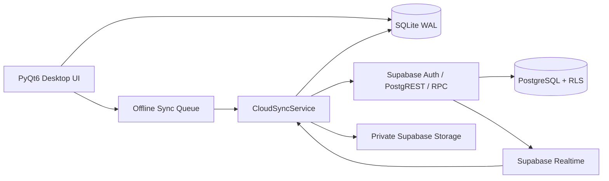

# ⛏️ CraftLife Desktop

<div align="center">

**An offline-first productivity, personal management, learning, and social RPG desktop application built with PyQt6.**

Turn everyday progress into XP, Gold, streaks, achievements, Guild contributions, and character growth—without giving up ownership of your local data.


[Quick Start](#-quick-start-offline) · [Features](#-feature-set) · [Cloud Setup](#%EF%B8%8F-optional-cloud--supabase-setup) · [Build](#-build-a-windows-release) · [Troubleshooting](#-troubleshooting)

</div>

---

## Language support

This README is written in English. The CraftLife user interface supports:

- English (`en`)
- Indonesian (`id`)

The language can be changed from Settings without restarting the application.

---

## 📌 Release scope

CraftLife v1.4.0 provides a complete desktop experience that works locally without an internet connection. The UI is a React shell inside PyQt `QWebEngineView`; game logic stays in Python/SQLite. Supabase integration is optional and additive.

| Area | Status |
|---|---|
| Offline/local desktop application | ✅ Ready to use |
| SQLite cache and backup | ✅ Available |
| Cloud Phase 1–4 source code | ✅ Available |
| Supabase deployment | ⚙️ Must be applied by the project operator |
| Realtime with periodic fallback | ✅ Available after cloud configuration |
| Fully authoritative cloud game wallet/inventory | 🗺️ Planned for Phase 5 |
| Push notifications while the app is closed | 🗺️ Planned for Phase 6 |
| Production operations and purge scheduler | 🗺️ Planned for Phase 6 |

**“Full Release” in this repository means the offline-first desktop application is complete and usable.** Operators enabling cloud services must apply all migrations, run RLS authorization tests, verify Storage policies, and deploy the required Edge Function before opening a cloud project to public users.

---

## 📚 Table of contents

- [Overview](#-overview)
- [Design principles](#-design-principles)
- [Feature set](#-feature-set)
- [Offline-first architecture](#-offline-first-architecture)
- [System requirements](#%EF%B8%8F-system-requirements)
- [Quick start](#-quick-start-offline)
- [Optional AI setup](#-optional-ai-learning-setup)
- [Optional cloud setup](#%EF%B8%8F-optional-cloud--supabase-setup)
- [Cloud migration order](#-cloud-migration-order)
- [Project structure](#-project-structure)
- [Data locations and backup](#-data-locations-and-backup)
- [Security and privacy](#-security-and-privacy)
- [Realtime and sync](#-realtime-and-sync-behavior)
- [Build a Windows release](#-build-a-windows-release)
- [Update an installation](#-updating-an-existing-installation)
- [Testing](#-testing-and-validation)
- [Troubleshooting](#-troubleshooting)
- [Known limitations](#-known-limitations)
- [Roadmap](#%EF%B8%8F-roadmap)
- [Contributing](#-contributing)
- [FAQ](#-frequently-asked-questions)
- [License](#-license)

---

# 📖 Overview

CraftLife is an all-in-one desktop application that combines:

- productivity and task management;
- RPG-style gamification;
- health, food, water, and sport tracking;
- personal finance;
- an AI-assisted learning workspace;
- notes, calendar, reminders, Pomodoro, and music;
- a private Love Space;
- friends, realtime chat, PvP, Guilds, and leaderboards;
- a local SQLite offline cache;
- optional Supabase Auth, Database, Storage, RPC, RLS, and Realtime services.

CraftLife does not require users to create a cloud account. Without a `.env` file, the application continues to work locally.

## Hybrid UI (v1.4)

```text
CraftLife.exe
  ├─ PyQt6 shell (login optional, tray, WebEngine)
  ├─ api_server.py  →  http://127.0.0.1:8765  (SQLite / database.py)
  └─ web/dist       →  React UI (no Node on the user PC)
```

- **Users:** double-click the exe. No `npm`, no two terminals.
- **Developers:** `py api_server.py` + `cd web && npm run dev` (Vite on port 3000). After `npm run build`, the app loads port 8765 instead.

Set `CRAFTLIFE_WEB_UI=0` to fall back to the legacy PyQt widgets. Set `CRAFTLIFE_WEB_LOGIN=1` to use the web login screen.

---

# 🧭 Design principles

1. **Local first** — the desktop UI uses SQLite for a fast and resilient experience.
2. **Cloud optional** — local users do not lose features because they have not linked an account.
3. **No fake success** — an online social action is successful only after Supabase confirms it.
4. **Server authority** — Friends, Couple membership, online Guilds, online PvP, attachment registration, and online reward claims are controlled by RPCs and RLS.
5. **Private by default** — cloud Storage buckets are never public.
6. **Backward compatible** — cloud migrations are additive to the existing local application.
7. **Retry safely** — queued operations use idempotency keys or stable cloud IDs.
8. **Never overwrite silently** — multi-device personal-data conflicts require an explicit choice.

---

# ✨ Feature set

## 🏠 Dashboard and character progression

- player level, XP, HP, MP, Gold, and streak summaries;
- configurable dashboard widgets;
- daily progress and activity overview;
- onboarding wizard;
- Quick Add;
- Command Palette;
- rank progression;
- annual “Year Wrapped” summary;
- talent tree;
- character classes and passive buffs.

## ✅ Habits, Dailies, and Quests

- positive and negative Habits;
- recurring Dailies;
- one-time Quests/Todos;
- difficulty-based rewards;
- folders;
- drag-and-drop and manual reordering;
- repeat-day configuration;
- completion streaks and failure tracking;
- task history;
- built-in habit templates;
- trash and restore;
- idempotent cloud productivity events.

## 🍅 Pomodoro

- focus timer;
- break timer;
- looping alarms until acknowledged;
- task labels;
- local XP and Gold rewards;
- session history;
- server-limited productivity points in cloud mode.

## 🏃 SportTrack

- custom sport activities;
- duration and calories burned;
- completion streaks;
- reps and sets logs;
- weekly series;
- sport ranks;
- sport level and statistics;
- cloud productivity events.

## 💚 Health and Food

- a built-in nutrition database with hundreds of food entries;
- custom foods;
- calories, protein, carbohydrates, and fat;
- meal logs;
- recipes;
- nutrition targets;
- water intake and daily goals;
- weight, height, BMI, age, gender, and activity factor;
- steps, sleep, resting heart rate, stress, and mood;
- health trends and charts;
- local SQLite storage.

> CraftLife is not a medical device. Predictions and summaries are intended for personal tracking only and must not be treated as medical advice or diagnosis.

## 💰 Economy

- income and expenses;
- categories and folders;
- debts;
- debt notes and receivables;
- savings goals;
- investments and returns;
- recurring subscriptions;
- daily series and charts;
- currency display preferences;
- report export.

## 📚 Learning workspace

- learning notebooks;
- PDF, text, and document sources;
- source chunking and local retrieval;
- contextual AI chat;
- flashcards;
- quizzes and generated study material;
- mind maps;
- two-host podcast generation;
- multilingual Edge TTS;
- learning-output export;
- optional Gemini integration;
- graceful fallback when optional AI libraries or providers are unavailable.

## 📝 Notes

- rich-text editing;
- folders and nested folders;
- archive;
- search;
- adjustable zoom level;
- integration with tracker JSON export/import.

## ⏰ Reminders

- date and time reminders;
- repeat types and repeat days;
- system-tray notifications;
- looping beep alarms;
- custom MP3 sounds;
- automatic next-occurrence calculation;
- device-local custom sound paths.

## 📅 Calendar

- monthly calendar;
- Indonesian and international holiday data;
- per-day notes;
- task and event context;
- Love Space event integration.

## 🎵 Music

Music is available as a full primary sidebar page with a polished Spotify-inspired interface:

- professional library sidebar and now-playing hero;
- local playlists and a protected Favorite playlist;
- title, artist, album, duration, and embedded cover-art metadata;
- track search;
- shuffle, repeat, previous, next, seek, and volume controls;
- embedded lyrics panel;
- add individual files or scan a folder recursively;
- move, copy, favorite, or remove tracks through a context menu;
- MP3, WAV, FLAC, M4A/MP4, and Ogg support depending on OS codecs;
- music files remain local and are never uploaded to Supabase.

## 🛒 Shop, Inventory, Crafting, and Pets

- local item shop;
- weapons, armor, consumables, and buffs;
- inventory quantities and equipment;
- enchant state;
- crafting recipes;
- pet ownership and active-pet selection;
- pet hunger, happiness, level, and EXP;
- class skills and boss bonuses;
- achievements and redeem codes.

> In v1.0.0, the main game wallet and inventory remain local-authoritative. A full server reward ledger is planned for Phase 5.

## 👤 Profile and personalization

- display name and username;
- biography;
- avatar class, color, and emoji;
- local profile-photo BLOB;
- private profile-photo cloud Storage;
- multiple themes;
- high-contrast mode;
- font scaling;
- English and Indonesian;
- IDR, USD, and EUR display preferences.

## 💞 Love Space

### Local and cloud-aware relationship features

- explicit Couple request, acceptance, rejection, and cancellation;
- one accepted partner per user;
- one shared Love Space per Couple;
- shared relationship profile and start date;
- days-together calculation;
- events and plans;
- memories;
- daily check-ins;
- connection score;
- Connection Prompts and favorites;
- weekly reviews;
- bucket list;
- menstrual/cycle tracker and prediction;
- shared and private Gallery;
- actual image decode validation;
- local image BLOB cache.

### Cloud privacy rules

- only Love Space members can read shared data;
- writes are allowed only while the relationship is `accepted`;
- an ended relationship receives a 30-day read-only grace period;
- uploaders retain photo-management rights according to policy;
- Gallery images are processed before upload and limited to 5 MB;
- Love Space Gallery quota is 1 GB;
- cycle information is sensitive and should be used only with the tracked person’s consent.

## 👥 Friends and realtime Direct Chat

- server-authoritative friend requests;
- friend profiles;
- online, away, and offline presence;
- typing indicators;
- local Direct Chat fallback;
- cloud message cache;
- offline send queue;
- replies;
- sender-only edits;
- sender-only soft delete and tombstones;
- reactions;
- unread counters;
- pagination;
- 30-message-per-minute server limit;
- Realtime updates;
- periodic pull fallback.

### Private chat attachments

Supported file types:

- JPG, JPEG, PNG, and WebP → processed to WebP;
- PDF;
- UTF-8 TXT;
- DOCX;
- XLSX;
- PPTX.

Limits:

| Rule | Limit |
|---|---:|
| Attachments per message | 5 |
| Processed image | 5 MB |
| Document | 10 MB |
| Active quota per uploader | 250 MB |
| Upload slots | 50 files/hour |
| Processed image dimensions | maximum 1600×1600 |

Hardening includes:

- server-authorized upload slots;
- deterministic private Storage paths;
- upload-slot expiration;
- SHA-256 verification;
- idempotent retries;
- SQLite BLOB cache;
- thumbnail cache;
- deleted-attachment retention;
- orphan cleanup through an Edge Function.

## ⚔️ Online PvP

- challenge request, acceptance, rejection, and cancellation;
- server-controlled challenge time windows;
- scores calculated from validated productivity events;
- the client never submits a score;
- automatic or opportunistic finalization;
- one-time reward claims;
- local reward application only after cloud claim confirmation;
- Realtime challenge state.

## 🛡️ Online Guild

- create Guild, request join, cancel request, accept, and reject;
- leave, kick, ban, and unban;
- leader transfer;
- Guild disband;
- one-user-one-Guild constraint;
- one-leader invariant;
- `leader`, `officer`, and `member` permissions;
- editable Guild description;
- Guild Chat replies, edits, deletes, reactions, pagination, and unread counts;
- moderation delete for leaders and officers;
- SQLite Guild Chat cache;
- productivity contribution feed;
- server-controlled boss catalog;
- server-computed boss HP, duration, expiration, and damage;
- one-time boss rewards;
- Guild EXP and level;
- online Guild leaderboard.

## 🔔 Notification Center

- durable cloud notification cache;
- unread badge;
- filters for messages, social, Love Space, PvP, Guild, and security;
- pagination;
- mark one or all as read;
- deep-link navigation to related entities;
- Realtime with periodic fallback;
- new-device and revoked-device security events.

## 💻 Device Manager

- list linked cloud devices;
- identify the current device;
- rename a device;
- revoke one other device;
- revoke all other devices;
- first-seen and last-seen timestamps;
- platform and app version;
- current-device protection.

> Revoking a device registry UUID stops that UUID from performing personal sync. It is not equivalent to global Supabase Auth session revocation, which is planned for Phase 6.

## 🏆 Leaderboards

- local ranking;
- global productivity ranking;
- online Guild ranking;
- server-computed points;
- public profile fields only.

---

# 🧱 Offline-first architecture



## Source of truth by feature

| Feature | Offline/local mode | Cloud-linked mode |
|---|---|---|
| Habits, Dailies, Quests | SQLite | SQLite + private snapshot/productivity events |
| Notes, Health, Economy | SQLite | SQLite + private personal snapshot |
| Profile | SQLite | Cloud profile mirror + SQLite cache |
| Friends | Local fallback | Supabase authoritative |
| Couple membership | Local fallback | Supabase authoritative |
| Shared Love Space | SQLite cache | Supabase authoritative |
| Direct Chat | Local fallback | Supabase authoritative + SQLite cache |
| Online PvP | Local PvP fallback | Supabase authoritative |
| Online Guild | Local Guild fallback | Supabase authoritative |
| Profile, Gallery, Chat files | SQLite cache | Private Storage + RLS |
| Game wallet and inventory | SQLite | Server ledger planned for Phase 5 |

## Personal multi-device sync

`tracker_v1` is a private document snapshot covering 36 tracker tables, including tasks, notes, finance, health, Pomodoro, calendar, reminders, and relationship tracker data.

- optimistic revisions;
- semantic SHA-256 hash;
- maximum 8 MB payload;
- explicit conflict detection;
- no silent overwrite;
- **Keep Local Data** or **Restore Cloud Data** resolution;
- ten historical server versions;
- custom reminder file paths are excluded.

---

# 🖥️ System requirements

## Desktop application

| Component | Minimum | Recommended |
|---|---:|---:|
| Operating system | Windows 10 64-bit | Windows 11 64-bit |
| Python in source mode | 3.10 | 3.11 or 3.12 |
| RAM | 4 GB | 8 GB+ |
| Free disk space | 500 MB | 2 GB+ for Learning, audio, and cache |
| Display | 1080×700 | 1280×720 or larger |
| Internet | Optional | Required for cloud, AI, and online TTS |

Windows is the primary tested platform. Linux and macOS may run from source, but multimedia codecs, credential backends, tray behavior, and packaging can differ.

## Cloud development

- Node.js 20+;
- npm 10+;
- Supabase CLI 2.113+;
- Docker Desktop for local Supabase tests;
- a Supabase project for staging/production;
- Singapore region is recommended for users near Indonesia.

---

# 🚀 Quick start offline

Cloud configuration is not required.

## 1. Clone the repository

```bash
git clone https://github.com/Hellowww-02/CraftLife.git
cd CraftLife
```

## 2. Create a virtual environment

### Windows PowerShell

```powershell
python -m venv .venv
.\.venv\Scripts\Activate.ps1
```

If PowerShell blocks activation:

```powershell
Set-ExecutionPolicy -Scope Process -ExecutionPolicy Bypass
.\.venv\Scripts\Activate.ps1
```

### Linux or macOS

```bash
python3 -m venv .venv
source .venv/bin/activate
```

## 3. Install dependencies

```bash
python -m pip install --upgrade pip
pip install -r requirements.txt
```

## 4. Launch CraftLife

```bash
python MainPyQt6.py
```

CraftLife initializes its SQLite schema and built-in data on first launch.

### Developer UI (Vite)

```powershell
pip install -r requirements.txt
pip install PyQt6-WebEngine
py api_server.py
# other terminal:
cd web; npm install; npm run dev
py MainPyQt6.py
```

Production/frozen builds serve `web/dist` from the local API (port 8765) and do not need Vite.

---

# 🤖 Optional AI Learning setup

Learning features that use Gemini require a valid provider API key configured by the user in CraftLife. AI-related packages are listed in `requirements.txt`, but the application handles missing or failed optional imports gracefully.

Important rules:

- never commit an AI API key;
- never include a key in screenshots or issues;
- documents and prompts sent to an AI provider are governed by that provider’s privacy policy;
- Gemini keys are excluded from CraftLife personal cloud snapshots;
- local notebook data remains available without a linked cloud account.

Podcast TTS and transcript retrieval require internet access.

---

# ☁️ Optional Cloud — Supabase setup

For the full operator guide, see [`SUPABASE_SETUP.md`](SUPABASE_SETUP.md).

## 1. Install cloud dependencies

```bash
pip install -r requirements.txt
npm install
```

## 2. Create a local `.env`

```powershell
Copy-Item .env.example .env
notepad .env
```

Use only:

```env
SUPABASE_URL=https://YOUR_PROJECT_REF.supabase.co
SUPABASE_PUBLISHABLE_KEY=sb_publishable_...
CRAFTLIFE_CLOUD_ENABLED=true
CRAFTLIFE_SYNC_INTERVAL_SECONDS=60
```

Compatibility aliases are supported, but the names above are recommended.

### Never place these values in the desktop `.env`

```text
sb_secret_*
service_role
SUPABASE_SERVICE_ROLE_KEY
database password
Supabase CLI access token
CHAT_MAINTENANCE_SECRET
SMTP credentials
```

`.env` is excluded by `.gitignore`.

## 3. Configure Supabase Auth

In the Supabase Dashboard:

1. enable Email/Password Auth;
2. require email verification;
3. configure a non-localhost Site URL for your release;
4. configure the verification redirect allowlist;
5. request a new verification email after changing redirect settings.

CraftLife never stores the Supabase password in SQLite. Refresh tokens are stored through the operating system credential store using `keyring`.

## 4. Link the Supabase CLI

```powershell
npx supabase login
npx supabase link --project-ref YOUR_PROJECT_REF
npx supabase migration list
```

The CLI may request your database password. Enter it only in the CLI prompt and never commit it.

## 5. Validate locally

Docker Desktop must be running:

```powershell
npm run supabase:start
npm run supabase:reset
npm run supabase:test
npm run supabase:lint
```

Local Studio is normally available at:

```text
http://localhost:54323
```

## 6. Dry-run and push to staging

```powershell
npx supabase db push --dry-run
npx supabase db push
npx supabase migration list
npx supabase db lint --linked --level warning
```

Always use a staging project first. Do not push directly to production before the Alice/Bob/Carol authorization matrix passes.

## 7. Deploy the attachment cleanup Edge Function

Generate a secret locally without exposing it in chat or source code:

```powershell
$secret = -join (
    (48..57) + (65..90) + (97..122) |
    Get-Random -Count 48 |
    ForEach-Object { [char]$_ }
)

npx supabase secrets set CHAT_MAINTENANCE_SECRET=$secret
npx supabase functions deploy chat-attachment-maintenance
```

The function uses `SUPABASE_SERVICE_ROLE_KEY` only inside the Supabase Edge Runtime. Automatic scheduling belongs to the Phase 6 production setup.

## 8. Link a CraftLife account

1. run CraftLife with `.env` beside the source or executable;
2. open **Settings → Cloud & Sync**;
3. choose **Link Cloud Account**;
4. create an account;
5. verify the email address;
6. return and choose **Sign In & Link**;
7. choose **Migrate Local Data**;
8. choose **Sync Now**;
9. inspect Device Manager and the sync status.

---

# 🗃 Cloud migration order

Migrations must remain in this exact order:

```text
20260812000000_initial_social_cloud.sql
20260812010000_fix_profiles_insert_policy.sql
20260813000000_social_realtime_pvp_guild.sql
20260813120000_personal_realtime_sync.sql
20260813180000_phase4a_love_space_shared.sql
20260813210000_phase4b1_chat_core.sql
20260813220000_phase4b2_b3_chat_attachments.sql
20260813230000_phase4c_guild_complete.sql
20260813235900_phase4d_e_final.sql
```

Do not rename an applied migration. Do not use `migration repair` merely to hide an SQL error.

If a migration fails:

1. read the first SQLSTATE and statement number;
2. confirm whether the migration appears as applied remotely;
3. correct the unapplied local file;
4. run `db push --dry-run` again;
5. use repair only when remote history and the actual remote schema are known to differ.

## Fixed attachment migration syntax

The final attachment migration uses:

```sql
p_size_bytes > (
  case
    when p_mime_type like 'image/%' then 5242880
    else 10485760
  end
)
```

This fixes the earlier PL/pgSQL `SQLSTATE 42601` caused by an unparenthesized `CASE` expression in an `IF` condition.

---

# 🗂 Project structure

```text
CraftLife/
├── MainPyQt6.py              # desktop shell (WebEngine + legacy pages)
├── api_server.py             # local HTTP API for the React UI
├── web_shell.py              # QWebEngineView host
├── life_api.py / studio_api.py
├── web/                      # React + Vite UI (dev); web/dist after build
├── database.py               # SQLite schema, migrations, and local domain logic
├── translations.py           # English and Indonesian translations
├── learning_helper.py        # Learning, AI, and TTS helpers
├── cloud_config.py           # External .env configuration
├── cloud_service.py          # Supabase client boundary
├── sync_service.py           # Queue, pull/push, and conflict orchestration
├── applog.py                 # Application logging
├── food_data.py              # Built-in nutrition data
├── holidays.py               # Calendar and holiday helpers
├── mathtools.py              # Learning math helpers
├── requirements.txt
├── package.json
├── .env.example
├── SUPABASE_SETUP.md
├── CLOUD_FINALIZATION_PLAN.md
├── LICENSE
├── README.md
└── supabase/
    ├── config.toml
    ├── migrations/
    ├── tests/
    └── functions/
        └── chat-attachment-maintenance/
            └── index.ts
```

Generated files and folders such as `.venv`, `node_modules`, `build`, `dist`, `.env`, `craftlife.db`, logs, and backups are ignored.

---

# 💾 Data locations and backup

## Source mode

When running:

```bash
python MainPyQt6.py
```

`craftlife.db` is stored beside the source files.

## Frozen Windows build

A PyInstaller build stores the user database under:

```text
%APPDATA%\CraftLife\craftlife.db
```

The cloud `.env` remains external beside the executable:

```text
dist\CraftLife\CraftLife.exe
dist\CraftLife\.env
```

Do not place `.env` inside `_internal`.

## Back up before updating

```powershell
Copy-Item .\craftlife.db .\craftlife.before-update.db -Force
Copy-Item .\.env .\.env.before-update -Force
```

CraftLife also provides manual database backup and tracker JSON export/import.

Never distribute a user’s:

- `craftlife.db`;
- `.env`;
- backup directory;
- logs containing private information;
- generated Learning audio unless explicitly intended.

---

# 🔐 Security and privacy

## Local authentication

- PBKDF2-HMAC-SHA256;
- random salt;
- 260,000 iterations;
- temporary login lockout;
- hashed local session tokens;
- security questions and backup codes;
- profile lock.

## Cloud authentication

- Supabase Email/Password Auth;
- required email verification;
- refresh tokens stored through `keyring`;
- publishable key only in the desktop client;
- RLS and RPC authorization;
- private Storage buckets;
- 30-day soft-delete request.

## Cloud Storage buckets

```text
profile-photos
love-space-photos
chat-attachments
```

All buckets must have:

```text
public = false
```

## Realtime security

Realtime never replaces authorization. PostgreSQL RLS decides which rows a client can receive.

Required manual test accounts:

- **Alice** and **Bob** — valid shared relationship, conversation, and Guild flows;
- **Carol** — non-member denial testing.

Carol must not be able to read or receive:

- Alice and Bob’s Direct Chat;
- attachment metadata or objects;
- private Love Space records;
- private Guild chat, contributions, or boss actions;
- personal snapshots;
- device records;
- owner notifications.

## Encryption scope

CraftLife cloud traffic uses TLS, and access is protected by Auth, RLS, and private Storage. Direct Chat is **not end-to-end encrypted**. Do not describe CraftLife Chat as E2EE.

## Sensitive data

Health, finance, cycle, relationship, and Learning information may be sensitive. Users should:

- use a trusted device;
- protect the operating system account;
- enable disk encryption;
- avoid public screenshots;
- review third-party AI privacy policies;
- avoid uploading documents that are not needed.

---

# ⚡ Realtime and sync behavior

Realtime subscriptions cover social requests, messages, reactions, typing, presence, notifications, PvP, Guild state, Love Space, attachments, and personal snapshots.

Reliability mechanisms include:

- the asynchronous Supabase client;
- a dedicated background thread;
- exponential reconnect backoff;
- event debouncing;
- a sync lock;
- periodic sync fallback;
- queued retry with exponential delay;
- idempotency keys;
- local cloud caches;
- optimistic personal snapshot revisions.

When the network is unavailable:

- local modules continue to work;
- existing cloud cache remains readable;
- eligible personal changes are queued;
- queued Direct Chat messages and attachments retry;
- server-authoritative social mutations are never falsely reported as successful.

---

# 📦 Build a Windows release

See [`scripts/build_windows.md`](scripts/build_windows.md). One command:

```powershell
powershell -ExecutionPolicy Bypass -File .\scripts\build.ps1
```

This compiles `web/` to `web/dist`, then PyInstaller `--onedir` with the UI embedded. End users run `dist\CraftLife\CraftLife.exe` without Node.

Install PyInstaller (also done by the script):

```powershell
pip install --upgrade pyinstaller PyQt6-WebEngine
```

If an application icon is available, add:

```powershell
--icon path\to\craftlife.ico
```

## Critical build rule

Do not use:

```text
--optimize 2
--strip
```

`--optimize 2` is equivalent to Python `-OO` and removes docstrings. Some Google Generative AI packages inspect docstrings at runtime and may crash with:

```text
AttributeError: 'NoneType' object has no attribute 'splitlines'
```

Use:

```text
--optimize 1
```

After building:

```powershell
Copy-Item .\.env .\dist\CraftLife\.env -Force
```

Only copy `.env` for a controlled deployment. Never publish a real `.env` as a GitHub Release asset.

---

# 🔄 Updating an existing installation

1. close CraftLife;
2. back up `.env` and the database;
3. replace only source/application files;
4. preserve local user data;
5. copy additive migrations;
6. run Python validation;
7. run a Supabase dry-run;
8. apply migrations to staging;
9. test Alice, Bob, and Carol;
10. deploy included Edge Functions;
11. distribute the update only after validation.

Example source-mode backup:

```powershell
$Project = 'D:\Path\To\CraftLife'
Set-Location $Project

Get-Process CraftLife -ErrorAction SilentlyContinue | Stop-Process -Force
Copy-Item .\craftlife.db .\craftlife.before-update.db -Force
if (Test-Path .\.env) {
  Copy-Item .\.env .\.env.before-update -Force
}
```

Never overwrite `%APPDATA%\CraftLife\craftlife.db` when installing a new executable build.

---

# 🧪 Testing and validation

## Python syntax

```powershell
python -m py_compile MainPyQt6.py database.py cloud_config.py cloud_service.py sync_service.py translations.py learning_helper.py
```

## SQLite integrity

```powershell
python -c "import database as db; db.init_db(); c=db.get_conn(); print(c.execute('pragma integrity_check').fetchone()[0]); print('FK errors:', len(c.execute('pragma foreign_key_check').fetchall()))"
```

Expected result:

```text
ok
FK errors: 0
```

A fresh final Phase 4 schema currently contains approximately 88 SQLite tables, including cloud cache tables.

## Local Supabase

```powershell
npm run supabase:start
npm run supabase:reset
npm run supabase:test
npm run supabase:lint
```

## Remote staging

```powershell
npx supabase migration list
npx supabase db push --dry-run
npx supabase db push
npx supabase db lint --linked --level warning
```

## Required authorization matrix

| Test | Alice | Bob | Carol |
|---|---:|---:|---:|
| Read own profile/private data | Allow | Allow | Own only |
| Read the Alice/Bob shared Love Space | Allow | Allow | Deny |
| Read the Alice/Bob Direct Chat | Allow | Allow | Deny |
| Download an Alice/Bob chat attachment | Allow | Allow | Deny |
| Edit another sender’s message | Deny | Deny | Deny |
| Read private Guild chat as a member | Allow if member | Allow if member | Deny if not a member |
| Promote self to Guild leader | Deny | Deny | Deny |
| Supply Guild boss HP | Deny | Deny | Deny |
| Read another user’s tracker snapshot | Deny | Deny | Deny |
| Manage another user’s devices | Deny | Deny | Deny |

## Long-running validation

Before production:

- run Realtime continuously for 8–24 hours;
- test Windows sleep and resume;
- disconnect and reconnect the network;
- expire and refresh Auth tokens;
- test simultaneous edit, delete, and reaction events;
- interrupt attachment uploads;
- retry duplicate queue jobs;
- race Guild leader transfers;
- attempt duplicate PvP and Guild reward claims;
- perform database backup and restore rehearsals.

---

# 🐞 Troubleshooting

## Supabase reports `Configured: False`

Verify that `.env` is beside `MainPyQt6.py` in source mode or beside `CraftLife.exe` in frozen mode.

Recommended variable names:

```env
SUPABASE_URL=...
SUPABASE_PUBLISHABLE_KEY=...
```

Restart CraftLife after changing `.env`.

## `PGRST205`: `public.profiles` is missing

The initial Supabase migration has not been applied to the linked project:

```powershell
npx supabase migration list
npx supabase db push --dry-run
npx supabase db push
```

## RLS error while inserting `profiles`

Ensure this migration is applied:

```text
20260812010000_fix_profiles_insert_policy.sql
```

## Verification link opens localhost or reports `otp_expired`

- configure the Auth Site URL and redirect allowlist;
- request a new verification email;
- use the newest link;
- return to CraftLife and sign in after verification.

## Attachment migration fails with `SQLSTATE 42601`

Ensure the final corrected migration is present:

```text
supabase/migrations/20260813220000_phase4b2_b3_chat_attachments.sql
```

Verify it:

```powershell
Select-String .\supabase\migrations\20260813220000_phase4b2_b3_chat_attachments.sql -Pattern 'p_size_bytes > \(case'
```

Do not repair a migration that never succeeded remotely. Replace the file, dry-run, and push again.

## CLI warns that `.supabase\profile` is missing

If the CLI still reports that it is using an access token, initializes the login role, and connects to the remote database, this warning is non-fatal. The following SQLSTATE is the actual migration result.

## Docker is missing

Supabase local development requires Docker Desktop. A remote database push does not start the local Supabase stack.

## Realtime sync client raises `NotImplementedError`

CraftLife uses Supabase’s asynchronous client for Realtime. Ensure `cloud_service.py` is current and reinstall:

```powershell
pip install --upgrade supabase realtime
```

## `QThread` has been deleted

Use the current `MainPyQt6.py`, which safely resets deleted cloud-worker references and follows the `worker.finished → thread.quit → deleteLater` lifecycle.

## Google Generative AI crashes with `splitlines` after building

Rebuild without `--optimize 2` and without `--strip`:

```powershell
Remove-Item build,dist,CraftLife.spec -Recurse -Force -ErrorAction SilentlyContinue
```

Then rebuild with `--optimize 1`.

## Database is locked

- close duplicate CraftLife processes;
- wait for backup/export to finish;
- do not open `craftlife.db` in another application with write access;
- restart CraftLife;
- preserve WAL/SHM files while the app is running.

## Music does not play

Check that:

- the file still exists;
- the operating system has a codec for the format;
- an audio output device is available;
- Mutagen is installed.

## AI or TTS is unavailable

Check optional packages and internet access. CraftLife should continue to run without AI-provider availability.

---

# ⚠️ Known limitations

- Direct Chat uses TLS, Auth, and RLS, but is not E2EE.
- Push notifications while CraftLife is closed are not implemented.
- Device UUID revocation is not full global Auth-session revocation.
- Permanent account purge after the 30-day grace period requires Phase 6 scheduling.
- PvP and Guild maintenance is also triggered opportunistically by active clients; the full scheduler is a Phase 6 task.
- The attachment cleanup Edge Function must be scheduled by the production operator.
- Server-side antivirus/content scanning is not included; client signature checks and server metadata validation are not substitutes for malware scanning.
- Cloud game wallet, inventory, shop, crafting, pets, achievements, and Learning sync are not fully server-authoritative.
- A modified desktop client cannot directly forge server-scored productivity points, but complete anti-cheat requires the Phase 5 reward ledger.
- Linux and macOS multimedia, tray, credential backend, and packaging behavior may differ from Windows.
- Very large tracker datasets may exceed the `tracker_v1` 8 MB document limit and require the granular sync planned for Phase 5.

---

# 🛣️ Roadmap

Detailed planning is maintained in [`CLOUD_FINALIZATION_PLAN.md`](CLOUD_FINALIZATION_PLAN.md).

## Completed in source

- [x] Phase 1 — Auth, Profiles, Friends, Couple, Love Space, Gallery, Storage, and RLS
- [x] Phase 2 — Chat, Presence, Notifications, Productivity, PvP, Guilds, and Leaderboards
- [x] Phase 3 — Device registry, private multi-device tracker sync, and conflict resolution
- [x] Phase 4A — Cloud-native shared Love Space
- [x] Phase 4B — Direct Chat core, reactions, attachments, and hardening
- [x] Phase 4C — Complete online Guild lifecycle, chat, boss, and rewards
- [x] Phase 4D — Notification Center and Device Manager
- [x] Phase 4E — Final RLS, privilege, and rate-limit hardening

## Planned

### Phase 5 — Cloud game state and Learning

- server reward ledger;
- cloud wallet;
- inventory, shop, and crafting transactions;
- pets, achievements, and redeem codes;
- Learning notebooks, sources, generated content, and Storage;
- granular per-row sync;
- full cloud data export and deletion.

### Phase 6 — Production operations

- scheduled maintenance;
- permanent account purge;
- global Auth session revocation;
- push notifications while the application is closed;
- abuse reports and moderation;
- malware-scanning strategy;
- monitoring and alerting;
- backup and restore drills;
- migration rollback rehearsals;
- staged production rollout.

---

# 🤝 Contributing

Contributions are welcome.

## Workflow

```bash
git clone https://github.com/Hellowww-02/CraftLife.git
cd CraftLife
git checkout -b feature/short-description
```

Before opening a pull request:

```bash
python -m py_compile MainPyQt6.py database.py cloud_config.py cloud_service.py sync_service.py translations.py learning_helper.py
```

For cloud changes:

```bash
npm run supabase:reset
npm run supabase:test
npm run supabase:lint
```

A pull request should explain:

- the problem and solution;
- affected local and cloud modules;
- migration and RLS impact;
- backward-compatibility impact;
- test steps;
- screenshots for UI changes;
- confirmation that no secrets or user data were committed.

## Coding guidelines

- preserve SQLite local fallback;
- keep network operations out of data-only SQLite helpers;
- keep social state server-authoritative in cloud mode;
- use RPC and RLS for sensitive mutations;
- use idempotency keys for retryable operations;
- never silently overwrite sync conflicts;
- use `_card`, `_btn`, `_lbl`, and `PageHeader` for UI consistency;
- update both English and Indonesian translations;
- keep private buckets private;
- never add a service-role key to desktop code.

---

# ❓ Frequently asked questions

## Does CraftLife require internet access?

No. Core modules work locally with SQLite.

## Is a Supabase account required?

No. A cloud account is required only for multi-device sync and online social features.

## Is a publishable key safe in a desktop application?

A publishable key is intended for clients, but it is not a substitute for RLS. Never use a secret or service-role key in the desktop app.

## Is Direct Chat end-to-end encrypted?

No. Chat is protected by TLS, Auth, RLS, and private Storage, but it is not E2EE.

## Where is the cloud password stored?

Supabase Auth handles the password. It is not stored in SQLite. Refresh tokens use the OS credential store through `keyring`.

## Will local data disappear when cloud sync fails?

It should not. SQLite remains the offline store and cache. Cloud social mutations are not reported as successful when the server rejects them.

## How can data be moved to another computer?

- local-only mode: copy the database while CraftLife is closed, or use export/import;
- cloud-linked mode: link the same verified cloud account, then sync or restore;
- always create a backup before restoring.

## Does updating the EXE delete the database?

Not when the release preserves `%APPDATA%\CraftLife`. Never package or overwrite a user’s database during an application update.

## Is the Supabase Free plan enough?

It is suitable for staging and small tests. Review database, Storage, Realtime, egress, and Edge Function limits before production.

---

# 📄 License

CraftLife is licensed under the [MIT License](LICENSE).

```text
Copyright (c) 2026 CraftLife
```

The software is provided “AS IS”, without warranty. See `LICENSE` for the complete text.

---

# 🙏 Acknowledgements

CraftLife uses or is inspired by:

- Python;
- PyQt6 and Qt;
- SQLite;
- Supabase;
- Pillow;
- Matplotlib;
- OpenPyXL;
- python-docx;
- ReportLab;
- Mutagen;
- PyMuPDF and pypdf;
- Edge TTS;
- Google Generative AI SDKs;
- Minecraft-inspired progression aesthetics;
- Habitica-style productivity gamification;
- notebook and knowledge-work applications.

Minecraft and other referenced products are trademarks of their respective owners. CraftLife is an independent project and is not affiliated with Mojang or Microsoft.

---

# 📬 Support and bug reports

Use GitHub Issues:

```text
https://github.com/Hellowww-02/CraftLife/issues
```

Include:

- operating system and version;
- Python and CraftLife versions;
- source or executable mode;
- local-only or cloud-linked mode;
- exact reproduction steps;
- complete error text;
- migration filename and statement number for SQL errors.

Never attach:

- `.env`;
- a personal `craftlife.db`;
- screenshots containing keys;
- a database password;
- a service-role key;
- `sb_secret_*`;
- a CLI access token;
- the attachment maintenance secret.

---

<div align="center">

## ⛏️ CraftLife Desktop

**Build better systems. Complete real quests. Level up your life.**

Made with Python, PyQt6, SQLite, and optional Supabase cloud services.

</div>
